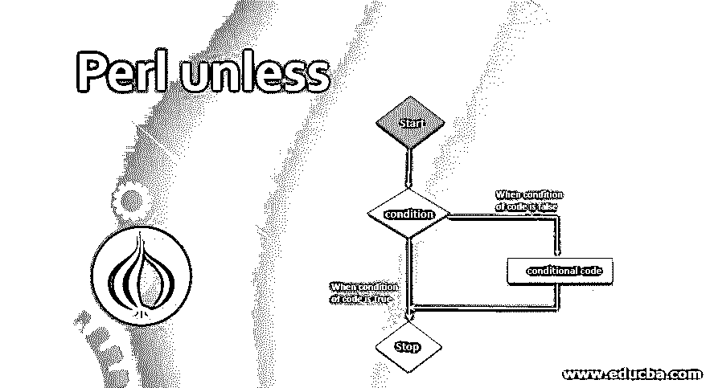
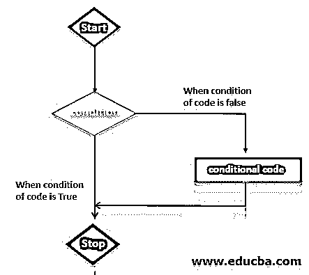
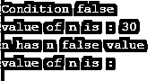
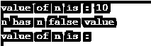

# Perl 除非

> 原文：<https://www.educba.com/perl-unless/>

## Perl 的定义除非

Perl 除非语句与 perl 中的 if 语句相反，当给定条件为假时，它将执行除非语句体中的多个语句。如果一个语句在条件为真时执行代码，那么在条件为假时，它将执行该语句。当给定条件为假时，Perl 除非语句对于一次执行多个语句非常有用和重要。我们可以将 else if 语句与 unless 语句一起使用。

### 语法和参数

下面是 perl 中 unless 语句的语法如下。

<small>网页开发、编程语言、软件测试&其他</small>

**语法#1:**

`Unless (Boolean expression (condition)) {
Statements    -- Statement is executed in unless statement when given condition is false.
}`

**语法#2:**

`Unless (expression)
Block         -- Used with unless statement.`

**语法#3:**

`Unless (Condition)
Block elsif (condition)
Block
… else
Block`

**参数:**

下面是参数描述语法，除非语句如下。

*   **除非:**除非语句与 perl 中的 if 语句相反，if 语句在语句条件为真时执行代码，在除非语句中则相反，它将在条件为假时执行语句。除非声明非常有用和重要。
*   **Condition:** Condition 定义为代码，其中我们要定义条件块，如果条件为真，那么 unless 语句将执行 unless 语句下的语句。
*   **语句:**语句被定义为一个在 unless 语句块下的语句。如果条件为真，则 unless 语句将执行 unless 语句块。
*   **Block:** Block 是 unless 语句中非常重要的参数。Block 无非是 unless 语句条件下的语句。
*   **表达式:**表达式定义为条件码除非语句。

### 流程图

下面是除非语句如下的流程图。流程图只不过是程序代码的逐步执行。下图显示了除非语句的流程图。

*   流程图是非常重要的，以找到一步一步的执行，除非语句，它如何在程序语句中工作。

*   上图显示了程序代码中 unless 语句的图形表示或流程。除非是如何工作，它显示在流程图。
*   除非语句的流程图以关键字 name 作为 start 开始，以 name 作为 stop 结束，否则我们也可以以 name 作为 end 关键字结束流程图。
*   开始后，流程图编译器将检查条件或代码块。如果条件为假，则它将执行条件块“除非”语句下的语句。
*   如果条件为假，编译器将执行该语句或代码块。如果条件为真，那么除非语句将跳过程序语句中的代码块。
*   流程图对于显示 perl 语言中任何程序或代码的图形流程都是非常重要的。

### Perl 中的 unless 语句是如何工作的？

下面是除非语句的工作原理。

*   Unless 语句与 if 语句相反，在 if 语句中，当语句条件为真时执行代码；在 unless 语句中，情况相反，当条件为假时执行语句。
*   我们可以使用带有 else 的 unless 语句在一个程序中定义多个条件。
*   Perl 除非语句与 if 语句相反。它将执行主体内部的多个语句，除非当给定的语句条件为 false 时出现一个语句。
*   当给定的条件为假时，一次执行多个语句是非常有用和重要的。我们可以将 else if 语句与 unless 语句一起使用。
*   我们可以使用 unless 语句后跟 else 语句。当给定条件为假时，unless 语句将从右向左执行该语句。
*   Perl 将执行 unless 前面的语句。如果条件语句为真，那么 perl 将跳过块代码语句。
*   当我们必须执行多条语句时，我们使用了以下形式的语句。

`Unless (condition) {
// Block of code
}`

*   如果上述代码的条件为假，那么它将执行代码块。如果上述代码的条件为真，那么它将跳过代码块。

### Perl 的例子，除非

下面是 unless 语句的例子。

#### 1.除非在 Perl 中使用 False 条件

下面的例子表明，除非在 perl 中使用 false 条件。我们在下面的例子中使用了一个错误的条件块。

**举例:**

`$n = 30;
# Check the condition using unless in perl if the condition is false execute the block of statement.
unless( $n < 25 ) {
# If condition of statement is false then execute below statement.
printf "Condition false\n";
}
print "value of n is : $n\n";
$n = "";
# check the boolean condition.
unless ( $n ) {
# If condition of statement is false then execute below statement.
printf "n has n false value\n";
}
print "value of n is : $n\n";'`

**输出:**

#### 2.除非在 Perl 中使用 True 条件

下面的例子表明，除非使用真条件。我们在下面的例子中使用了一个真条件块。

**举例:**

`$n = 10;
# Check the condition using unless in perl if the condition is false execute the block of statement.
unless( $n < 25 ) {
# If condition of statement is false then execute below statement.
printf "Condition true\n";
}
print "value of n is : $n\n";
$n = "";
# check the boolean condition.
unless ( $n ) {
# If condition of statement is false then execute below statement.
printf "n has n false value\n";
}
print "value of n is : $n\n";`

**输出:**

### 推荐文章

这是一个 Perl 指南，除非。在这里，我们还讨论了除非语句的定义和在 perl 中的工作原理，以及不同的例子和代码实现。您也可以看看以下文章，了解更多信息–

1.  [Perl 命令](https://www.educba.com/perl-commands/)
2.  [Perl vs Python](https://www.educba.com/perl-vs-python/)
3.  [玻璃箱测试](https://www.educba.com/glass-box-testing/)
4.  [ASP.NET 要求现场验证器](https://www.educba.com/asp-dot-net-requiredfieldvalidator/)

