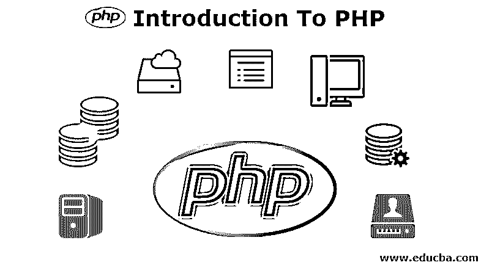
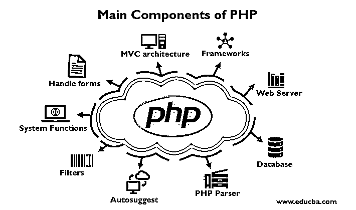

# PHP 简介

> 原文：<https://www.educba.com/introduction-to-php/>

## PHP 简介

下面的文章提供了 PHP 入门的大纲。PHP 也被称为超文本预处理器。PHP 是一种开源的服务器端脚本语言，主要用于开发 web 应用。PHP 语言的语法类似于 C 语言。PHP 最初是由拉斯马斯·勒德尔夫创建的，它最早出现在 1995 年。PHP 广泛用于开发 web 应用程序，并已成为开发人员创建新应用程序的主要语言之一。

### PHP 的主要组件

下面给出了 PHP 的主要组件:

<small>网页开发、编程语言、软件测试&其他</small>

*   MVC 架构: PHP 主要致力于模型-视图架构，这有助于管理代码并分离模型、视图和控制器文件。它有助于非常容易地连接数据库，并且可以在不影响其他文件或模块的情况下轻松地完成更改。
*   PHP 有不同的框架，分别是 Aura、Yii、Symfony、Laravel 和 Zend。框架有助于实现整洁干净的代码，易于管理，并使开发人员的开发更容易。
*   **Web 服务器:** PHP 主要工作在 Web Server 软件上，使用 Apache 服务器。
*   **数据库:** PHP 可以和任何数据库一起使用，但是主要和 MySQL 一起使用。
*   **PHP 解析器:**解析器帮助将 PHP 指令解析为 HTML 代码，然后将其发送到 web 浏览器以显示内容。
*   **自动建议:**在这篇 PHP 简介中，组件已经准备好使用 PHP 和数据库 MySQL 实现带有自动建议功能的搜索表单。
*   **过滤器:**在 PHP 中，过滤器用于使用 filter 函数来验证数据。该过滤功能有助于检查已经提交的无效输入，以避免安全问题和[网页](https://www.educba.com/web-page-design-layout/)的破坏。
*   **系统函数:**在 PHP 中，执行系统函数来打开文件。它还有助于创建、读取和写入文件。
*   **处理表单:**在 PHP 中，表单被处理，能够从文件中获取数据，保存数据，发送电子邮件，并将数据返回给用户。PHP 可以加密数据，并能够访问和设置 cookie 变量。在 PHP 的帮助下，开发者可以限制用户访问页面。

### PHP 的特点

以下是提到的特征:

*   它简单易用。
*   它非常高效，能够更快地连接数据库和加载应用程序。
*   借助于使用 [PHP 框架](https://www.educba.com/php-frameworks/)，它为 web 应用程序提供了更多的安全性。
*   开发者更熟悉它，并且为初学者提供在线支持。
*   它展示了灵活性和与另一种编程语言集成的能力。
*   它是开源的，免费的。
*   它是轻量级的，并且有许多框架可用于开发 web 应用程序。
*   它有助于快速实现 web 应用程序的开发。

### 基于 PHP 的应用程序

PHP 正被广泛用于开发基于 web 的应用程序和所有领域的其他应用程序。

下面列出了开发 PHP 应用程序所基于的一些技术:

*   内容管理系统
*   基于网络的应用和网页开发
*   电子商务网站和应用。
*   数据分析和表示
*   图像处理。
*   基于图形用户界面设计的应用程序
*   开发 flash 的功能
*   平面设计
*   小型企业应用
*   学校和大学网站
*   将文件转换成其他文件
*   小型电子游戏

### PHP 的优点和缺点

下面给出了提到的优点和缺点:

#### 优势:

*   PHP 最重要的优势就是开源，免费。它可以在任何地方下载，并随时用于 web 应用程序的开发。
*   它是平台无关的。基于 PHP 的应用程序可以运行在任何操作系统上，如 UNIX、 [Linux 和 windows](https://www.educba.com/linux-vs-windows-server/) 等。
*   基于 PHP 的应用程序可以很容易地加载并连接到数据库。它之所以被广泛使用，主要是因为它在慢速互联网上的加载速度比其他编程语言更快。
*   它有较少的学习曲线，因为它简单易用。如果个人知道，C 编程可以很容易地在 PHP 上工作。
*   在为不同版本提供持续支持的帮助下，它多年来都更加稳定。
*   它有助于重用相同的代码，并且不需要为 web 应用程序的开发编写冗长的代码和复杂的结构。
*   它有助于轻松管理代码。
*   它有强大的库支持使用不同的功能模块进行数据表示。
*   PHP 内置的数据库连接模块有助于轻松连接数据库，减少开发 web 应用程序和基于内容的网站的工作量和时间。

#### 缺点:

*   它并不那么安全，因为它是开源的，因为源代码很容易获得。
*   它不适合基于内容的大型 web 应用程序。
*   它具有弱类型，这可能导致给用户不正确的数据和信息。
*   PHP 框架需要学会使用 PHP 内置功能来避免编写额外的代码。
*   使用 PHP 框架和工具的更多特性会导致 web 应用程序的低性能。
*   PHP 不允许改变或修改 web 应用程序的核心行为。
*   PHP 框架在行为上是不一样的，它们的性能和特性也是不一样的。

### 结论 PHP 简介

PHP 是用于开发基于 web 的应用程序的最广泛使用的编程和服务器端脚本语言。总体概述、组件、特征、应用、优点和缺点在 PHP 帖子的介绍中有所描述。在某些领域，PHP 最适合开发小型应用程序和有财务问题的开发人员。他们可以很容易地使用这种现成的语言，并根据自己的需求开发应用程序。PHP 入门是一门流行的语言，有很好的在线支持和社区来帮助初学者。它纯粹是基于开发任何应用程序的编程语言个人的趋势或需求。

### 推荐文章

这是 PHP 入门指南。这里我们讨论了 PHP 的基本概念、主要组件、特点、优点和缺点。您也可以阅读以下文章，了解更多信息——

1.  [PHP OOP 面试问答](https://www.educba.com/php-oop-interview-questions/)
2.  [如何使用 PHP 命令](https://www.educba.com/php-commands/)
3.  [PHP 职业——你必须试试](https://www.educba.com/career-in-php/)
4.  [核心 PHP 面试问题](https://www.educba.com/core-php-interview-questions/)

