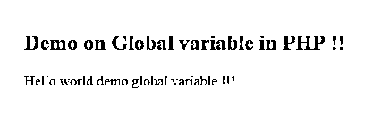
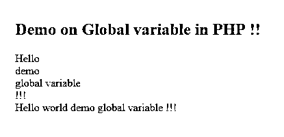

# PHP 全局变量

> 原文：<https://www.educba.com/php-global-variable/>

## PHP 全局变量的定义

在任何编程语言中，全局变量是那些在方法或函数外部声明的变量，它们也可以在函数内部声明。全局变量就像任何其他变量一样，但不同的是这个范围在应用中是全局的。如果我们将任何变量设为全局变量，那么我们可以从整个应用程序中访问该变量，这意味着可以在脚本内部或外部访问。全局变量在任何地方都以相同的方式运行，顾名思义，它们对其他资源是全局的。在下一节中，我们将更详细地讨论这个 PHP 全局变量。

**语法:**

<small>网页开发、编程语言、软件测试&其他</small>

它们可以像其他变量一样声明。但是要访问它们，我们需要遵循一些标准。首先，我们将看到如何在 PHP 中声明一个可以在应用程序的任何地方访问的全局变量。见下文；

`$variable = your_value;`

正如你在这里看到的，我们只需要定义变量名，但对于这一点，我们使用' $ '符号。在这之后，我们可以给我们想要的变量赋值。为了更好地理解，我们将看到一个练习语法，它可以在程序编码时使用；

**例如:**

`$demoVar = "hello i am global variable";`

### PHP 中全局变量是如何工作的？

现在我们知道全局变量是全局声明的，可以在应用程序的任何地方使用。这个变量和 PHP 中的其他变量一样。同样，这些变量也可以从函数内部或外部访问。正如我们之前讨论的，我们只是像声明其他变量一样声明它们，但是为了访问它们，我们需要遵循 PHP 定义的一些标准。所以这里我们将讨论如何在函数内部使用它们以及如何声明它们。为了更好地理解，我们将看到一个例子，让初学者更清楚地了解全局变量。但是在继续之前，我们将讨论它访问全局变量的一些属性，我们也将看到我们存储全局变量的位置。在 PHP 中，它维护一个数组，其中存储了我们在应用程序中定义的所有全局变量。通过使用这个数组，我们可以在脚本内外访问这个变量。让我们讨论一下全局变量的一些要点，以便在应用程序中使用它们(见下文);

#### 1)全局阵列

在 PHP 中，我们使用数组来访问这个全局变量。像任何其他编程语言一样，它在数组中维护全局变量的历史。如果我们想从数组中访问任何特定的元素或变量，那么我们必须传递变量的确切名称来访问它们。让我们看看它的语法，见下文；

**语法:**

`$GLOBALS['variable_name']`

正如你在上面几行代码中看到的，我们使用' $GLOBALS '关键字来访问它们，后跟方括号。在这个括号中，我们必须给出我们想要访问的变量名。为了更好地理解，让我们看一个练习示例，见下文；

**例如:**

`$GLOBALS['demovar']`

#### 2)在 PHP 的函数中访问它们

如果我们想访问任何函数或方法中的全局变量，那么我们可以使用' global '关键字。在提到变量名之后，我们可以在整个函数中使用它们，而不用 global 关键字。为了更好地理解，我们将看到一个在函数中使用它们的语法，见下文；

**语法:**

`global $demovar1, $demovar2, $demovar3, $demovar4;
echo $demovar1;`

正如你在上面的例子中看到的，我们使用了一个全局关键字来访问函数内部的变量。但是一旦定义了，我们就可以直接使用它们，而不用全局关键字。现在我们将看看在应用程序中使用全局变量的一些优点，如下所示:

在 PHP 中使用 global 关键字时，需要考虑以下几点:

*   如果你想定义一个全局变量，你可以使用“$”后跟你的变量名。
*   这个变量可以在函数内部或外部访问，但是要访问它们，我们必须使用“global”关键字。
*   我们通过使用维护应用程序中定义的所有变量的全局数组来访问任何东西内部的全局变量。
*   但是请记住，变量应该是唯一的，否则它会像任何其他编程语言一样被覆盖。
*   要直接从数组中访问变量，我们必须使用' $GLOBALS '关键字，后跟变量名，就像我们通过索引访问数组一样。
*   使用全局变量的优点是，我们可能需要在应用程序中的任何地方登录用户名，因此通过使用它，我们可以将它们存储到全局变量中，并且我们可以在应用程序时轻松地访问它们。这将节省内存并提供代码优化。

### 例子

在这个例子中，我们声明了一个全局变量，并试图打印和连接它们。简单的程序，适合初学者从 PHP 中的全局变量开始。

#### 示例#1

**代码:**

`<!DOCTYPE html>
<html>
<body>
<h2 style = " color :red ">Demo on Global variable in PHP !!</h2>
<?php
//decraring global variable
$demovar1 = "Hello  ";
$demovar2 = "world  ";
$demovar3 = "demo  ";
$demovar4 = "global variable  ";
$demovar5 = "!!!";
//printing result here
echo $demovar1.$demovar2.$demovar3.$demovar4.$demovar5;
?>
</body>
</html>`

**输出:**

#### 实施例 2

在本例中，试图使用数组从函数中访问全局变量。

**代码:**

`<!DOCTYPE html>
<html>
<body>
<h2 style = " color :red ">Demo on Global variable in PHP !!</h2>
<?php
//decraring global variable
$demovar1= "Hello  ";
$demovar2 = "world  ";
$demovar3 = "demo  ";
$demovar4 = "global variable  ";
$demovar5 = "!!!";
// decralrig function
function demoFuntionForglobal() {
echo $GLOBALS['demovar1']." ";
echo $GLOBALS['demovar3']." ";
echo $GLOBALS['demovar4']." ";
echo $GLOBALS['demovar5']." ";
}
demoFuntionForglobal();
//printing result here
echo $demovar1.$demovar2.$demovar3.$demovar4.$demovar5;
?>
</body>
</html>`

**输出:**

### 结论

通过使用全局变量，我们可以访问整个应用程序中的变量，当我们必须在整个应用程序中使用相同的值时，这些变量是有用的，例如用户名、密码和许多其他细节取决于需求。我们只需要在函数内部访问它们时遵循一些标准。

### 推荐文章

这是一个 PHP 全局变量的指南。这里我们讨论 PHP 全局变量的定义，全局变量如何在 PHP 中工作，并分别举例说明。您也可以看看以下文章，了解更多信息–

1.  [PHP 梁()](https://www.educba.com/php-strlen/)
2.  [PHP 异步](https://www.educba.com/php-async/)
3.  [PHP array_pop()](https://www.educba.com/php-array_pop/)
4.  [PHP 内爆](https://www.educba.com/php-implode/)

