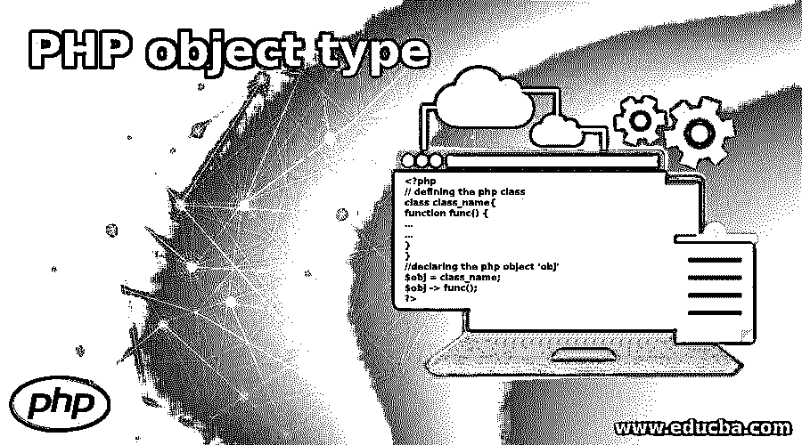
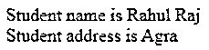
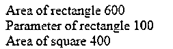

# PHP 对象类型

> 原文：<https://www.educba.com/php-object-type/>

## PHP 对象类型介绍

下面的文章提供了 PHP 对象类型的概要。对象是 Php 中存储数据的一种数据类型。它是由类定义的实例。为了创建对象，我们首先需要先定义类，然后可以为该类创建“n”个对象。这些对象继承了类的所有属性和行为，但是同一个类中的每个对象都有自己不同的值和属性，因此可以独立操作。对象还包含如何处理信息的信息。Php 中的对象是使用 new 关键字创建的。对象也称为实例。

**语法:**

<small>网页开发、编程语言、软件测试&其他</small>

下面给出了 Php 中对象类型声明和用该对象调用函数的基本语法:

`<?php
// defining the php class
class class_name{
function func() {
…
…
}
}
//declaring the php object ‘obj’
$obj = class_name;
$obj -> func();
?>`

### 不同的 PHP 对象类型

众所周知，变量保存不同数据类型的数据。Php 中的每种数据类型都有特定的角色。

Php 支持 9 种数据类型:

*   布尔代数学体系的
*   浮动
*   数组
*   目标
*   资源
*   空
*   线
*   整数
*   空

对于面向对象编程(OOPs)，任何程序员都必须理解它的基本概念。

这些基本概念包括:

*   班级
*   目标
*   方法
*   性能

首先，我们从 OOPs 中学到的是类。阶级不过是一张蓝图。它定义了需要执行的任务的实际布局。例如，为了找到像正方形、长方形、三角形这样的几何图形的面积，该类是“图形”。

对象是类的实例，可以存储该类的值和函数。一个类可以有很多对象，每个对象都有自己的属性，相互独立。在上面的类“Figure”中，可以分别创建正方形、长方形和三角形的对象，它们有自己的属性。

让我们看看使用对象时的基本情况:

#### 1.在 PHP 中创建一个对象

一旦完成了类的创建，就创建了该类的对象。一个类可以有一个或多个对象。Php 中的对象是使用“new 关键词。

下面给出了在 Php 中创建 Figure 类的“正方形”和“矩形”对象的基本例子。

`rect =  new Figure();
squ =  new FIgure();`

我们已经为类“Figure”的正方形和矩形分别创建了两个对象“rect”和“squ”。这两个对象是相互独立的，并且有它们自己的特定属性。

#### 2.使用对象调用成员函数

在创建了类及其对象之后，接下来要做的就是用这些创建的对象调用成员函数。

下面给出的是用对象调用成员函数的基本方法:

`rect -> getArea(20, 30);
squ -> getArea(20);
rect -> getParameter(20, 30);
squ -> getParameter(20);`

在上面的示例中，创建了两个参数化方法“getArea”和“getParameter”。为了访问这些方法，上面为矩形' rect '和正方形' squ '创建的对象与'--> '操作符一起使用。传递不同的参数 1 和 2，以便分别为正方形和矩形调用不同的函数。

#### 3.使用对象调用构造函数

构造函数是 Php 中的函数类型，在创建对象时会自动调用。程序员可以使用构造函数初始化东西。Php 提供了一个函数 __construt()来定义构造函数。使用构造函数可以很容易地传递参数。

下面给出了在 Php 中调用构造函数的基本示例:

`function __construct( $arg1, $arg2 ) {
$this->length = $length;
$this->breadth = $breadth;
}`

程序员不需要在单独的函数中设置值。这可以在对象创建时直接在构造函数中完成，类似于下面给出的例子。

`$rect = new Figure(20, 30);
$squ = new Figure(20, 20);`

程序员可以在创建对象时直接传递参数，而不是创建设置值的方法。像在对象中一样，“rect”值(20，30)直接在构造函数中传递。

### PHP 对象类型的例子

下面给出了 PHP 对象类型的例子:

#### 示例#1

`<!DOCTYPE html>
<html>
<body>
<?php
class Student {
public $name;
public $address;
//constructor for the values passed ‘name’ and ‘address’
public function __construct($name, $address) {
$this->name = $name;
$this->address = $address;
}
//function ‘display()’ to print the values
public function display() {
echo "Student name is ".$this-> name;
echo " ";
echo "Student address is ".$this ->address;
}
}
//Object declaration ‘stud_details’
$stud_details = new Student('Rahul Raj', 'Agra');
//calling the method ‘display’ using the object ‘stud_details’
echo $stud_details -> display();
?>
</body>
</html>`

**输出:**

#### 实施例 2

**代码:**

`<!DOCTYPE html>
<html>
<body>
<?php
// defining the class ‘Figure’
class Figure {
public $length;
public $breadth;
//defining the constructor using __construct() method
function __construct($length, $breadth) {
$this->length = $length;
$this->breadth = $breadth;
}
// defining the function ‘getArea’
function getArea() {
return $this->length*$this->breadth;
}
//defining the function ‘getParameter’
function getParameter() {
return (2*($this->length + $this->breadth));
}
}
//creating object ‘rect’ for rectangle and passing arguments in the constructor
$rect = new Figure(20,30);
$squ = new Figure(20, 20);
echo "Area of rectangle ";
//calling the member method ‘getArea’ using the object created
echo $rect->getArea();
echo " ";
echo "Parameter of rectangle ";
//calling the member method ‘getParameter’ using the object created
echo $rect->getParameter();
echo " ";
//calling the member method ‘getArea’ using the object created for ‘squ’ object
echo "Area of square ";
echo $squ ->getArea();
?>
</body>
</html>`

**输出:**

**

** 

### 结论

上面的描述清楚地说明了什么是 PHP 对象类型，以及它是如何在 PHP 程序中声明和使用的。PHP 中的所有方法、函数和类成员都是使用对象来访问的。PHP 中的一个类可以有很多对象，每个对象都有自己的属性。因为理解对象是一个重要的主题，所以在代码中使用它们之前，需要仔细深入地理解它们。

### 推荐文章

这是 PHP 对象类型的指南。在这里，我们分别讨论介绍、不同的 PHP 对象类型以及示例。您也可以看看以下文章，了解更多信息–

1.  [PHP 堆栈跟踪](https://www.educba.com/php-stack-trace/)
2.  [PHP 表单验证](https://www.educba.com/php-form-validation/)
3.  [PHP 附加文件](https://www.educba.com/php-append-file/)
4.  [PHP usort()](https://www.educba.com/php-usort/)

