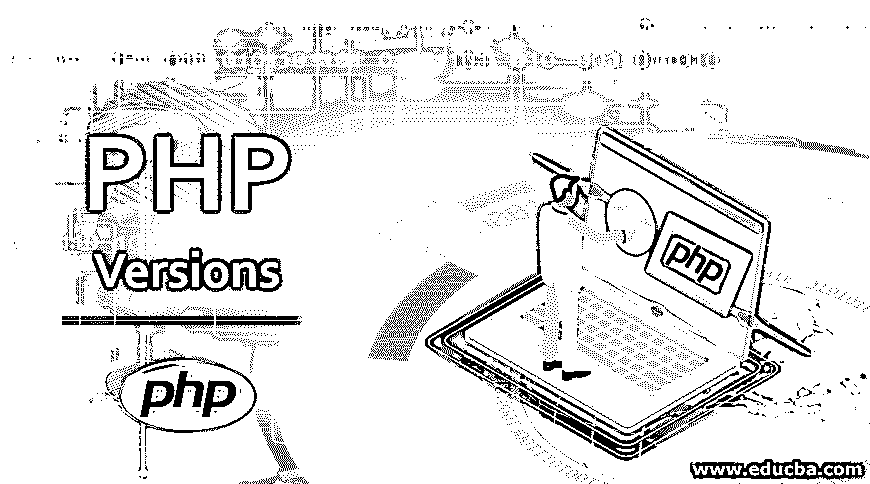
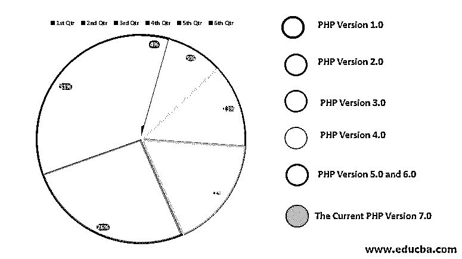

# PHP 版本

> 原文：<https://www.educba.com/php-versions/>

## PHP 版本介绍

PHP 是广泛使用的开源 web 开发脚本/编程语言，它的脚本中可以包含 HTML 代码。自从 1994 年第一个版本发布以来，已经发布了 5 个版本用于 PHP 升级。PHP 的六个版本分别命名为' PHP 1.0 版'，' PHP 2.0 版'，' PHP 3.0 版'，' PHP 4.0 版'，' PHP 5.0 和 6.0 版'，当前版本为' PHP 7.0 版'。

### 顶级 PHP 版本

下面给出了顶级 PHP 版本:

<small>网页开发、编程语言、软件测试&其他</small>

#### 1.PHP 版本 1.0

*   如前所述，PHP 开发始于 1994 年，由拉斯马斯·勒德尔夫开发。他用 C 作为脚本语言，写了几个[通用网关接口程序](https://www.educba.com/what-is-common-gateway-interface/)。
*   他最初用它们来维护他的个人主页。后来，他将这些代码规范扩展到 web 表单和数据库。这个升级的实现被称为个人主页或表单解释。
*   这个 PHP 的初始版本已经有了几个基本的功能。它具有表单处理能力、Perl 类变量以及处理 HTML 的能力。语法也类似于；然而，它更简单，但不一致。

#### 2.PHP 版本 2.0

*   PHP 的最初版本虽然不是很完善，但当它在 1995 年发布供公众使用时，受到了开发人员的广泛欢迎。
*   随着它越来越受欢迎，一个正式的开发团队成立了，致力于解决版本 1 的不一致性。
*   一旦不一致被克服，更新的语言在 1997 年作为版本 2 发布。

#### 3.PHP 版本 3.0

*   随着 PHP 越来越受欢迎，它吸引了 Zeev Suraski 和 Andi Gutmans 的注意。
*   1997 年，Zeev Suraski 和 Andi Gutmans 重写了 PHP 内部解析器，并形成了 PHP 3 的基本结构。PHP 3 的正式发布是在 1998 年 6 月公开测试完成之后。
*   后来，Suraski 和 Gutmans 开始重写核心 PHP，并在 1999 年生产了 Zend 引擎。这导致了 Zend Technologies 在以色列的成立。

#### 4.PHP 4.0 版

*   最后，在 2000 年，由 Zend Engine 1 驱动的 PHP 第 4 版发布供公众使用。
*   到了 2008 年，PHP 第 4 版已经进化到了 4.4.9。但是，安全更新不再支持它。

#### 5.PHP 版本 5.0 和 6.0

*   2004 年，这款车发布，搭载 Zend Engine 2。
*   它包括几个新的特性和对面向对象编程的更好的支持，PDO 扩展为程序员访问数据库提供了一个轻量级的接口。
*   它升级到了 5.6 版本。2018 年 12 月，官方对 PHP 安全的支持结束，但 Debian 继续提供安全支持，直到 2020 年。
*   当开发人员开始使用 PHP 5 开发应用程序时，人们意识到 PHP 5.0 对 Unicode 编码的支持不足，这导致开发人员社区对它的看法不一。
*   2005 年，Andrei Zmievski 负责克服这个障碍，并启动了一个项目，在整个 PHP 系统中嵌入 Unicode 支持。
*   为了实现这一点，他在基本 PHP 系统中加入了 ICU，即 Unicode 库的国际组件。随着这一变化，PHP 中的文本字符串在内部被表示为 16 位 Unicode 转换格式，即通常所说的 UTF–16。
*   当人们意识到 UTF–16 之间的转换也可能导致几个性能问题时，迁移部分完成，最终项目中途放弃。这个练习进一步强调了在 PHP 核心中嵌入 Unicode 支持的有效方法的重要性。
*   2010 年 3 月，PHP 版本 6.0 发布了非 Unicode 特性，比如 traits 和闭包绑定。这一更新让开发人员社区寄希望于高效的 Unicode 集成。

#### 6.当前版本 7.0

*   在 2016 年和 2017 年期间，PHP 经历了重大变化，更新发布为 PHP 7。为推出这一版本而选择的版本号必须面对几次争论。
*   尽管 PHP Unicode 项目还没有正式发布，但是一些书籍已经引用了它作为 PHP 版本 6。如果一个实际的版本也以版本 6 的形式发布，它将会在开发者社区中引起混乱。因此，决定将此更新发布为 7.0 版。
*   PHP 7 基于 phpng，phpng 代表 PHP 下一代。PHP 下一代是开发人员为了克服以前 PHP 版本的高性能限制而发起的。phpng 分支是 PHP 7.0 版本的基础分支。
*   PHP 7 确实提供了一些优化和性能改进。它还包括一个内置的缓存机制，以获得更好的性能。但是这些永远比不上 JIT 编译器所能提供的性能。
*   虽然 PHP 可以继续发展，但它也有某些缺点，因此可能不会吸引所有的开发人员。PHP 是一种开源代码语言，这意味着任何人都可以访问它的核心 ode 库，并找出不足之处加以利用。
*   由于这个弱点，PHP 网站被黑的概率比其他语言内置的要高。由于 PHP 不是非常模块化，所以它不是开发大型应用程序的理想语言。另外， [PHP 数据类型](https://www.educba.com/php-data-types/)可能会让新程序员感到惊讶。例如，字符串“1000”与“1e3”相同，因为它们都转换为浮点类型。

### 结论

如上所述，尽管存在不一致和性能问题，PHP 从第一次发布开始就在开发人员社区中非常受欢迎。它是一种易于使用的语言，它的创造者致力于继续 PHP 的发展来克服这些问题。尽管面临来自 Python 和 Java 等 PHP 同行的激烈竞争，PHP 的持续改进周期仍然让许多开发人员着迷于将 PHP 作为一种 web 开发语言。

### 推荐文章

这是 PHP 版本指南。在这里，我们讨论了基本概念和 6 大 PHP 版本及其详细解释。您也可以阅读以下文章，了解更多信息——

1.  [PHP 表单](https://www.educba.com/php-form/)
2.  [PHP 中的多维数组](https://www.educba.com/multidimensional-array-in-php/)
3.  [PHP 中的继承](https://www.educba.com/inheritance-in-php/)
4.  [PHP 中的函数](https://www.educba.com/functions-in-php/)

