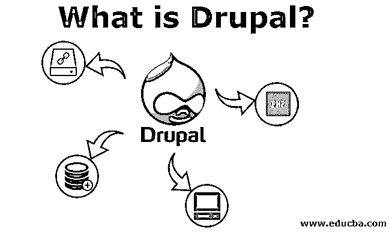
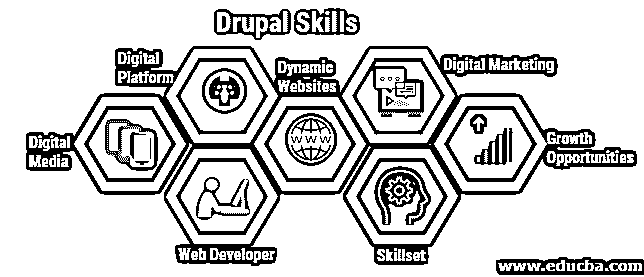

# Drupal 是什么？

> 原文：<https://www.educba.com/what-is-drupal/>

## Drupal 简介

Drupal 是在通用公共许可证(GNU)下发布的，它只不过是一个开源的内容管理框架。在这个竞争激烈的世界里，良好的数字体验不仅仅是外观，它已经成为一个区分市场的因素。近年来，在数字体验平台(DXP)的帮助下，全球公司正专注于创造更好的数字体验，通过网站、移动应用程序和许多其他方式与用户有效沟通和互动。

随着数字时代的到来，数字体验的作用、影响和作用已经获得了极大的尊重和关注。是用 [PHP 语言](https://www.educba.com/what-is-php/)编写的数字体验平台。从政府、公司、政治到个人博客，大约 2.3%的网站由 Drupal 后端框架支持。

<small>网页开发、编程语言、软件测试&其他</small>

### 谅解

它具有与任何其他内容管理系统相似的功能。有了它的帮助，人们可以轻松地开发各种复杂的大型网站。它包括菜单管理、帐户注册、系统管理、RSS 提要、分类和页面布局定制。它是一个 [web 应用程序框架](https://www.educba.com/what-is-web-application/)，可以作为单用户或多用户博客或网站。框架和网站安装的管理不需要编程技能。对于开发者来说，它提供了一个复杂的 API。

### 如何使用 Drupal？

与其他内容管理系统相比，它非常灵活。由于其基于 PHP 的模板，人们可以编辑或添加任何信息，而无需任何技术知识。能够运行 PHP 的 Web 服务器和存储配置和内容的数据库是运行 Drupal 的两个基本要求。

**Drupal 需要一个“堆栈”软件，如:**

*   软件服务器
*   软件数据库
*   解读 PHP 软件

Codebase 和 Database 是每个 Drupal 网站使用的两个代码集。人们下载 Drupal 时会得到文件和文件夹。这些文件夹和文件被称为代码库。这些文件管理和创建网站的所有内容。数据库存储内容。人们可以通过复制这些代码来复制或移动 Drupal 站点。有了 Drupal，上传很容易；在基于 web 的应用程序中编辑任何类型的内容。

### Drupal 有什么好处？

灵活性和简单性是 Drupal 区别于其他 CMS 的地方。其网站建设的模块化方法使需要简单性和灵活性的新来者易于理解。它充当用户的内容管理系统和内容管理框架。无论是网上商店还是新闻网站，只要组合合适的模块，就可以创建一个伟大的网站。从“多对多”到“一对多”,帮助用户创建内容并相互交流。从头开始设计，它可以将内容创建和网站管理委托给用户。定义用户权限后，每个人都可以开始在 Drupal 中协作。

与其他 CMS 相比，它非常容易安装。一个小时之内，您就可以创建一个 Drupal 站点，只需要很少的基于 web 的配置问题和 FTP 上传。人们可以在很短的时间内连接到数据库。有了内置的主题，人们可以随时开始添加内容。与其他 CMS 相比，操作和工作极其简单。由于 Twig 模板系统，我们可以在不需要任何原始 PHP 的情况下向网站添加动态内容。它有干净的生成标记，符合标准的 XHTML。

### 我们为什么要使用 Drupal？

*   通过内置的用户界面，它可以翻译系统中的所有内容。
*   使用 Drupal，人们可以将自己网站连接到其他网站和服务。
*   它不需要许可费用，因为它是开源软件。
*   它具有有效的显示质量，能够吸引读者。
*   人们可以将网站与不同的社交媒体平台连接起来，如 Twitter、脸书、Instagram 等。
*   它有许多定制的主题来创建一个有吸引力的网站。用户还可以通过使用基本主题来设计基于 web 的应用程序，从而创建自己的主题。
*   它管理 web 应用程序、社交媒体网站、信息网站和会员网站上的内容。

### 优势

*   使用 Drupal，人们可以向基于 web 的应用程序添加任何类型的内容，比如视频、文本、博客、实时统计、菜单处理等。
*   它内置了用于开发基于网络的应用程序的寺庙；因此，没有必要从头开始。
*   它有一个组织结构；在 Drupal 中很容易找到和重用内容。
*   借助 Drupal 内置的主题和模板，你可以创建一个吸引人的网站。
*   它有 700 多个插件。由于它是开源的，人们可以创建自己的插件。

### 不足之处

*   与其他 CMS 相比，它没有一个用户友好的界面。安装需要专业人员。
*   它与其他软件的兼容性较差，因为它是一个新的内容管理系统。
*   与其他内容管理系统相比，它在性能上有所欠缺。它需要一个强有力的互联来保证顺利工作。它还会给系统带来很大的服务器负载。

### 这项技术如何帮助你的职业发展？

它在全球以及印度的众多公司中广受欢迎。Drupal 网站在全球范围内的适应正在推动 Drupal 专业人员的增长。拥有 Drupal 技能和经验的专业人士在这个领域有很多机会。目前，超过一百万的网站和应用程序将 Drupal 作为他们的数字体验平台。它已经成为成千上万内容丰富、动态网站的首选。专业人士可以在数字媒体开发人员、网络开发人员、数字营销等领域大展拳脚。每个人学习不同技术的原因都不一样，但是学习这些肯定会增加你的技能，也会提供很多成长的机会。

### 结论

在上面的脚本中，我们提出了一些要点。本文详细介绍了它的用途、特性、优点和缺点。将 Drupal 作为一个数字体验平台，人们可以开发一个功能丰富、交互式的高质量网站，满足所有 web 需求。它帮助公司或个人在正确的时间将网络内容交付给正确的用户。组织或个人可以创建一个创新和动态的网站来吸引他们的访问者。有了基础知识，就可以轻松操作 Drupal。此外，还应该考虑到繁忙的流量和缓慢的互联网连接会严重影响 Drupal 网站。

### 推荐文章

这是一个什么是 Drupal 的指南？在这里，我们讨论了对 Drupal 的理解，它的优点、缺点，以及我们如何和为什么使用 Drupal。您也可以浏览我们推荐的其他文章，了解更多信息——

1.  [什么是汇编语言？](https://www.educba.com/what-is-assembly-language/)
2.  [Drupal 7 vs Drupal 8](https://www.educba.com/drupal-7-vs-drupal-8/)
3.  [什么是缓冲区溢出？](https://www.educba.com/what-is-buffer-overflow/)
4.  [Drupal 面试问题](https://www.educba.com/drupal-interview-questions/)

