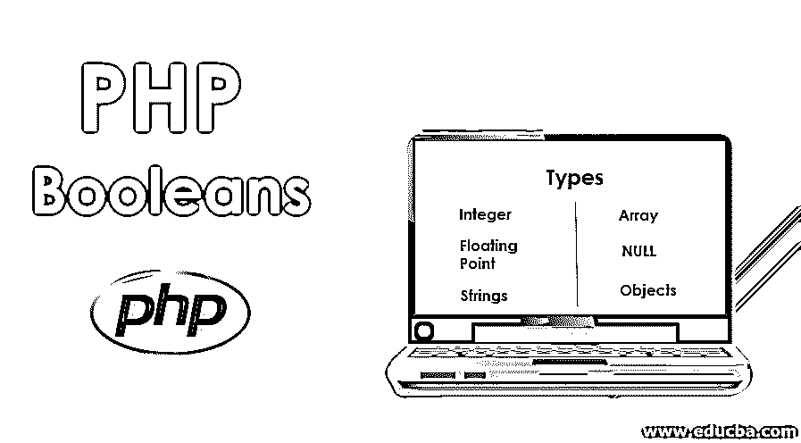
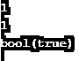

# PHP Booleans

> 原文：<https://www.educba.com/php-booleans/>




## PHP 布尔函数简介

在了解什么是 PHP 布尔之前，我们先了解一下什么是布尔？

Boolean 是一种数据类型，用于大多数计算机编程语言，如 Java、Python、C、PHP 等。它是一种有一个或两个可能值(真或假)的数据类型。意在表示逻辑和布尔代数的两个真值。根据条件，它会将其值设置为 1(真)或 0(假)。许多编程语言都使用这种数据类型来检查条件是否满足以及语句是否被执行。

<small>网页开发、编程语言、软件测试&其他</small>

**PHP Boolean**

在 PHP 中，布尔数据类型用于设置变量的值。它主要用于 If、While、for、Switch 等条件语句。这些条件和迭代命令主要是为了测试这些布尔值表达式而定义的。布尔值只返回两个值，即 true 或 false。因此，在条件语句中使用它来传递特定的条件，以执行与其对应的后续语句。

### PHP 布尔值的类型

让我们来看看不同类型的布尔值:

*   **Integer:** 该布尔值用于检查变量输出是否非零的条件。如果输出为零，则条件为假，语句将不会在循环中立即执行，而是跳过循环并执行进一步的语句。
*   **浮点**:该布尔值用于检查变量的输出是否为浮点数的情况，例如 0.0。如果输出非零，则条件为真，循环语句将被执行，如果输出为零，则循环内的语句将被跳过，并继续执行进一步的语句。
*   **字符串:**这个布尔值用来检查字符串是否为空**。**如果条件语句的输出为真，那么输出将是一个字符串值，循环内的语句将被执行。如果输出为 false，则输出为零字符串或空字符串。
*   **数组:**这个布尔值用来检查一个数组里面是否有元素。如果条件为真，那么它必须至少有一个元素，循环中的语句将被执行。如果条件为假，则输出必须是空数组，将跳过循环内的语句，并继续执行进一步的语句。
*   **NULL:** 这个布尔值用来检查变量的值是否为 NULL。如果变量一开始就被初始化为空，或者没有设置任何值，或者没有设置，那么变量的值将为空。如果条件为真，那么循环中的语句将被执行。如果输出为 false，它将跳过循环中的语句，并继续执行进一步的语句。
*   **对象:**该布尔值用于检查对象是否存在。如果存在，则条件为真，语句将被执行，而条件为假，则它将跳过循环中的语句，并继续执行进一步的语句。

### 布尔值是如何工作的？

布尔值只有 0 和 1，即不是真就是假。如果条件满足，则为真，否则为假。

#### 示例#1

让我们考虑简单的例子来理解布尔值是如何工作的。

**代码:**

```
<?php
$selling_price = 75.5;
$cost_price =50;
if ($selling_price == 0)
{
echo "The selling price should be a non zero";
}
else
{
echo "The selling price is $selling_price";
}
?>
```

**输出:**


在上面的例子中，输出是非零的。因此，if 语句里面的语句不被执行。

#### 实施例 2

让我们再举一个字符串布尔值的例子:

**代码:**

```
<?php
$a="Leela";
$b="Swamy";
if ($a)
{
echo "The name of the person is ".$a.$b;
}
else
{
echo "The string is empty";
}
?>
```

**输出:**


在上面的示例中，名称是非空的，也没有使用比较运算符。PHP 自动转换该值，并将其设置为布尔值 true。所以这些语句将在 if 语句中执行。

#### 实施例 3

我们再举一个例子:

**代码:**

```
<?php
$var=NULL;
$var1=500;
if ($var == NULL)
{
$var=$var1;
echo "The value of var is $var";
}
?>
```

**输出:**


在上面的例子中，$var 变量已经被初始化为 null。因此，条件变为真，循环中编写的语句被执行，并将值设置为 500。

#### 实施例 4

函数 is_bool()可用于检查变量是否包含布尔值。is_bool()是 PHP 中的一个内置函数。它是一个布尔函数，所以当值为布尔值时返回 TRUE，否则返回 FALSE。我们举个简单的例子。

**代码:**

```
<?php
$a=TRUE;
$b=FALSE;
echo $a.'<br>';
echo $b.'<br>';
echo is_bool($a).'<br>';
echo is_bool ($b).'<br>';
?>
```

**输出:**


在上面的例子中，函数 is_bool()的输出将是 0 或 1。在本例中，输出将为 1，在中断后也将为 1。它只是检查是否为变量设置了布尔值，在本例中，两个变量都已初始化为布尔值。

#### 实施例 5

类似于 is_bool()函数，我们有一个名为 var_dump()函数的函数来打印类型和值作为输出。该函数用于打印与开发人员想要在屏幕上打印的变量相关联的数据类型。

**代码:**

```
<?php
$a = true;
echo $a.'<br>';
echo is_bool($a).'<br>';
var_dump($a).'<br>';
?>
```

**输出:**




在上面的例子中，is_bool()函数和 var_dump 函数()的输出是不同的。var_dump()函数将打印数据类型以及变量的值。

### 结论

在本文中，我们讨论了布尔值及其类型。许多布尔类型在许多程序和应用中使用。布尔值在许多编程语言中起着至关重要的作用，尤其是在 PHP 中，我们使用 cookies 和 sessions 来检查它们是已设置还是未设置。

### 推荐文章

这是一个 PHP 布尔的指南。在这里，我们讨论不同类型的 PHP 布尔值的基本概念，它与例子和代码实现一起工作。您也可以阅读以下文章，了解更多信息——

1.  [PHP 中的回文](https://www.educba.com/palindrome-in-php/)
2.  [PHP 中的抽象类](https://www.educba.com/abstract-class-in-php/)
3.  PHP 中的[对象](https://www.educba.com/object-in-php/)
4.  [PHP 字符串操作符](https://www.educba.com/php-string-operators/)


