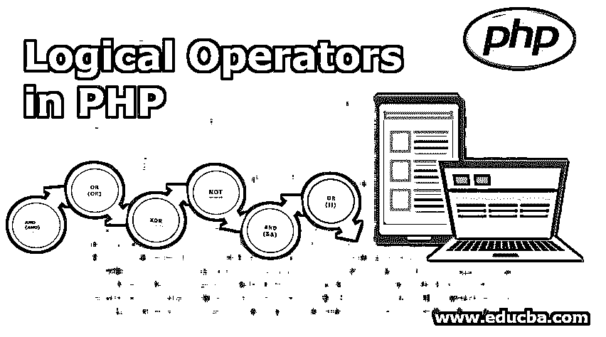
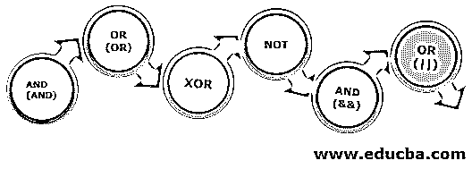

# PHP 中的逻辑运算符

> 原文：<https://www.educba.com/logical-operators-in-php/>




## PHP 中逻辑运算符的介绍

PHP 操作符是有助于轻松进行逻辑运算的符号。用这些操作符生成的代码有助于执行一些特定的操作。逻辑运算符包括加法(+)、大于(>)等运算符。这些指令指示编译器执行必要的操作。它可以检查多个操作，然后确定哪些条件为真。特定运算符使用的值称为操作数。运算符与函数不同，尽管有时它们可以用作函数。

### PHP 中的逻辑运算符

现在让我们详细研究一下逻辑运算符。我们有六种逻辑运算符。它们如下:

<small>网页开发、编程语言、软件测试&其他</small>




PHP 也有逻辑操作符来帮助组合条件语句。仅举几个例子，它们是 AND、OR、NOT 等。

#### 1.和(和)

如果比较的两个变量都为真，AND 运算符返回 true。

```
<?php
$x = 100;
$y = 50;
if ($x == 100 and $y == 50) {
echo "AND is true";
}
?> 
```

**输出:**


作为一个例子，我们可以用水龙头和水来类比。当两个水龙头都不工作时，水就不会顺着水龙头流下来。这意味着如果两个条件都不满足或为假，那么结果将为假或 0。类似地，如果只有一个龙头关闭，并且水位线相同，则当管道关闭时，水不一定会流动。

这意味着即使一个条件为真，结果也将为假或 0。最后一种情况是，当两个水龙头都开着，并且两个水龙头的水管相同时，水将流过水龙头，因此条件将为真。

#### 2.或(或)

以类似的方式，如果任一条件为真，OR 运算符也起作用。

```
<?php
$x = 100;
$y = 50;
if ($x == 100 or $y == 80) {
echo "XOR is TRUE";
}
?> 
```

**输出:**


OR 运算可以用有三个汇的方式来解释。每个水槽有两个水龙头。并非所有对的接收器都不同，场景将如前面所述。第一种情况是没有水龙头打开，这意味着没有水。这解释了 False 或 0 的情况。第二种情况是其中一个龙头打开。这意味着有水从一个水龙头流出。这个场景帮助您理解，如果两个条件中的任何一个为真，那么结果为真。第三种情况是两个龙头都打开。水将从两个水龙头流出。这解释了当两个条件都为真时，它将返回真。

#### 3.异或运算

当变量或为真，而不是两者都为真时，XOR 条件返回真。

```
<?php
$x = 100;
$y = 50;
if ($x == 100 xor $y == 80) {
echo "XOR here!";
}
?
```

**输出:**


#### 4.不

当需要检查特定变量是否为真时，使用 NOT 运算符。这意味着当我们必须检查任何条件是否为真时，我们可以使用 NOT。

```
<?php
$x = 100;
if ($x !== 90) {
echo "NOT is here";
}
?>
```

**输出:**


在本例中，您可以看到我们正在检查变量是否不是 90。变量 x 是 100，显然满足 NOT 条件。因此，我们的输出符合指定的条件，因此您会看到输出为“NOT is here”

#### 5.与和

这类似于我们之前看到的和。只有当两个条件都为真，或者两个变量都为真时，它才会返回值为真。

```
<?php
$x = 100;
$y = 50;
if ($x == 100 && $y == 50) {
echo "&& is true!";
}
?> 
```

**输出:**


#### 6.或者||

类似的行 OR 条件也与上面提到的 OR 相同。即使指定的条件之一为真，该运算符也能工作。它的结果与前面提到的 tap 示例相似。或者有三个不同的水槽，即使只有一个水龙头开着，也能注满水槽。

```
<?php
$x = 100;
$y = 50;
}
if ($x == 100 || $y == 80) {
echo "OR is true!";
}
?> 
```

**输出:**


在上面的示例中，变量 x 满足为$x=100 指定的条件，因此当结果为真时，结果显示消息。虽然这里变量 y 的条件没有得到满足，但输出还是显示出来了。这是因为即使满足一个条件，OR 条件也会起作用。

### 结论

PHP 有许多逻辑操作符，这使得它很容易使用。PHP 编译器帮助快速编译这些操作符。[逻辑运算符有助于执行](https://www.educba.com/sql-logical-operators/)逻辑运算。这些可以是算术运算、逻辑运算、字符串运算或数组运算。PHP 有一个执行所有这些操作的工具。它有助于同时检查多个条件。这节省了时间，并增加了 PHP 编译器的优化。因此，建议在使用 PHP 时使用这些操作符。因此，逻辑运算符有助于轻松完成逻辑运算。因此，这些条件有助于您获得布尔结果，并对其进行相应的处理。

### 推荐文章

这是 PHP 中逻辑运算符的指南。这里我们讨论 PHP 中逻辑运算符的基本概念和不同类型。您也可以看看以下文章，了解更多信息–

1.  [PHP 操作符](https://www.educba.com/php-operators/)
2.  [PHP 数组搜索](https://www.educba.com/php-array-search/)
3.  [PHP substr_replace()](https://www.educba.com/php-substr_replace/)
4.  [PHP 加密](https://www.educba.com/php-encryption/)


