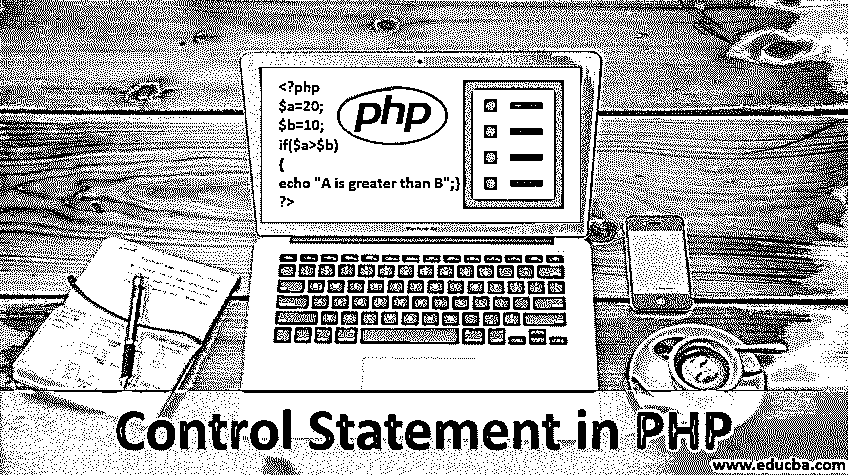
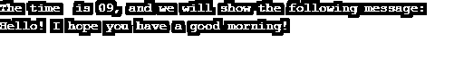

# PHP 中的控制语句

> 原文：<https://www.educba.com/control-statement-in-php/>




## PHP 中控制语句的介绍

控制语句是所有现代编程语言的基本组成部分，如 PHP、Java、Python、Go、Ruby、NodeJS。这些控制语句[允许软件开发者](https://www.educba.com/career-as-a-software-developers/)和架构师决定他们开发的软件或程序在不同条件下将如何运行。例如，在一个电子商务平台上，开发人员希望同一个系统对于不同的用户角色(如买家和卖家)表现不同。这种不同的行为只能通过控制语句来实现。

### PHP 中不同的控制语句

像所有其他语言一样，PHP 提供了一些控制语句，使开发人员能够开发不同的逻辑在不同的条件下执行。PHP 核心包括控制语句:

<small>网页开发、编程语言、软件测试&其他</small>

1.  如果
2.  if.else
3.  if.else..如果
4.  交换语句

让我们详细看看这些控制语句，并通过示例理解它们的实现。

#### 1.PHP 中的 IF 语句

PHP 中的 IF 语句是该语言中最简单的控制语句。IF 条件作用于基于特定条件评估的布尔值，并且仅当条件满足或为真时，它才用于执行特定的代码行。提供给 if 语句的条件[首先进行评估，根据评估结果，生成假值或真值，并基于此生成代码，IF 条件块是否在程序流中被执行或跳过。](https://www.educba.com/if-statement-in-shell-scripting/)

让我们浏览一下 if 语句的语法，以便更好地理解它:

```
if (my_condition) {
code to execute if the condition supplied is true;
}
```

如上所示，if 语句要求()圆括号中的条件应该被求值。在花括号中，{}我们提供了应该执行的代码规范。

让我们看下面的例子:

**代码:**

```
<?php
$a=20;
$b=10;
if($a>$b)
{
echo "A is greater than B";
}
?>
```

**输出:**


#### 2.PHP 中的 IF-ELSE 语句

如前所述，IF 语句提供了非常基本的程序控制。IF-ELSE 语句通过定义两个代码块进一步增加了 IF 语句的复杂性；一个在条件为真时执行，另一个在条件评估为假时执行。自然地，由于条件可以评估为 true 或 false，IF 中的代码块或者 ELSE 下的代码块都将执行。在任何情况下，两个块都不会并行执行。

下面让我们回顾一下它的语法:

```
if (condition top evaluate) {
code to executed if the condition supplied is true;
}
else
{
code to execute if the condition supplied is false;
}
```

让我们通过一个例子来理解它的实现:

**代码:**

```
<?php
$a=20;
$b=10;
if($a>$b)
{
echo "A is greater than B";
}
else
{
echo "B is greater than B";
}
?>
```

**输出:**


现在，当$a 和$b 的值在上面的代码中交换时，如下所示:

**代码:**

```
<?php
$a=10;
$b=20;
if($a>$b)
{
echo "A is greater than B";
}
else
{
echo "B is greater than A";
}
?>
```

**输出:**


#### 3.PHP 中的 IF–ELSE–IF 语句

有时可能需要一起使用多个 if 条件，在这种情况下，我们可以使用多个 if-else 语句的组合。只要满足我们的要求，我们可以将几个 if-else 语句组合在一起工作。

if-else if 组合语句的语法如下:

```
If (condition1)
{
Code to execute;
}
elseIf(condition2)
{
Code to execute if condition 2 is met;
}
Else
{
Code to execute if condition1 and condition2 are not met;
}
```

让我们通过一个例子来更好地理解这一点:

**代码:**

```
<?php
$t = date("H"); //collecting the date from server
echo "The time  is " . $t;
echo ", and we will show the following message:";
echo "\n";
if ($t < "10") {  //condition 1
echo "Hello! I hope you have a good morning!";
} elseif ($t < "20") { //condition 2
echo "Hello! I hope you have a good day!";
} else {
echo "Hello! I hope you have a good night!";
}
?>
```

**输出:**




#### 4.PHP 中的 Switch 语句

switch 语句或通常称为 Switch 循环是同时处理多个条件的非常有效的方法。它允许我们实现与 if-else if 和 else 相同的功能，但可以用更少的代码行来实现。

**语法:**

```
switch (condition) {
case value1:
code to be executed if n=label1;
break;
case value 2:
code to be executed if n=label2;
break;
case value 3:
code to be executed if n=label3;
break;
...
default:
code to be executed if n is different from all labels;
}
```

Switch 语句首先评估“条件”，然后执行具有相应标签值的块中的代码。如果标签值都不符合条件，它将执行默认块中的代码。

现在，让我们通过下面的实际例子来理解 switch 语句的流程:

**代码:**

```
<?php
$myfavsport = "cricket";
switch ($myfavsport) {
case "cricket":
echo "Your favorite sport is cricket!";
break;
case " football":
echo "Your favorite sport is football!";
break;
case "throwball":
echo "Your favorite sport is throwball!";
break;
default:
echo "Your favorite sport is neither cricket, football or throwball!";
}
?>
```

**输出:**


### 结论

借助上面的例子，我们可以理解 PHP 中不同的控制语句是如何工作的。开发人员可以根据他们想要在代码中定义的逻辑流来选择控制语句。控制语句是软件系统的定义块。语言提供的控制应用程序的执行和逻辑流程的控制语句越好，就越适合构建复杂的软件。

### 推荐文章

这是 PHP 中控制语句的指南。在这里，我们讨论了 PHP 的不同条件，并举例说明了它的代码实现。您也可以阅读以下文章，了解更多信息——

1.  [PHP 中的函数](https://www.educba.com/functions-in-php/)
2.  [PHP 开关语句](https://www.educba.com/php-switch-statement/)
3.  [PHP 中的静态方法](https://www.educba.com/static-method-in-php/)
4.  [PHP 中的访问修饰符](https://www.educba.com/access-modifiers-in-php/)


