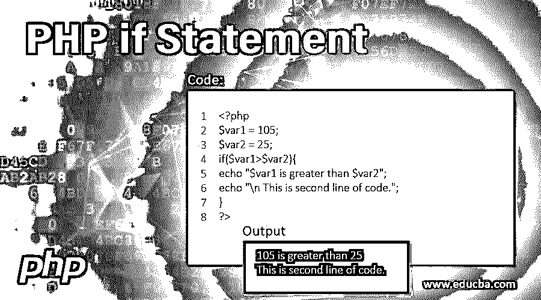

# PHP if 语句

> 原文：<https://www.educba.com/php-if-statement/>




## PHP if 语句介绍

PHP 编程语言有一些基本特性来实现复杂的事情，如果语句是其中之一的话。这是任何编程语言的基本构件之一。每当我们谈论一些有条件的事情时，我们需要有 if-else 来完成工作。是的，你没看错，根据业务需求，它后面可以跟 else。使用这个 if 语句，我们可以比较两个或更多的东西，并在结果的基础上，我们可以执行进一步的选择。如果不使用 if-else 语句，我们就无法假设任何应用程序。

### PHP if 语句的语法

使用这个 if 语句有各种方法，我们将看到所有关于它的语法和位描述。

<small>网页开发、编程语言、软件测试&其他</small>

#### 1.使用单行 if 语句

**语法:**

```
if (expression)
statement
```

if 是我们在 PHP 语言中可以说的关键字，就像任何其他编程语言一样。该表达式是一个条件语句。该语句只是一条指令，当 if 条件为真时将被执行。不需要为语句的一行使用大括号。

#### 2.使用多行 if 语句

**语法:**

```
if (expression){
statement 1
statement 2
}
```

这个和上面那个唯一的区别是我们在这个里面有大括号。当我们需要执行多行语句时，我们可以使用这些大括号。

#### 3.一起使用 if else 语句

**语法:**

```
if (expression){
statement 1
statement 2
}
else{
statement 1
}
```

我们可以一起使用 if 和 else 来轻松处理业务需求。其他什么都不是，但它只是一个案例。一旦 if 部分为假，将执行 else 部分。在 if 的情况下，表达式为 true，否则不会被执行。

#### 4.多个 if 语句

**语法:**

```
if (expression 1){
statement 1
statement 2
}
if (expression 2){
statement 3
statement 3
}
if (expression 3){
statement 4
}
```

我们也可以在编程代码或应用程序中使用多重 if。这将帮助我们检查或验证多重表达式，我们可以为这些不同的 if 表达式编写不同的语句。在上面的例子中，每个 if 都将被逐个检查。如果我们只想根据给定的表达式执行一个条件，这不是理想的情况。我们可以以不同的方式使用这个 if，使用 else if 关键字来处理这个问题。

#### 5.使用 else if 语句

**语法:**

```
if (expression 1){
statement 1
statement 2
}
else if (expression 2){
statement 3
statement 3
}
```

在这种情况下，如果第一个表达式为 true，那么下一个表达式 else-if 将被程序跳过。我们也可以在 else if 表达式和语句的末尾使用 else。

#### 6.三元 if else 语句

**语法:**

```
$var = (5 > 2 ? "This will be printed in case of true": "false");
```

现在，对于开发者来说，如果他们有一个比较和一小段代码，这就是趋势。我们可以说这种比较是处理这种情况的一种内联方式。

### PHP 中 if 语句如何工作？

这个 if 和 else 的工作只是一个基本的现实生活中基于条件的东西。如果我们做某事，我们会得到一些东西，如果不做，我们将一无所获。这意味着如果任何一个表达式为真，那么该条件下的代码将被执行，否则将被执行。如果我们看到 PHP 语言中的各种 if-else 语法。现在是时候开始将例子使用上面提到的语法了。

#### 示例 1–单行 if 语句

**代码:**

```
<?php
$var1 = 105;
$var2 = 25;
if($var1>$var2){
echo "$var1 is greater than $var2";
}
?>
```

**输出:**


#### 示例 2–多行 if 语句

**代码:**

```
<?php
$var1 = 105;
$var2 = 25;
if($var1>$var2){
echo "$var1 is greater than $var2";
echo "\n This is second line of code.";
}
?>
```

****输出:****


#### 示例 3–一起使用 if else

**代码:**

```
<?php
$var1 = 10;
$var2 = 20;
if($var1>$var2){
echo "$var1 is greater than $var2";
}else{
echo "$var2 is greater than $var1";
}
?>
```

****输出:****


#### 示例 4–多个 if 语句

**代码:**

```
<?php
$var1 = 10;
$var2 = 20;
if($var1>$var2){
echo "$var1 is greater than $var2";
}
if($var2>$var1){
echo "$var2 is greater than $var1";
}
?>
```

**输出:**


#### 示例 5–使用 else if

**代码:**

```
<?php
$var1 = 10;
$var2 = 20;
$var3 = 65;
if($var1>$var2){
echo "$var1 is greater than $var2";
}
else if($var2>$var1){
echo "$var2 is greater than $var1";
}
else if($var3>$var1){
echo "$var3 is greater than $var1";
}
else if($var3>$var2){
echo "$var3 is greater than $var2";
}
?>
```

****输出:****


我们可以看到，有其他条件为真，但当第一个条件匹配时，它的输出是给定的。是的，在多个 if 和 else-if 组的情况下，第一个 true 语句将被执行，其余的将被跳过。因此，开发人员或程序员应该非常小心地使用这个条件。如果我们不注意使用这类语句，那么在任何应用程序中都会导致严重的问题。

#### 示例 6–三元 if else

**代码:**

```
<?php
$var1 = 15;
$var2 = 25;
$greater_val = ($var1 > $var2 ? "$var1 is greater than $var2" : "$var2 is greater $var1");  // use of ternary if
echo $greater_val;
?>
```

****输出:****


### 结论

每当我们在编程代码中需要决策时，我们都应该使用 if else 语句。我们可以使用三元 if else 来获得一个小而快速的基于 if else 条件的解决方案。任何组织或个人都应该根据自己的业务需求使用最佳方案。

### 推荐文章

这是一个 PHP if 语句指南。这里我们讨论 PHP if 语句的介绍和不同的语法，以及例子和代码实现。您也可以阅读以下文章，了解更多信息——

1.  [PHP 中的公共函数](https://www.educba.com/public-function-in-php/)
2.  [PHP 中的日历](https://www.educba.com/calendar-in-php/)
3.  [PHP 中的日期函数](https://www.educba.com/date-function-in-php/)
4.  [C 中的 Else if 语句？](https://www.educba.com/else-if-statement-in-c/)


