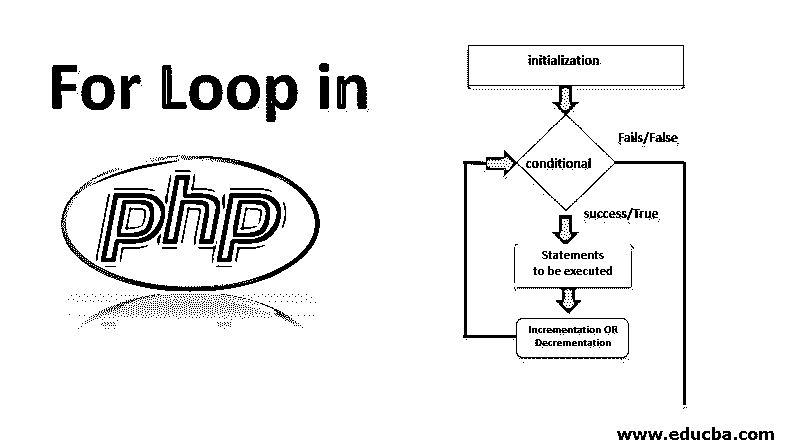
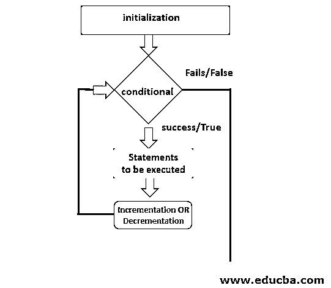
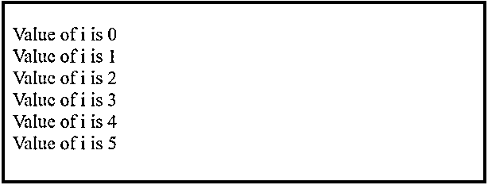
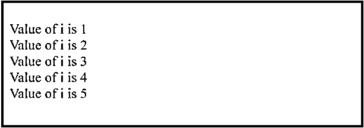
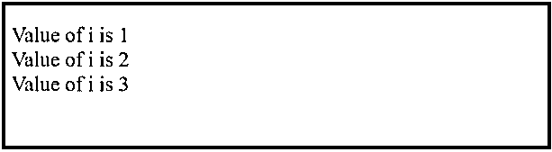
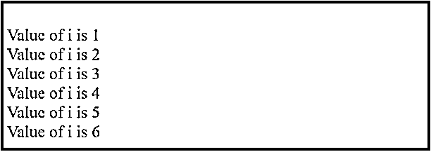
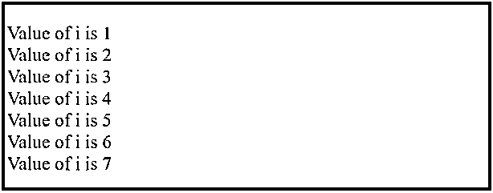
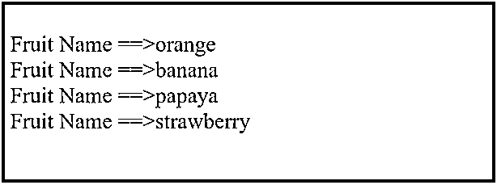
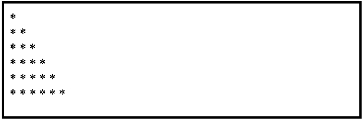
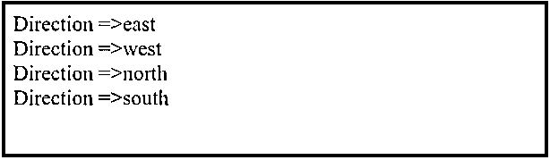

# PHP 中的 For 循环

> 原文：<https://www.educba.com/for-loop-in-php/>




## PHP 中 For 循环的介绍

PHP 中的循环用于重复执行一项任务。[中的 For 循环 PHP 有多种形式](https://www.educba.com/what-is-php/)。For 循环与任何其他循环一样循环多次，例如。While 循环。While 循环和 for 循环执行基于条件的代码块。当预先知道一个特定的代码块应该执行这个次数时，比如说 5 次，我们使用 for 循环。而只要所述条件满足，就使用 while 循环。类似的还有 do-while 循环，当我们不知道循环应该执行多少次，但知道至少应该执行一次时，我们就使用 do-while 循环。类似地，其他循环也是如此。

For 循环包含不同的表达式。这些表达式可以是初始化，也可以是条件等。

<small>网页开发、编程语言、软件测试&其他</small>

for 循环包含后跟分号的表达式，语法如下。

**语法**

```
for(initialization; condition; increment/decrement) {
///statements to be executed
}
```

**其中:** for 循环是包含代码的块

**初始化:**是声明和赋值或初始化变量所用的值，它保存一个整数值

**条件:**为了使循环工作，首先检查并评估该条件，如果为真，则循环进一步执行。

**递增/递减**:增加/减少循环迭代的变量值。

**流程图**




### For 循环是如何工作的？

首先，对变量的初始化进行评估。第二，用循环条件检查每次迭代，如果为真，执行将继续，并且代码块或语句将执行。如果检查的条件不为真，即假，则循环结束，没有代码块或要执行的语句。最后，初始化变量的递增和递减是在执行上述语句之后完成的。

#### PHP 中 For 循环的例子

下面举几个例子

##### 示例#1

请记住，在下面的程序中，I 的值被初始化为 0，因此，使用 echo 打印$i 变量，我们得到从 0 开始的值，并继续打印到 5，因为条件是打印到值 5。

```
<?php
//example to demonstrate simple for loop
for($i=0; $i<=5;$i++) {             // declaring variable i, condition , incre/decr
echo '<br>';                                        // line break
echo 'Value of i is '. $i;  //printing the value of variable i
}
?>
```

**输出:**




##### 实施例 2

在下面的程序中，I 的值被初始化为 1，因此，使用 echo 语句打印$i 变量，我们得到从 0 开始的值，并继续打印到 5，因为条件是打印到值 5。

这里，变量 I 的初始化不在 for 循环中，而是在程序开始时的 for 循环之外。

```
<?php
//example to demonstrate for loop
$i=1;                                                                 // declaring variable i
for(; $i<=5;$i++) {                                        //  condition , increment and decrement
echo '<br>';                                        // line break
echo 'Value of i is '.$i;                  // printing the value of variable i
}
?>
```

**输出:**




##### 实施例 3

在这个程序中，包含条件的表达式没有在 for 循环语句中提到，而是在 for 循环中，就像 if($i == 4)后面跟随着 break 语句的[一样。](https://www.educba.com/break-statement-in-javascript/)

迭代时，如果$i 值达到值 4，控件将跳出 for 循环。

```
<?php
//example to demonstrate for loop
for($i=1; ;$i++) {          // declaring variable i , increment and decrement
if($i == 4) {                             // condition
break;
}
echo '<br>';                                        // line break
echo 'Value of i is '.$i;  // printing the value of variable i
}
?>
```

**输出:**




##### 实施例 4

在这个程序中，在打印 I 变量的值以继续迭代之后，在 for 循环中提到增量和减量。

```
<?php
//example to demonstrate for loop
for($i=1;$i<=10;) {          // declaring variable i declaring  condition
if($i == 7) {
break;
}
echo '<br>';                                          // line break
echo 'Value of i is '.$i;                     // printing the value of variable i
$i++;                                                     // increment and decrement
}
?>
```

**输出:**




##### 实施例 5

**在这个程序中，for 循环不包含任何表达式，但有不同的说法。**

```
<?php
//example to demonstrate for loop
$i=1;                                                               // declaring variable i
for(;;) {
if($i == 8) {                                         // declaring  condition ,
break;
}
echo '<br>';                                        // line break
echo 'Value of i is '.$i;                     // printing the value of variable i
$i++;                                                   // increment and decrement
}
?>
```

**输出:**




##### 实施例 6

在下面的程序中，我们使用 for 循环来迭代数组。我们可以使用 for [和 foreach 循环](https://www.educba.com/powershell-foreach-loop/)进行迭代。此外，这里使用的数组可以是类似数组的[索引数组](https://www.educba.com/indexed-array-in-php/)、[关联数组](https://www.educba.com/associative-array-in-php/)。

水果是一个数组，我们使用 count 函数计算数组的长度，得到数组的长度，即 4，因此 for 循环将相应地迭代并打印水果的名称。

```
<?php
//example to demonstrate for loop for array
$fruits = array('orange', 'banana', 'papaya', 'strawberry');
$count = count($fruits);
for($i=0; $i<$count; $i++) {
echo '<br>';
echo 'Fruit Name ==>'.$fruits[$i];
}
?>
```

**输出:**




##### 实施例 7

在这个程序中，for 循环用于打印星形图案，

```
<?php
//example to demonstrate star pattern using for loop
for($i=0;$i<=5;$i++)
{
for($j=0;$j<=$i;$j++) {
echo " * ";
}
echo "<br/>";
}
?>
```

**输出:**




##### 实施例 8

在下面的程序中，foreach 循环用于循环遍历一个水果循环。

```
<?php
//example to demonstrate array using foreach loop
$directions = array('east','west','north', 'south');
foreach($directions as $key=>$value) {
echo 'Direction =>'. $value.'<br/>';
}
?>
```

**输出:**




### 结论–PHP 中的 For 循环

在本文中，我们学习了 for 循环、流程图的语法、PHP 中循环的工作方式以及类似 foreach 循环的相关循环。我们还学习了循环是如何正常迭代的，以及它是如何遍历数组的，我们还学习了循环的[是如何使用](https://www.educba.com/for-loop-in-unix/)来打印星形模式的。希望这篇文章对你有所帮助。

### 推荐文章

这是一个 PHP 中 For 循环的指南。这里我们用流程图讨论 PHP 中 For 循环的例子以及它是如何工作的。您也可以阅读以下文章，了解更多信息——

1.  [PHP 中的会话](https://www.educba.com/sessions-in-php/)
2.  [PHP 中的回文](https://www.educba.com/palindrome-in-php/)
3.  [PHP 开关语句](https://www.educba.com/php-switch-statement/)
4.  [PHP 编译器](https://www.educba.com/php-compiler/)


