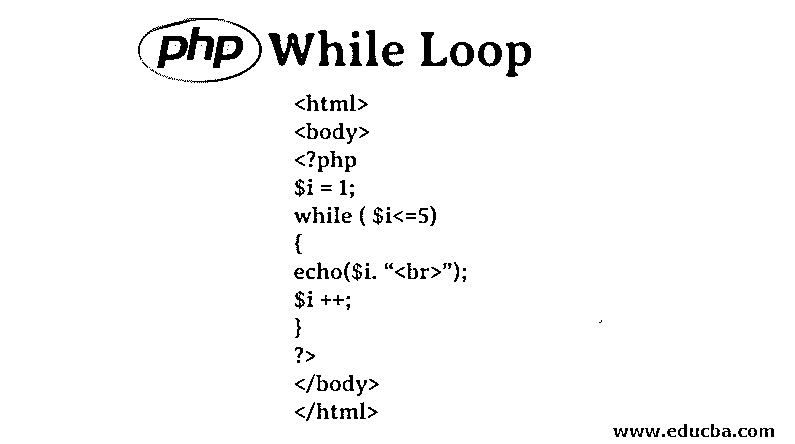
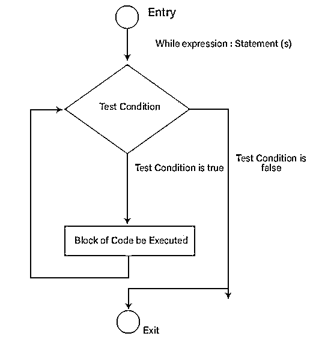
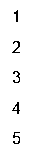

# PHP While 循环

> 原文：<https://www.educba.com/php-while-loop/>




## PHP While 循环简介

任何编程语言中使用的循环都是根据预期的输出多次运行相同的代码行或语句块。代码块应该执行的次数在循环中指定，以便从循环中退出。就像大多数编程语言使用不同的循环一样， [PHP 也支持](https://www.educba.com/php-constants/)循环，基本上有四种类型的循环:

1.  For 循环
2.  While 循环
3.  Do-while 循环
4.  For-each 循环

这些循环通常在语法和执行方式上有所不同。

<small>网页开发、编程语言、软件测试&其他</small>

**例**:在循环中，我们必须指定代码块在开始时执行的次数，而在 while 循环中，我们通常指定条件，在它下面提到的条件块将被执行，直到所提到的条件成立。现在，如果我们以 do-while 循环为例，在 do-while 循环中，在代码行的末尾检查条件，因此即使条件为假，do-while 循环也将至少运行一次。然而，在[for-each 循环](https://www.educba.com/for-each-loop-in-java/)中，针对数组中的每个元素运行代码块，直到数组中不再有元素。

### 什么是 While 循环？

While 循环通常被称为入口控制循环。这是因为，只要 While 循环开始时给出的测试表达式为真，While 循环中编写的代码就会被严格执行。如果测试表达式为真，则执行代码。现在，在第二次迭代中，再次检查条件。如果上述条件仍然成立，则第二次执行代码。相同的过程将继续发生，直到测试表达式为假，然后我们从循环中退出。

**语法**

while 循环的语法是:

```
while (TEST CONDITION){
//block of statements
}
```

**Note:** The test condition is a boolean expression which is either true or false. The execution of the code block depends on the result of the output of this boolean expression.

### 什么时候使用 PHP While 循环？

虽然可以随时使用循环，但是需要执行一段代码，直到满足给定的条件。当使用一些查询从数据库中读取记录时，While 循环也非常流行。

### PHP While 循环的流程图

while 循环中的执行流程并不复杂。使用下面显示的非常基本的流程图可以理解这一点。




### PHP While 循环示例

考虑使用 While 循环打印前 5 个自然数的情况。

#### 示例#1

**代码:**

```
<html>
<body>
<?php
$i = 1;
while ( $i<=5)
{
echo($i. “<br>”);
$i ++;
}
?>
</body>
</html>
```

**输出:**




这将打印从 1 开始的前 10 个自然数。让我们理解代码的功能。在第一次运行中，如 While 循环的条件中所述，I 的值(为 1)是针对 10 进行测试的。当测试条件为真时，我们进入循环，打印 1，然后将变量 I 的值增加 1。现在 I 的值变成了 2。以类似的方式再次测试测试条件，导致打印 2、3、4 等，直到每次循环执行时 I 的值都增加 1，从而变为 10。随着 I 的值变为 10，while 循环的条件变为 10=10，这是真的。现在打印 10，I 的值变成 11。while 循环的条件现在失败了，因为 11<= 10 为假，所以我们退出循环。

#### 实施例 2

**代码:**

```
<?php
$i = 20; // number of loops
while(!$i ==0)
{
/* condition checks if
!( i is equal to 0), i.e
1) if i=1
=> !(1==0 is false)
=> !(false)
=>  true
2) if i =0
=> !(0==0 is true)
=> !(true)
=>  false
*/
echo $i.”<br>”;
$i  = $i-5;
}
?> 
```

**输出:**


这一次，条件检查变量 I 是否不等于 0。对于 I 不等于 0 的所有情况，条件都成立，只要变量 I 的值变为等于 0，条件就变为假，我们就退出循环。此外，每次进入 While 循环时，我们都将 I 的值减 5，因此，首先，将打印值 20，然后，条件为真时，将打印 15，然后是 10，最后是 5。现在，I 的值将减少 5，变成 0，所以我们不能进入循环。因为条件检查是在我们进入循环时执行的，所以 while 循环也称为进入控制循环。因此，这意味着在条件第一次不匹配的情况下，While 循环中的代码一次也不会执行。

### 结论

While 循环是入口控制循环，而 do-While 循环是出口控制循环。如果 While 循环中的条件不为真，While 循环中的代码块甚至不会执行一次，而在 do-While 循环中，即使条件不为真，代码块也会至少执行一次，因为在 do-While 循环结束时测试了条件。While 循环中的布尔条件将控制 While 循环中的执行流程。

### 推荐文章

这是 PHP While 循环的指南。在这里，我们讨论 PHP While 循环的介绍，并用例子解释流程图和类型。您也可以浏览我们推荐的其他文章，了解更多信息——

1.  [C# While 循环](https://www.educba.com/c-sharp-while-loop/)
2.  [Java 中的 While 循环](https://www.educba.com/while-loop-in-java/)
3.  [C# do-while 循环](https://www.educba.com/c-sharp-do-while-loop/)
4.  [JavaScript 中的 While 循环](https://www.educba.com/while-loop-in-javascript/)


