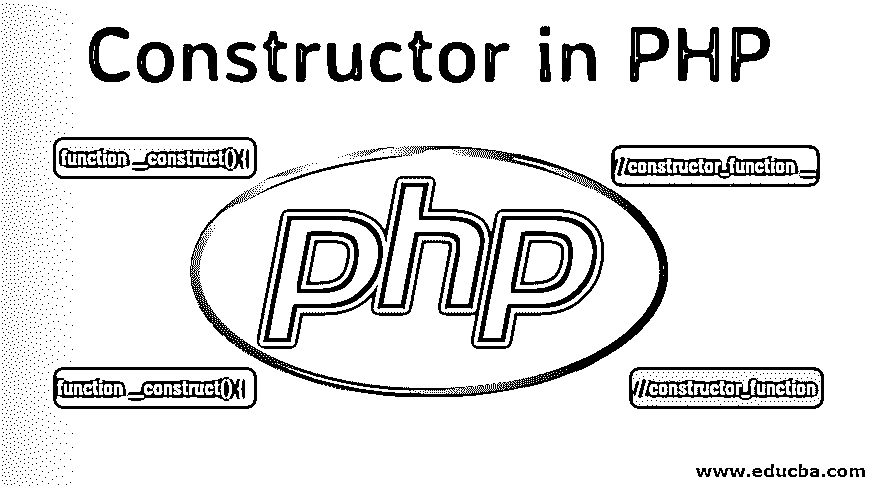
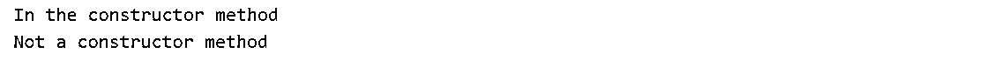
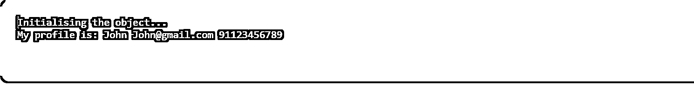
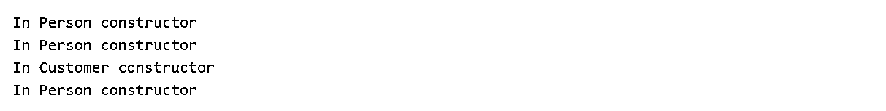
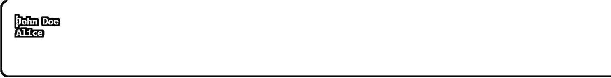
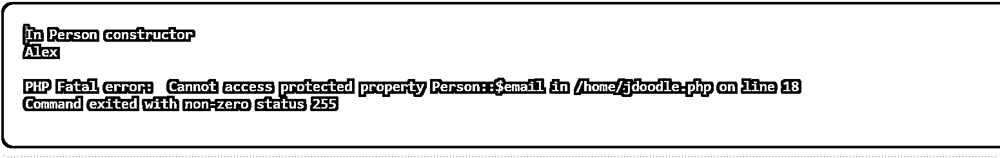

# PHP 中的构造函数

> 原文：<https://www.educba.com/constructor-in-php/>

## PHP 中的构造函数介绍

构造器是 PHP5 OOP(面向对象编程)概念。构造函数与我们在程序中声明的类相关联。当类的对象被实例化时，构造函数被自动调用，因此构造函数的定义是这样的，“构造函数是一个特殊的方法，当类的对象被实例化时，它被自动调用”。在这个主题中，我们将学习 PHP 中的构造函数。

**语法**

<small>网页开发、编程语言、软件测试&其他</small>

`<?php
Class Classname {
//constructor
function __construct() {
//statements
}
}
?>`

在上面这段代码中，构造函数以 __ 双下划线开头，后跟关键字 construct。没有 __construct()的构造函数，或者在类名改变的情况下，定义的方法只是方法而不是构造函数。因此，按照定义的语法在类中定义构造函数是很重要的。

### 构造函数的类型

下面是一些类型的构造函数，它们的输出如下

#### 1)预定义的构造函数

为了澄清预定义的构造函数，让我们看一个下面给出的例子

**预定义构造函数的例子**

**代码:**

`<?php
class Person {
function  CanSpeak() {
echo " Not a constructor method " . ' ';
}
function __construct() {
echo " In the constructor method " . ' ';
}
}
//Object of class calling the constructor internally
$p = new Person();
// Object of class calling the normal method
$p->CanSpeak();
?>`

**输出:**

在上面的例子中

我们有一个 person 类，它有两个方法，其中 Person 可以使用 Speak()方法和构造器方法 __construct()。接下来，我们将该类实例化为一个对象$p。一旦创建了对象，就调用构造函数方法并执行该方法中的语句，同样，使用同一个对象$p 调用 CanSpeak()方法(它是一个普通方法，而不是构造函数方法),并执行该方法中的语句。此外，由于上面定义的构造函数没有任何参数，我们称它为零参数构造函数或预定义构造函数。

#### 2)参数化构造函数

构造函数可以有也可以没有参数。带参数的构造函数称为[参数化构造函数](https://www.educba.com/parameterized-constructor-in-c-plus-plus/)，不带参数的构造函数称为零参数构造函数。让我们看一个例子。

**参数化构造函数示例**

**代码:**

`class Person {
private $first;
private $email;
private $mobile;
public function __construct($name, $email, $mobile) {
echo "Initialising the object... ";
$this->name = $name;
$this->email = $email;
$this->mobile = $mobile;
}
public function showProfile() {
echo "My name is: " . $this->name. " " . $this->email. " " . $this->mobile;
}
}
$john = new Person("John","John@gmail.com", "9187986786");
$john->showProfile();`

**输出:**

### 构造函数是如何工作的？

让我们看一下基类构造函数和派生类，它们使用 extends 关键字扩展基类，extends 关键字有自己要执行的构造函数和要执行的父构造函数。到目前为止，我们只了解了类中声明的构造函数。让我们在这里给构造函数增加一些知识。在下面的例子中，基类 Person 有一个构造函数，现在这个构造函数被派生类或子类使用 parent 关键字调用，因此可以访问基类 Person 的构造函数。

#### 输出流

首先，调用 Person 构造函数，然后调用 customer 构造函数，后者在内部再次调用 Person 构造函数，然后调用自己的 Customer 构造函数，最后调用 Employee 类，它扩展了 Person 类，从而再次调用 Person 构造函数。

**代码:**

`class Person {
function __construct() {
echo "In Person constructor"." ";
}
}
class Customer extends Person  {
function __construct() {
parent::__construct();
echo "In Customer constructor"." ";
}
}
class Employee extends Person  {
// inherits Person’s constructor
}
// In Person constructor
$p = new Person();
// In Person constructor
// In Customer constructor
$c = new Customer();
// In Employee constructor
$e = new Employee();`

**输出:**

在下面的例子中，我们展示了 set 方法和 get 方法是如何工作的。在 OOP 中使用封装概念。最初，程序是用一个构造函数、一个 set_name 方法和一个 get_name 方法声明的。请注意，构造函数是一个参数化的构造函数，在实例化该类时肯定会调用它，因此第一个输出是 John Doe 接下来创建了该类的一个对象，并调用了 set_name 和 get_name 方法，它们将输出打印为 Alice。

**代码:**

`<?php
class Person {
public $name;
function __construct($name) {
echo $this->name = $name;
}
function set_name($name) {
$this->name = $name;
}
function get_name() {
echo $this->name;
}
}
// In Person constructor
$p = new Person('John Doe');
echo "\n";
$p->set_name('Alice');
$p->get_name();
?>`

**输出:**

#### 访问说明符

PHP 中有三个访问说明符

*   公共
*   保护
*   私人的

Public: 声明为 Public 的类的成员在任何地方都是可访问的。

**Protected:** 声明为 Protected 的类的成员只能在基类和扩展基类的派生类中访问。

**Private:** 声明为 Private 的类的成员可以被定义它的类访问。

此外，声明的变量称为数据成员或属性，声明的函数称为数据方法。在下面的例子中，我们将基类声明为 Person，它具有以下属性以及访问说明符 public name、protected email 和 private mobile。现在，该类用一个对象$p 和从该对象访问的这三个属性实例化。哪些输出是错误的，为什么因为，protected 属性说 protected 只能在基类和扩展基类的派生类中访问？

**代码:**

`<?php
class Person {
public $name=;
protected $email;
private $mobile;
function __construct() {
print "In Person constructor";
}
}
// In Person constructor
$p = new Person();
echo $p->name;
echo $p->email;
echo $p->mobile;
?>`

**输出:**

### 结论

希望这篇文章能帮你找到你一直在寻找的东西。这篇文章有不同的例子供你学习。你把例子运用得越多，就越容易掌握。

### 推荐文章

这是 PHP 中构造函数的指南。这里我们讨论了构造函数类型的基本概念以及 PHP 中的构造函数是如何工作的。您也可以阅读以下文章，了解更多信息——

1.  [什么是 PHP？](https://www.educba.com/what-is-php/)
2.  [PHP 字符串函数](https://www.educba.com/php-string-functions/)
3.  [Java 中的布局](https://www.educba.com/layout-in-java/)
4.  [PHP 中的公共函数](https://www.educba.com/public-function-in-php/)

