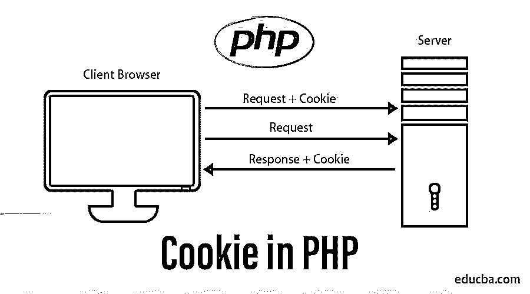

# PHP 中的 Cookie

> 原文：<https://www.educba.com/cookie-in-php/>




## PHP 中的 Cookie 介绍

下面这篇文章，PHP 中的 cookie，提供了 PHP 中 Cookie 的详细概要。PHP 是一种后端技术，通常用于制作 web 应用程序。web 应用程序通常具有身份验证。服务器根据业务逻辑通过定义的机制对用户进行身份验证。

在用户获得身份验证时，我们通常使用 session_id 来验证后续的用户请求。现在，这个 session_id 是在服务器端创建的。然而，在来自客户端的每个后续请求中，必须从用户端接收这个 session_id。因此，需要一个文件来存储 session_id。为了在用户桌面上存储这样的 session_id，我们有一个 cookie 的概念。这个 cookie 文件可以用来存储用户的 session_id。对于来自客户端的后续请求，将从 cookie 文件中读取 session_id，然后在请求中使用。PHP 中的 cookie 通常用于识别用户。如上所述，这个 cookie 存储像 session_id 这样的信息，它用于用户认证的目的。cookie 文件存储更多信息，如用户名、值等。

<small>网页开发、编程语言、软件测试&其他</small>

### Cookie 的用途

下面给出了 cookie 的用法:

*   **存储会话标识–**cookie 可以存储用户的会话标识。这个存储的 session_id 是安全的，因此可以用于在请求服务器时读取 session_id。
*   **提供更好的用户偏好—**cookie 可用于根据 cookie 文件中设置的偏好提供更好的用户体验。

### 关于 Cookie 的其他重要事情

以下是关于 cookie 的其他重要内容:

*   **4KB 的文件大小:**cookie 的文件大小最大为 4KB。
*   **由网站创建的 cookie 只能由创建它的网站读取:**由网站创建的 Cookie 只能由该特定网站读取和使用。另一个网站无法读取该网站创建的 cookies。
*   **可以存储 cookie_id 将被销毁时的实例:**在创建 Cookie 时，可以提及 Cookie 文件将在其后被删除的实例。
*   **存储 cookie 文件:**该 Cookie 文件存储的目录或文件夹因浏览器不同而不同。
*   **机器独有:**cookie 仅对特定机器有效。cookie 不特定于谁登录了网站，而是更特定于用户登录了哪台机器。

### 在 PHP 中创建 Cookie

现在让我们来看看如何储存饼干。

**代码:**

```
php
setcookie( variable_name_of_cookie, variable_value_of_cookie, [ instance_after_which_cookie_gets_deleted], [path_of_the_cookie_created], [domain], [secure], [httponly] )
?>
```

现在，让我们试着理解上面提到的代码:

*   **cookie 变量名称–**此变量存储 cookie 的名称。该参数是必需的。这个参数用于检索存储在 cookie 中的值。
*   **variable _ value _ of _ cookie—**这是另一个存储 cookie 值的强制参数。它存储创建的 cookie 变量的值。
*   **instance _ after _ which _ cookie _ gets _ deleted—**显示 cookie 将被删除的实例。
*   **path _ of _ the _ cookie _ created-**该参数是可选的。它用于指定在服务器上创建 cookie 的路径。
*   **域–**域是另一个可选参数。此参数指定 cookie 将存在的层次结构。
*   **secure–**这是一个可选参数，指定是否需要使用安全的 https 协议在服务器和机器之间传递 cookie。默认情况下，它的值设置为 false，并使用 HTTP 协议；否则，如果另外指定，那么它使用 https 协议。
*   **http only–**该参数指定客户端语言是否可以使用服务器的这个 cookie。

现在，让我们看看如何删除 cookie。

### 删除 Cookie

删除 cookie 是相当容易的。下面的代码片段可用于删除 cookie。

**代码:**

```
php
setcookie( “variable_name_of_cookie” , “variable_value_of_cookie”, current_instance - 10 );
?>
```

现在让我们理解代码片段:

*   **variable _ name _ of _ cookie—**该变量显示 cookie 的名称，需要删除。该参数是必需的。cookie 需要操作的就是这个参数。
*   **variable _ value _ of _ cookie–**这是另一个强制参数，指定分配给 cookie 变量的值。它通常被指定为空白
*   **instance _ at _ which _ cookie _ gets _ deleted—**显示需要删除哪个实例的 cookie

### PHP 中 Cookies 的使用

cookie 用于指定用户的身份。因此，它有助于指定用户。php 中的 cookie 有着广泛的用途，比如它可以存储用户偏好等。，以修改用户体验。

#### Cookies 的管理:

在这里，我们将了解如何在谷歌浏览器中禁用 cookies。

*   点击 ctrl+shift+delete。
*   它将显示一个新的对话框。
*   点击 cookie 复选框。
*   点击对话框按钮。

### 饼干的优点和缺点

以下是提到的一些优点和缺点:

#### 优势:

*   存储 cookies 更轻，因为它不会给服务器带来额外的负载。它通常存储在客户机上。
*   cookie 很容易配置。
*   使用 cookies，它可以用来存储会话信息，如页面或线程等。
*   cookie 一旦被存储，以后也可以在不创建 cookie 的情况下使用。
*   Cookies 用于个性化用户偏好。
*   基于用户的偏好，cookies 可以用来向用户显示相似类型的广告。
*   [cookie 可以用来](https://www.educba.com/cookies-in-javascript/)让浏览变得更容易。

#### 缺点:

*   不建议使用 cookie 来存储需要保护的数据。cookies 中的内容是纯文本的，因为只有这些数据可以被存储，这不是安全问题。
*   加密和解密 cookies 数据是没有意义的，因为它需要额外的编码，导致资源额外的责任。
*   一个 cookie 最多可以存储 4 KB 的数据；因此，它不能用于存储大量数据。
*   来自广告网站的 Cookies 可以跟踪用户的个人信息，如浏览偏好。

### 结论 PHP 中的 Cookie

cookie 广泛应用于基于网络的应用程序中。它用于识别用户。cookie 用于存储用户偏好，如用户正在浏览哪个网站等。不同的网站收集这些数据。可以根据需要创建或删除 cookie。它还用于存储其他特定数据。

### 推荐文章

这是 PHP 中的 Cookie 指南。在这里，我们讨论了 cookie 的介绍、用途、工作、管理和优缺点。您也可以浏览我们推荐的其他文章，了解更多信息——

1.  [PHP 框架](https://www.educba.com/php-frameworks/)
2.  [PHP 字符串函数](https://www.educba.com/php-string-functions/)
3.  [HTTP cookie](https://www.educba.com/http-cookies/)
4.  [PHP 常量](https://www.educba.com/php-constants/)


