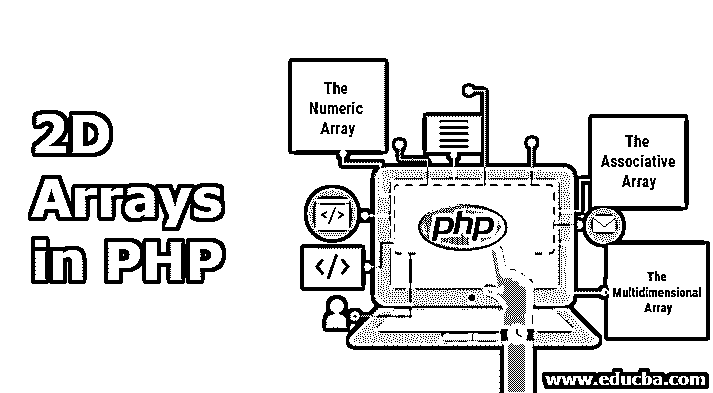
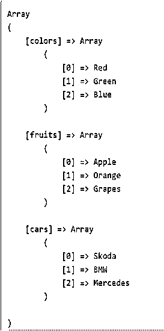
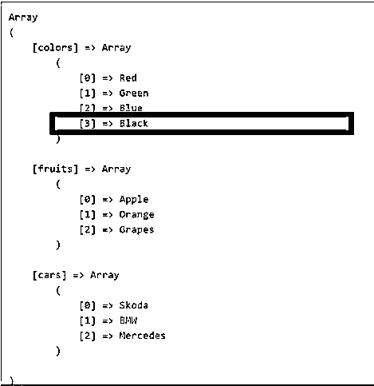
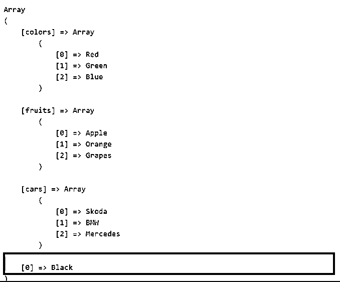
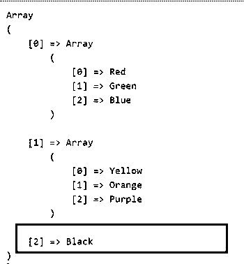
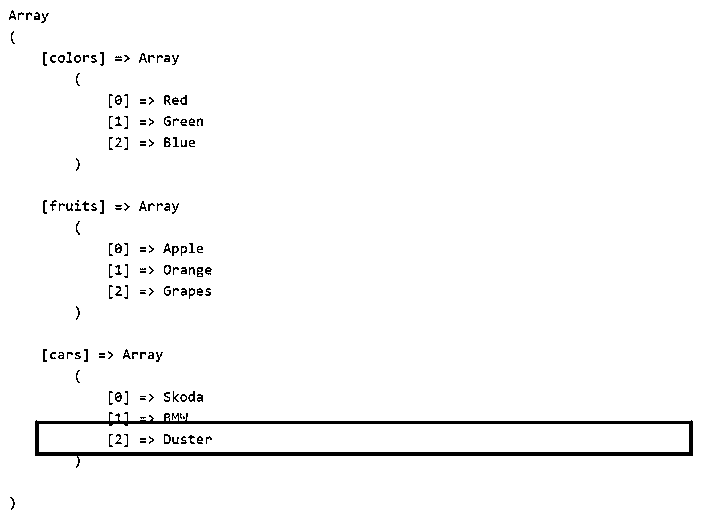
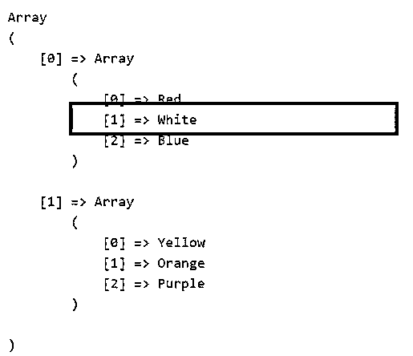
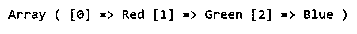
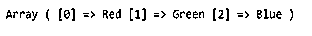
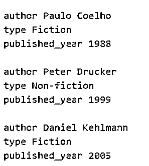

# PHP 中的 2D 数组

> 原文：<https://www.educba.com/2d-arrays-in-php/>




## PHP 中的 2D 数组简介

数组是任何数据类型的元素的集合。php 中有许多数据类型，如字符串、整数、布尔、数组、对象、资源等。2D 数组是这些数据类型的混合，主要是数组。PHP 中有以下三种不同类型的 2D 数组:

*   数字数组
*   [关联数组](https://www.educba.com/associative-array-in-java/)
*   多维数组

### PHP 中 2D 数组的类型

这三个数组解释如下:

<small>网页开发、编程语言、软件测试&其他</small>

**1。数值数组:**带有数值索引的数组。

**语法**:

```
array(value1, value2, value3, …);
```

**举例**:

```
$input = array(10,20,30,40,50);
```

**2。关联数组**:带有字符串或数字索引的数组。这个数组的元素以键值对的形式存储。

**语法**:

```
array(‘key1’ => ‘value1’, ‘key2’ => ‘value2’, ‘key3’ => ‘value3’,…);
```

**举例**:

```
$input =  array(0 =>Emma, 1=>Alice, 2=>’John’);
```

**3。多维数组**:数组的数组是多维数组或 2D 数组或嵌套数组。这种格式总是数组或数组。因此被称为嵌套数组。

**语法** **:**

```
array (
array (elements...),
array (elements...),
...
)
```

**举例:**

```
$input = array(
array( "red", "green", "blue" ),
array( "yellow", "black", "white" )
);
```

在上面的例子中，输入数组是一个二维数组的例子。这里，主数组包含 2 个元素，每个元素本身又是一个由 3 个元素组成的数组。

### 如何定义 2D 数组？

我们了解到，在 2D 数组中，值元素是一个数组，该数组还可以包含子数组。数组中提到的维度是行和列的形式。记住数组的表格格式，就更容易学习如何定义这些数组。意思是如果是二维数组，就用两个索引，同理，如果是三维数组，就用三个索引，以此类推。

### 如何创建 2D 数组？

既然我们知道如何定义 2D 数组，我们现在就可以创建它了。这里没有定义索引，默认情况下是一个总是从 0 开始的数字。

```
$input=array(
array( "red", "green", "blue" ),
array( "yellow", "black", "white" )
);
```

该数组也可以以关联数组的形式定义。

```
(in key =>value form)
```

索引或键是一个字符串，如颜色、水果和汽车。值元素采用数组的形式，每个数组包含 3 个元素。

```
$input = array(
‘colors’=>array (“Red", "Green", "Blue"),
‘fruits’=>array ("Apple", "Orange", "Grapes"),
‘cars’=>array (“BMW”,”Skoda”, ”Mercedes”)
);
```

### 如何访问 2D 数组的元素？

要访问这些数组值，可以使用方括号。随着你深入 2D 数组的更多层，方括号的使用将随着每一层而增加。

#### 示例#1

**代码:**

```
$input = array (
‘colors’ =>array (“Red", "Green", "Blue"),
‘fruits’ =>array ("Apple", "Orange", "Grapes"),
‘cars’ =>array ("Skoda", "BMW", "Mercedes")
);
```

请记住，第一组方括号包含关键字，在本例中是颜色、水果和汽车。接着是另一组方括号，用于向下遍历下一层，可以用 0，1，2 这样的数字来访问。

所以如果我们想访问上面数组中的元素“Grapes ”,

```
echo $input[‘fruits’][2];
```

类似地，下面的例子

如果我们想访问数组中的元素“Mercedes ”,那么

```
echo $input[‘cars’][2];
```

如果我们想访问数组中的元素“Red ”,那么

```
echo $input[‘colors][0];
```

因为数组中的索引总是从 0 开始。

#### 实施例 2

**代码:**

```
$input = array (
array (“Red", "Green", "Blue"),
array ("Yellow", "Orange", "Purple"),
);
```

如果我们想访问上述数组中的元素“Orange ”,我们将使用下面的代码行

```
echo  $input[0][1];
will give “Green”
echo  $input[1][2];
will give “Purple”
echo $input[0][0];
will give “Red”
```

### 如何在 PHP 中插入 2D 数组的元素？

既然我们知道了如何定义、创建和访问数组元素，我们现在将学习如何在数组中插入元素。PHP 中定义了[数组函数来处理多维数组，比如 array_push()函数来插入，array_shift()函数来移除等等。](https://www.educba.com/php-array-functions/)

```
$input = array (
‘colors’=>array (“Red", "Green", "Blue"),
‘fruits’=>array ("Apple", "Orange", "Grapes"),
‘cars’=>array ("Skoda", "BMW", "Mercedes")
);
```

使用 print_r()函数，我们将首先按原样打印数组。

**代码:**

```
//create multidimensional array
$input = array (
"colors"=>array ("Red", "Green", "Blue"),
"fruits"=>array ("Apple", "Orange", "Grapes"),
"cars"=>array ("Skoda", "BMW", "Mercedes")
);
// print the multidimensional array
echo "<pre>";
print_r($input);
echo "<pre>";
```

**输出:**




现在添加一个元素到水果子数组，我们将使用

```
array_push() function
```

**语法:**

```
array_push(array, value1,value2...)
```

在哪里，

*   该数组是$input 数组
*   value1 是要添加到数组中的元素
*   值 2、值 3 是可选的

#### 示例#1

**代码:**

```
$input = array (
"colors"=>array ("Red", "Green", "Blue"),
"fruits"=>array ("Apple", "Orange", "Grapes"),
"cars"=>array ("Skoda", "BMW", "Mercedes")
);
array_push($input['colors'], "Black");
echo "<pre>";
print_r($input);
echo "<pre>";
```

**输出:**




在下面的程序中，我们只是删除了键“colors ”,并发现它在给定数组的最后一个位置附加了一个 0 键，如输出图像所示。

#### 实施例 2

**代码:**

```
// create multidimensional array
$input = array (
"colors"=>array ("Red", "Green", "Blue"),
"fruits"=>array ("Apple", "Orange", "Grapes"),
"cars"=>array ("Skoda", "BMW", "Mercedes")
);
// adding a value to array
array_push($input, "Black");
// print the multidimensional array
echo "<pre>";
print_r($input);
echo "<pre>";
```

**输出:**




#### 实施例 3

**代码:**

```
//create multidimensional array
$input = array (
array ("Red", "Green", "Blue"),
array ("Yellow", "Orange", "Purple")
);
//add a color to the array
array_push($input, "Black");
// print the multidimensional array
echo "<pre>";
print_r($input);
echo "<pre>";
```

**输出:**




### 如何在 PHP 中更新 2D 数组的元素？

要更新 2D 数组中的元素，只需从数组中获取键，并替换特定数组中该键的值。

```
$input[‘cars’][‘Mercedes’]  = ‘Duster’;
```

#### 示例#1

**代码:**

```
//create multidimensional array
$input = array (
"colors"=>array ("Red", "Green", "Blue"),
"fruits"=>array ("Apple", "Orange", "Grapes"),
"cars"=>array ("Skoda", "BMW", "Mercedes")
);
//update the Mercedes with Duster
$input["cars"][2]  = "Duster";
// print the multidimensional array
echo "<pre>";
print_r($input);
echo "<pre>";
```

**输出:**




#### 实施例 2

**代码:**

```
//create multidimensional array
$input = array (
array ("Red", "Green", "Blue"),
array ("Yellow", "Orange", "Purple")
);
//update the Mercedes with Duster
$input[0][1]  = "White";
// print the multidimensional array
echo "<pre>";
print_r($input);
echo "<pre>";
```

**输出:**




### 如何删除 2D 数组的元素？

要删除 2D 数组中的一个元素，我们将使用 array_shift()函数。

array_shift 移除并返回数组的第一个元素值。

**语法:**

```
array_shift(array)
where
-array is the $input array
```

#### 示例#1

**代码:**

```
//create multidimensional array
$input = array (
"colors"=>array ("Red", "Green", "Blue"),
"fruits"=>array ("Apple", "Orange", "Grapes"),
"cars"=>array ("Skoda", "BMW", "Mercedes")
);
//print the removed element
print_r(array_shift($input));
```

**输出:**




#### 实施例 2

**代码:**

```
//create multidimensional array
$input = array (
array ("Red", "Green", "Blue"),
array ("Yellow", "Orange", "Purple")
);
//print the removed element
print_r(array_shift($input));
```

**输出:**




### 二维相联阵列

在下面的例子中，我们创建了一个包含书籍信息的二维数组，比如书籍的作者、书籍的类型以及出版年份。此外，我们将学习如何遍历或循环通过这个数组。通过多维数组循环，我们将使用一个嵌套的 foreach 循环。这意味着一个 foreach 循环在另一个 foreach 循环中。使用 for 循环也可以做到这一点。

```
$input = array(
"The_Alchemist" => array (
"author" => "Paulo Coelho",
"type" => "Fiction",
"published_year" => 1988
),
"Managing_Oneself" => array (
"author" => "Peter Drucker",
"type" => "Non-fiction",
"published_year" => 1999
),
"Measuring_the_World" => array(
"author" => "Daniel Kehlmann",
"type" => "Fiction",
"published_year" => 2005
)
);
```

仅仅打印上面的数组而不进行任何循环将会得到如下输出:

**代码:**

```
// create multidimensional array
$input = array(
"The_Alchemist" => array (
"author" => "Paulo Coelho",
"type" => "Fiction",
"published_year" => 1988
),
"Managing_Oneself" => array (
"author" => "Peter Drucker",
"type" => "Non-fiction",
"published_year" => 1999
),
"Measuring_the_World" => array(
"author" => "Daniel Kehlmann",
"type" => "Fiction",
"published_year" => 2005
)
);
// print the plain multidimensional array
echo "<pre>";
print_r($input);
echo "</pre>";
```

**输出:**


现在我们将使用 foreach 循环打印多维数组。

**代码:**

```
// create multidimensional array
$input = array(
"The_Alchemist" => array (
"author" => "Paulo Coelho",
"type" => "Fiction",
"published_year" => 1988
),
"Managing_Oneself" => array (
"author" => "Peter Drucker",
"type" => "Non-fiction",
"published_year" => 1999
),
"Measuring_the_World" => array(
"author" => "Daniel Kehlmann",
"type" => "Fiction",
"published_year" => 2005
)
);
//foreach to loop the outer array
foreach($input as $book) {
echo "<br>";
// foreach to loop the inner array
foreach($book as $key=>$value)
{
echo $key." ". $value. "<br>";
}
}
```

**输出:**




### 结论

我希望这篇文章有助于学习 PHP 中 2D 数组的概念。本主题涵盖了理解 PHP 中 2D 数组所需的所有概念。借助输出快照示例，本主题变得更加简单。根据这篇文章，如果所有的程序都练习得很好，肯定会帮助你很容易地掌握概念。我希望这个话题能提供更多的信息，以获得更多的知识。

### 推荐文章

这是 PHP 中 2D 数组的指南。这里我们讨论 php 中三种不同类型的数组，以及如何用适当的例子来更新、插入和删除 2D 数组的元素。你也可以看看下面这篇文章。

1.  [用于 PHP 中的循环](https://www.educba.com/for-loop-in-php/)
2.  [换入 PHP](https://www.educba.com/swapping-in-php/)
3.  [PHP 中的星形模式](https://www.educba.com/star-patterns-in-php/)
4.  [PHP 常量](https://www.educba.com/php-constants/)


