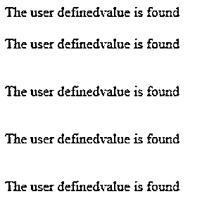
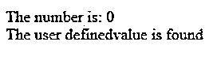
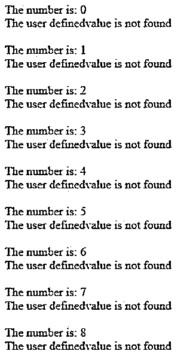

# PHP in_array

> 原文：<https://www.educba.com/php-in_array/>

## PHP in_array 简介

在 PHP 中，in_array 被定义为一个函数，用于在数组中搜索内存中的指定值。搜索变量可以是任何类型，如 string、int 等。，而函数 in_array()是设置参数和传递参数。同时，仅设置布尔值类型，如 true 或 false。搜索将区分大小写。它还将检查指定的值是否已存在于数组中。还将检查子数组。in_array 函数有一些默认方法，用于在数组条件下实现。

**语法:**

<small>网页开发、编程语言、软件测试&其他</small>

PHP 有一些默认的方法、变量和内置条件来实现项目需求。数组是顺序内存存储区域，用于存储和检索列表中的数字，不仅用于接受数字，还可以是字符串类型。

`<? php
$variable name=array(‘’,’’,…);
using conditional statements like if(in_array(‘’,$variable name))
{
----some php codes based on the requirements---
}
?>`

对于上面的代码，我们使用 in_array 作为基于特定值迭代循环条件的默认方法；它可能是任何用户定义的类型。一旦循环条件为假，条件语句就可能被终止。

### PHP 中 in_array 方法是如何工作的？

*   PHP 数组是 PHP 语言中的一个主要概念；它包括相同的一组预定义函数，这些函数将用于实现存储和检索内存区域。同样，PHP in_array 是预定义的函数，可用于检查循环语句中是否存在值；子数组还可以计算数组列表中的指定值，这些值可以是在数组列表中搜索变量数据之前已经设置的布尔条件语句。它可以是任何数据类型，如 int、string、float 或 decimal 等。，但是最新版本的 php 只接受这个参数作为方法中的第一个参数，在旧版本的 PHP 之前，这个参数不在指定的方法中使用。
*   在数组列表中搜索数据值后，该值将被视为所述用户定义数据的集合或预定义主值。然后，使用 if、else、for 等条件语句存储和检索数据值。使用这些循环，值被迭代并显示在 UI 上。最后一个参数，像$strict 一样，是可选参数，应该用它来设置布尔条件值；如果条件为真，则用于将新的和现有的数据值与指定的数据类型进行比较。如果条件为假，它将在循环之外终止。
*   每当数组指定的值将被用于在列表中存储和检索时，条件可以被设置为真，因为父根条件以及主数组值总是包含并将其设置为 0 或者布尔条件，如真/假语句，有时空值也在条目级中接受，然后数组方法如 in_array() 将总是抛出一些错误，并在 UI 中返回一些意外类型的结果，因为每当用户输入时，UI 屏幕中的数据总是存储在数据库中。UI 字段可以是任何数据类型， 字符串等，但无论用户在 UI 屏幕上输入什么数据，数据都只能存储在数据库中，因此，只有当我们检索数据时，才需要根据时间的要求，将值显示在屏幕上，类型与示例 4 相同，数组值为数字类型，类型为 4，字符串/字符类型为 4，这样，它将在应用程序中返回一些意外的错误情况。

### PHP in_array 示例

下面给出了 PHP in_array 的例子:

#### 示例#1

**代码:**

`<!DOCTYPE html>
<html>
<body>
<?php
$abarrays = array("Siva", "Raman", "Sivaraman", "ARun","Kumar","Arunkumar", 41);
if (in_array("41", $abarrays, TRUE))
{
echo "The user definedvalue is found  ";
}
else
{
echo "The user definedvalue is found  ";
}
if (in_array("Kumar",$abarrays, TRUE))
{
echo "The user definedvalue is found   ";
}
else
{
echo "The user definedvalue is found   ";
}
if (in_array(41,$abarrays, FALSE))
{
echo "The user definedvalue is found   ";
}
else
{
echo "The user definedvalue is found   ";
}
if (in_array(42,$abarrays, FALSE))
{
echo "The user definedvalue is found   ";
}
else
{
echo "The user definedvalue is found   ";
}
if (in_array(42,$abarrays, FALSE))
{
echo "The user definedvalue is found   ";
}
else if (in_array(41,$abarrays, TRUE))
{
echo "The user definedvalue is found   ";
}
else
{
echo "The user definedvalue is found   ";
}
?>
</body>
</html>`

**输出:**

**

** 

#### 实施例 2

**代码:**

`<!DOCTYPE html>
<html>
<body>
<?php
$a = 0;
$output = false;
$inputs = array(6743478, 74698793,87894379, "Siva", "sdjkj");
for ($a = 0; $a <= in_array("12345", $inputs); $a++) {
echo "The number is: $a  ";
if(in_array("Siva", $inputs))
{
echo "The user definedvalue is found  ";
}
else
{
echo "The user definedvalue is not found  ";
}
}
?>
</body>
</html>`

**输出:**

#### 实施例 3

**代码:**

`<!DOCTYPE html>
<html>
<body>
<?php
$p = 0;
$inputs = array(array('s', 'a', 't'), array('y', 'u'), 'm');
do {
echo "The number is: $p  ";
$p++;
if(in_array("Raman", $inputs))
{
echo "The user definedvalue is found  ";
}
else
{
echo "The user definedvalue is not found  ";
}
}
while($p <=$inputs);
?>
</body>
</html>`

**输出:**

在上面的例子中，我们使用了 PHP in_array()方法，用于每个循环的不同场景；他们将检查用户输入的条件和值。预定义数组方法和循环执行将仅由满足该方法的布尔条件来执行。

### 结论

在 PHP 中，脚本语言数组是用户定义和定制的函数，也是从内存中存储和检索数据的重要区域。将使用默认函数搜索数组值；有时，搜索值没有被获取，或者值可能是无效的，它抛出错误作为输出。

### 推荐文章

这是一个 PHP in_array 的指南。这里我们讨论一下入门，在 PHP 中 in_array 方法是如何工作的？和示例。您也可以看看以下文章，了解更多信息–

1.  [PHP 全局变量](https://www.educba.com/php-global-variable/)
2.  [PHP 计数](https://www.educba.com/php-count/)
3.  [PHP usort()](https://www.educba.com/php-usort/)
4.  [PHP sscanf()](https://www.educba.com/php-sscanf/)

