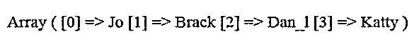
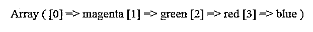

# PHP 获取数组的最后一个元素

> 原文：<https://www.educba.com/php-get-last-element-of-array/>

## PHP 简介获取数组的最后一个元素

PHP 获取数组的最后一个元素是指使用 end()函数获取关联数组中的最后一个元素。PHP 中的 end()函数是一个内置函数，它有一个独特的功能，可以操作和使用与数组相关的内部指针，指向数组的最后一个元素，然后从数组中返回最后一个元素。这个用于获取最后一个元素的 inbuild 函数与一些特定于[的 PHP 版本](https://www.educba.com/php-versions/)兼容，比如 PHP 版本 4、PHP 版本 5 和 PHP 版本 7。

**语法:**

<small>网页开发、编程语言、软件测试&其他</small>

获取数组最后一个元素的语法流程如下:

`end($src_array)`

*   **end ():** 这是一个允许从数组传递参数的函数，即 src_array。
*   **src_array:** 这是从 end()函数传递的参数，目的是获取所需的最后一个元素。
*   **返回类型:**所述函数的返回类型为 true 或 false，表示如果值为 true，则返回数组中的最后一个元素，如果值为 false，则返回值为空数组，没有任何返回类型。

### PHP 中如何获取数组的最后一个元素？

在 PHP 中，有几种方法可以获取数组的最后一个元素，但是出于需求的考虑，还是推荐一些方法。PHP 中元素和数组索引的获取和操作是根据遍历来完成的。因此，这取决于需要如何操作数据。

PHP 中获取数组最后一个元素的方法如下:

*   最初，应该使用 end()函数正确地遍历已定义的数组以获得最后一个元素。
*   End()函数是 PHP 中的内置函数，广泛用于使用指向数组最后一个元素的内部指针变化来获取最后一个元素，这意味着它完全取决于返回类型，这有其自身的意义。
*   如果 end 函数给出的值为 true，那么可以说最后一个元素被正确提取。但是如果 end 函数给出的值为 false，则表明返回值为空，没有提取最后一个元素。
*   在 PHP 中获取数组最后一个元素的另一种方法是使用 pop()函数，这意味着数组的最后一个元素很容易被删除，但是在某些情况下，比如如果数组为空并且不是数组，那么返回值将为 NULL。否则，它将返回值。
*   此外，数组的最后一个元素可以从多维数组中获取，这意味着如果 PHP 中的数组的最后一个元素被识别，那么数组的最后一列中的值可以使用索引键和列键来提取和操作，以作为该列的最后一个元素。
*   为了用数组列表中的键元素映射列，需要一个主键。
*   识别多维数组的正确方法是将其与关联数组及其功能进行比较。

### PHP 获取数组最后一个元素的例子

下面提到了不同的例子:

#### 示例#1

这个程序是用来演示通过使用 end()函数打印数组的最后一个元素来获取数组的最后一个元素，如图所示。源数组的输入是一个水果列表，最后一个要获取的元素是 Banana，如输出所示。

**代码:**

`<?php
$arr = array('Apple', 'Guava', 'Banana');
echo end($arr);
?>`

**输出:**

#### 实施例 2

这个程序演示了 PHP 中的数组集，它用于从数据库中获取与列相关的数据，然后在索引列中提供一个相关元素，用于从列中检索最后命名的值，如输出所示。

**代码:**

`<?php
$rcrds = array(
array(
'id' => 1124,
'1st_nm' => 'Ani',
'lst_nm' => 'Jo',
),
array(
'id' => 2356,
'1st_nm' => 'Samm',
'lst_nm' => 'Brack',
),
array(
'id' => 7890,
'1st_nm' => 'Brown',
'lst_nm' => 'Dan_l',
),
array(
'id' => 5623,
'1st_nm' => 'Ptr',
'lst_nm' => 'Katty',
)
);
$last_nm = array_column($rcrds, 'lst_nm');
print_r($last_nm);
?>`

**输出:**

**

** 

#### 实施例 3

这个程序演示了 PHP 中的 pop()函数，它专门演示了如何使用操作从数组中获取最后一个元素，首先获取列表，然后从列表中返回实际值作为最后一个元素，如输出所示。end()函数和 pop()函数的使用如输出所示。

**代码:**

`<!DOCTYPE html>
<html>
<body>
<?php
$arr_lst=array("magenta","green","red","blue","pink");
array_pop($arr_lst);
print_r($arr_lst);
?>
</body>
</html>`

**输出:**

#### 实施例 4

这个程序演示了 last key 和 end 函数同时从一个数组中获取最后一个值的区别，方法是使用一组数组作为输入，并给出一个长度为 3 的字符串作为输出，如输出中所示。

**代码:**

`<!DOCTYPE html>
<html>
<body>
<?php
$ar_lst = array(
'1st' => 151,
'2nd' => 234,
'lst' => 657,
);
end($ar_lst);
$key_set = key($ar_lst);
var_dump($key_set);
?>
</body>
</html>`

**输出:**

**Note:** A mere recommendation for the above program to get the last element of an array is the combination of both the end() function and key() function, where the end() function will be used to return the last element by advancing the array’s internal pointer followed by returning the value. Similarly, the key() function will also return the index element of the current array.

### 结论

PHP 数组的最后一个元素是使用 PHP 中的某些函数从数组中获取最后一个元素，比如 end()函数，pop()函数。同样，这完全取决于获取的需求和需要在数组集上执行的操作。此外，数组中的内部指针可以用作执行操作的指针。

### 推荐文章

这是一个 PHP 获取数组最后一个元素的指南。这里我们讨论一下入门，如何在 PHP 中获取数组的最后一个元素？还有例子。您也可以看看以下文章，了解更多信息–

1.  [PHP 表单验证](https://www.educba.com/php-form-validation/)
2.  [PHP 附加文件](https://www.educba.com/php-append-file/)
3.  [PHP 删除文件](https://www.educba.com/php-delete-file/)
4.  [PHP 梁()](https://www.educba.com/php-strlen/)

