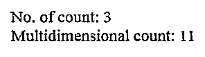
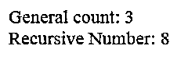
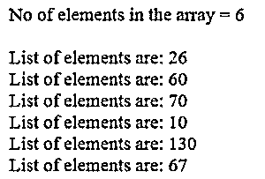
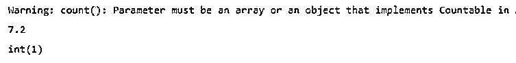
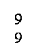
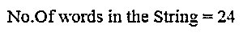

# PHP 数组长度

> 原文：<https://www.educba.com/php-array-length/>

## PHP 数组长度介绍

PHP 数组长度被定义为一个数组，用来获取数组中的许多元素。使用 count()函数和 size()，我们能够检索元素的计数。数组包含字符串或整数值，可以是一维的，也可以是多维的。数组用于保存键值对中的值，键值对是一个索引数组，具有许多用于数组处理的内置函数。这里使用两个正确的函数(预定义)可以节省大量计算时间。

**语法:**

<small>网页开发、编程语言、软件测试&其他</small>

PHP 数组长度定义如下:

`Count(array name, mode);`

这个函数有两个参数，即数组名，后跟一个表示维度的模式。空数组表示零，对于非数组值返回“1”。

### PHP 中数组长度是如何工作的？

数组长度由函数的计数和大小决定。按照语法，可选的 mode 参数被递归地设置为 count()，这将递归地计算数组中元素的数量。这个函数在多维数组中被大量使用。

要知道一个数组的长度，我们有几个常见的原因:

*   使用“for”循环遍历元素。
*   返回的搜索元素数量。
*   计算数组中的平均值。

但是在 PHP 中，为了获得数组中元素的数量，这里启用了 sizeof 或 count 函数来预测 PHP 中的数组长度。由于在我们的代码中元素的数量根据用户的需求而变化，所以查看数组列表的实际长度是非常重要的。PHP 有两个内置函数，即 count 和 size。

使用 count():对元素进行计数。

我们可以这样使用:

**代码:**

`$a1=array(6,3,1,9);
Echo “ The size is given as =”, count($a1);`

所以在这里，count 函数返回一个对象中元素的数量，并简单地在一个关联数组中计数。在上面的示例代码中，我们使用了一维数组。我们已经使用了 PHP 原生函数 count，所以当我们执行上面的代码片段时，函数的输出是‘4’。这是我们获取数值的方法。

第二种情况是当我们使用参数模式对元素进行计数时，为了执行这个操作，我们传递了一个常量“recursive”作为参数来对元素进行计数。在这种情况下，数组的长度以不同的方式确定。

**代码:**

`$avar = array (2,6,7, array (19,18,60));
$nelem = count ($avar, COUNT_RECURSIVE);
echo $nelem;`

上述代码将输出显示为“7”，而不是值“6”。

要在数组元素中执行迭代，我们可以使用 for-loop 进行迭代。该值应该循环继续执行。因此，在每个迭代步骤中，该值都会增加 1。在 count()方法中使用 for 循环时要小心，因为 PHP 缺乏区分索引数组和关联数组的能力。但是大多数程序员开发人员假装使用 count()而不是 sizeof()，因为它返回内存大小。即使和 count()函数类似，但大部分还是坚持使用 count()函数。

### PHP 数组长度示例

有两种方法定义 PHP 数组长度或大小计数。让我们在下面的例子中看看这些方法是如何用来确定长度的。

#### 示例#1

创建一个简单的数组来计算元素。

**代码:**

`<?php
$flowers= ['Jasmine', 'Diasy', 'Rose'];
echo "The count is: " . count($flowers);
?>`

**说明:**

*   当我们执行上面的代码片段时，输出显示为“3 ”,因为数组元素有 3 个元素。
*   首先，我们创建了一个“flowers”数组，在下一行中，我们使用了 count 命令。

**输出:**

#### 实施例 2

**代码:**

`<?php
$program = [
'C++' => ['Polymorphism', 'Inheritance', 'Template'],
'Java' => ['Interface', 'Multithread', 'Exception'],
'PHP' => ['ArrayLength', 'Count'] ];
echo "No. of count: ". count($program)." ";
echo "Multidimensional count: ". count ($program, 1);
?>`

**说明:**

*   确定计数为“1”的数组长度。

**输出:**

#### 实施例 3

**代码:**

`<!DOCTYPE html>
<html>
<body>
<?php
$bike=array
(
"Hero Splender"=>array
(
"HP2345",
"HS3456"
),
"Royal Enfield"=>array
(
"R3",
"Tr5"
),
"Honda Activa 6G"=>array
(
"Classic 250"
)
);
echo "General count: " . sizeof($bike)." ";
echo "Recursive Number: " . sizeof($bike,1);
?>
</body>
</html>`

**说明:**

*   上面的代码确定一般计数为‘3’，递归模式的数组长度为‘8’。

**输出:**

#### 实施例 4

使用 For-loop。

**代码:**

`<?php
$arr_iter = array (26,60,70,10,130,67);
echo "No of elements in the array = ", sizeof($arr_iter), "  ";
//Iterating through the array
for ($k=0; $k <sizeof($arr_iter); $k++){
echo "List of elements are: $arr_iter[$k]  ";
}
?>`

**说明:**

*   上面的代码使用 sizeof 函数获取数组的长度，并使用 for-loop 迭代数组元素。
*   输出显示了每次迭代中数组中的值列表。

**输出:**

#### 实施例 5

在模式中使用空值。

**代码:**

`<?php
$m[0] = 2;
$m[1] = 6;
$m[2] = 8;
value_res(count($m));
$n[3]  = 1;
$n[4]  = 3;
$n[8] = 5;
value_res(count($n));
value_res(count(null));
value_res(count(false));
?>`

**说明:**

*   上面的代码返回一个参数数组，因为值被赋值为 null。所以输出看起来像这样。

**输出:**

#### 实施例 6

使用 2D 数组的数组长度。

**代码:**

`<?php
$foods = array('choclates' => array('Diary Milk', 'Cadbury Godiva', 'Nestle','Snikkers',
'Candy Craze'), 'Fast Food' => array('Nuggets', 'Salad Platters'));
echo count($foods, 1);
echo " ";
echo sizeof($foods, 1);
?>`

**说明:**

*   在上面的代码中，我们将模式计数设为“1”；因此，这个多维数组将值计为“9”。

**输出:**

#### 实施例 7

字数统计。

**代码:**

`<?Php
$stringtype=' This is EDUCBA Asia largest Web Learning Platform providing courses in various Domains. We Provide Certification from many Leading Universities across the globe.';
$my1_array=explode(" ",$stringtype);
echo "No.Of words in the String = ".sizeof($my1_array);
?>`

**说明:**

*   上面的程序将一个段落存储在 String 类型的变量中。
*   这里使用 explode 函数创建了一个数组来拆分数组。
*   最后，统计一段话的字数。
*   我们得到的计数如下。

**输出:**

### 结论

在这里，我们看到了如何在 PHP 中确定数组的长度或大小，以及如何使用 PHP 函数获取数组使用的内存大小的各种方法。函数的计数和大小没有区别。取决于开发人员，方法是在编写代码时选择的。在本文中，我们通过许多例子探讨了 PHP 的数组长度，同时，我们也看到了更多关于多维数组的内容。

### 推荐文章

这是 PHP 数组长度的指南。这里我们讨论一下入门，PHP 中数组长度是如何工作的？和示例。您也可以看看以下文章，了解更多信息–

1.  [PHP 全局变量](https://www.educba.com/php-global-variable/)
2.  [PHP 梁()](https://www.educba.com/php-strlen/)
3.  [PHP array_pop()](https://www.educba.com/php-array_pop/)
4.  [PhpStorm](https://www.educba.com/phpstorm/)

