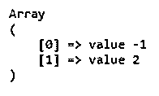
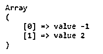
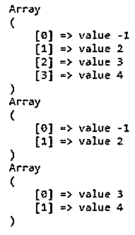
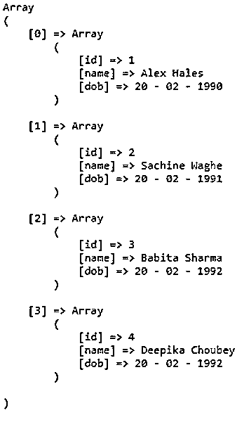
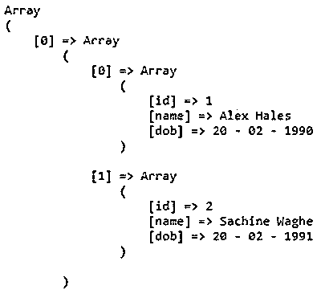

# PHP 拆分数组

> 原文：<https://www.educba.com/php-split-array/>

## PHP 拆分数组介绍

处理数组以及与数组相关的操作在 PHP 编程语言中非常常见，拆分数组就是其中之一。PHP 本身有各种内置函数来处理这个问题。开发人员或编码人员可以通过编写他们自己的定制代码来做同样的事情。拆分就是将单个数组转换成多个数组。一个数组可以拆分成多个块。一个内置的函数 array_chunk()可以用来将数组分割成多个定义了元素数量的数组。

**语法:**

<small>网页开发、编程语言、软件测试&其他</small>

1.array_chunk()

`array_chunk(array, size, preserve_key)`

*   array_chunk()是函数本身。
*   数组和大小是必需的参数。
*   preserve_key 采用布尔值。

2.array_slice()

`array_slice(array, start, length, preserve)`

*   array_slice()是函数本身。
*   数组和开始是必需的参数。
*   Length 和 preserve 是可选参数。start 参数显示数组需要从哪个位置开始切片，长度是多少。

**array _ chunk 的输出(直接赋给多个数组):**

`list($array1, $array2,.....) = array_chunk($array, length);`

$数组 1，$数组 2…是从$array 拆分后将在其中分配数组元素的数组。开发人员或代码应该注意元素的数量和需要分配元素的数组的大小。

### PHP 分裂数组是如何工作的？

下面给出了 PHP 拆分数组的工作原理:

#### 1.使用 array_chunk()

在使用数组的拆分功能之前，应该有一个包含一些元素的数组。然后，我们可以应用 array_chunk()函数来执行与数组拆分相关的操作。当我们需要将一个数组分割成一定数量的元素时，这个函数非常有用。使用 array_chunk()函数，可以将输出存储到单个数组中，另一方面也可以将输出存储到多个数组中。

#### 2.array_slice()的使用

这是拆分数组的另一种方式，通过这种方式我们可以得到数组中特定元素的个数。

#### 3.str_split()的使用

使用 str_split()函数可以将字符串拆分到数组中。这个函数可以将字符串中的每个字符转换成一个数组。

**举例:**

**代码:**

`$string = "Hello India";
print_r(str_split($string));`

### PHP 拆分数组示例

下面是提到的例子:

#### 示例#1

将一个数组分割成两个元素，并打印新数组的第一段。

**代码:**

`<?php
$array = array('value -1', 'value 2', 'value 3', 'value 4', 'value 5','value -6','value -7');
$newArrays = array_chunk($array,2); // apply array chunk
echo "<pre>";
print_r($newArrays[0]); // print the first segment (position) array after splitting that array.
?>`

**输出:**

#### 实施例 2

让我们尝试使用 array_slice()实现与 Ex1 相同的功能。

**代码:**

`<?php
$array = array('value -1', 'value 2', 'value 3', 'value 4', 'value 5','value -6','value -7');
$newArrays = array_slice($array,0,2); // apply slicing from 0 position with the length of 2
echo "<pre>";
print_r($newArrays);
?>`

我们可以看到与示例 1 中相同的输出。

**输出:**

#### 实施例 3

让我们试着分割数组并分配给预定义的数组。

**代码:**

`<?php
$array = array('value -1', 'value 2', 'value 3', 'value 4');
echo "<pre>";
print_r($array); // print the first segment (position) array after splitting that array.
list($array1, $array2) = array_chunk($array, 2);
print_r($array1);
print_r($array2);
?>`

**输出:**

在输出区域，我们可以看到三个数组。第一个是实际数组，第二个和第三个数组是拆分后实际数组的一部分。

**代码:**

`list($array1, $array2) = array_chunk($array, 2);`

换句话说，拆分后，两个数组将分别自动分配给$array1 和$array2。

#### 实施例 4

对多维数组使用 array_chunk()。

**代码:**

`<?php
$employees = array(
array("id" => 1,
"name" => "Alex Hales",
"dob" => "20 - 02 - 1990" ),
array("id" => 2,
"name" => "SachineWaghe",
"dob" => "20 - 02 - 1991" ),
array("id" => 3,
"name" => "Babita Sharma",
"dob" => "20 - 02 - 1992" ),
array("id" => 4,
"name" => "DeepikaChoubey",
"dob" => "20 - 02 - 1992" )
);
echo "<pre>";
print_r($employees); // actual array
$employeesArra = array_chunk($employees, 2);  // array after split
print_r($employeesArra);
?>`

**输出:**

**

** 

### 结论

有多种方法可以处理分离数组。在将 array_chunk()与动态数组赋值一起使用时，开发人员应该足够小心，因为有时数组和大小会破坏系统功能。array_chunk()函数可以用于单个数组和关联数组。该函数可用于所有类型的数组。

### 推荐文章

这是一个 PHP 拆分数组的指南。在这里，我们讨论 PHP 分裂数组的介绍以及工作和编程的例子。您也可以看看以下文章，了解更多信息–

1.  [PHP strtok()](https://www.educba.com/php-strtok/)
2.  PHP levenshtein()
3.  [PHP parse_str()](https://www.educba.com/php-parse_str/)
4.  [PHP is_null()](https://www.educba.com/php-is_null/)

