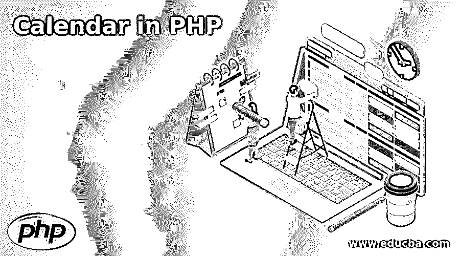
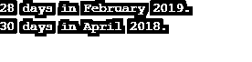
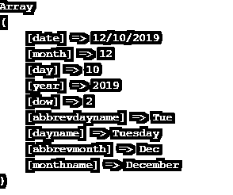
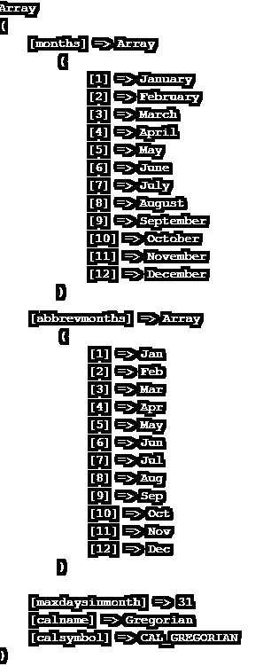
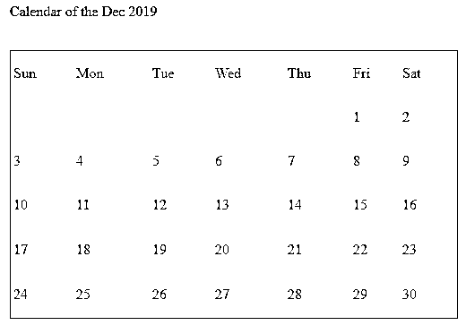

# PHP 中的日历

> 原文：<https://www.educba.com/calendar-in-php/>




## PHP 中的日历介绍

PHP 日历函数是所有关于玩日历相关的函数。我们必须在 PHP 中使用各种内置函数，以便轻松执行各种与日历相关的任务。当我们在任何 web 应用程序中处理事件、预订或任何类型的约会时，这个日历非常有用。与使用 jQuery 创建日历相比，在 PHP 中创建日历要困难一些。使用 [jQuery 日历非常简单。](https://www.educba.com/jquery-plugins/)

**语法**

<small>网页开发、编程语言、软件测试&其他</small>

使用日历特性的语法不仅仅局限于一行代码。有各种功能组合在一起，使日历运行正常。有各种可用的日历类和库，如果我们想使用 [PHP 版本](https://www.educba.com/php-versions/)，我们可以在我们的 PHP 应用程序中使用它们。创建我们自己的全功能的功能将需要比预期更长的时间。

**例如:**如果我们想知道一个指定月份和年份的天数，我们必须使用 cal_days_in_month(param1，param2，param2)函数。其中，param1 是一种日历，param2 是月份数，param3 是我们需要的天数的年份。

函数可以将儒略日计数转换成一个包含所有细节的日历。其中，参数 1 是儒略日，参数 2 是一种日历。

### PHP 日历函数及例子

有各种日历内置函数，我们将在示例部分看到各种示例。有如下功能:

#### 示例#1

**cal_days_in_month 函数:**该函数将给出给定月份和年份的天数。

**代码:**

```
<?php
// to get the number of days in a calendar month
$varDays = cal_days_in_month(CAL_GREGORIAN,2,2019);
echo $varDays ." days in February 2019.";
echo "\n";
$varDays = cal_days_in_month(CAL_GREGORIAN,4,2018);
echo $varDays ." days in April 2018.";
?>
```

**输出:**




#### 实施例 2

**cal_from_jd:** 该函数可用于[将日历](https://www.educba.com/calendar-in-asp-net/)从儒略日计数转换为支持的日历。同样，我们有一个函数 cal_to_jd()将日历转换为儒略日计数。我们用一个例子来理解同样的道理。

**代码:**

```
<?php
// to get the  calendar details of the current date
$current_timestamp = time(); // current timestamp
$unix_jd_time = unixtojd($current_timestamp);
print_r(cal_from_jd($unix_jd_time, CAL_GREGORIAN));
?>
```

**输出:**




#### 实施例 3

**cal_info:** 我们可以在 PHP 中使用这个函数来获取一个日历的详细信息。它将一个参数作为整数。这是一个可选参数。我们需要担心参数的传递。让我们用一个示例程序来看看同样的情况。

**代码:**

```
<?php
// to get the  calendar info
$info = cal_info(0); // if we not pass any valid param then it will gives all calendar details
print_r($info);
?>
```

**输出:**




这个函数可以用来将时间戳转换成儒略日计数。我们在前面的例子中已经看到了。该函数采用时间戳形式的参数。

我们可以在 PHP 中使用各种其他函数来享受全功能的日历。

### 怎么做日历？

在 PHP 中，我们有各种类型的日历，如公历、儒略历、犹太历和法国历等。在这一节中，我们将看到如何使用它创建一个当前的月历。如果不使用日期和时间功能，玩日历几乎是不可能的。

```
<?php
function showCurrentMonth($current_Month, $year)
{
$date = mktime(12, 0, 0, $current_Month, 1, $year);
$numberOfDays =cal_days_in_month(CAL_GREGORIAN,$current_Month, $year);
$offset = date("w", $date);
$row_number = 1;
// time to draw the month header
echo "<table style='color:blue; border:1px solid blue; width:500px; height:300px;'><br/>";
echo "<tr><td>Sun</td><td>Mon</td><td>Tue</td><td>Wed</td><td>Thu</td><td>Fri</td><td>Sat</td></tr> <tr>";
// this will print the additional td record in case the month is not starting with the Sunday.
for($i = 1; $i <= $offset; $i++)
{
echo "<td></td>";
}
//  this will print the number of days.
for($day = 1; $day <= $numberOfDays; $day++)
{
if( ($day + $offset - 1) % 7 == 0 && $day != 1)
{
echo "</tr> <tr>";
$row_number++;
}
echo "<td>" . $day . "</td>";
}
while( ($day + $offset) <= $row_number * 7)
{
echo "<td></td>";
$day++;
}
echo "</tr></table>";
}
?>
<html>
<head>
<title>Calendar of the current month (Dec 2019)</title>
</head>
<body>
<p>Calendar of the Dec 2019</p>
<?php
// Dec 2019 in PHP
showCurrentMonth(11, 2019);
?>
</body>
</html>
```

**对上面代码的解释:**在上面的代码中，我们可以看到生成一年中任意给定月份的日历的函数。我们可以根据业务需求生成任意数量的日历月。

**输出:**




### 结论

当动态日期和时间一次又一次出现时，需要使用它。我们也可以在 PHP 中使用 jQuery UI 日历。因此，根据截止日期和业务需求，我们也可以在 PHP 应用程序中使用 jQuery 日历。与 PHP 日历相比，大多数开发人员更喜欢使用 jQuery UI 日历特性。PHP 相对来说需要更多的时间。

### 推荐文章

这是一个 PHP 日历指南。这里我们用例子讨论 PHP 日历函数，并用 PHP 日历创建一个月的日历。您也可以阅读以下文章，了解更多信息——

1.  [PHP 文件处理](https://www.educba.com/php-file-handling/)
2.  [PHP 关键字](https://www.educba.com/php-keywords/)
3.  [PHP 中的静态方法](https://www.educba.com/static-method-in-php/)
4.  [PHP 布尔值](https://www.educba.com/php-booleans/)


