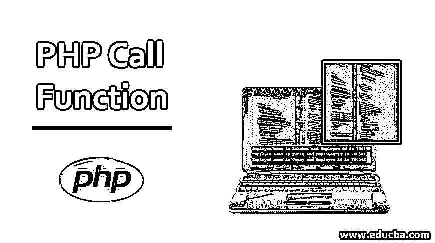
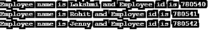

# PHP 调用函数

> 原文：<https://www.educba.com/php-call-function/>




## PHP 调用函数介绍

在 PHP 中，函数有两种类型，即内置函数和用户自定义函数。程序员或开发人员可以从程序中直接调用许多内置函数。这些内置函数对于要执行的任务有特定的含义。用户定义的功能是由程序专门开发的，该程序包含要针对应用程序执行的代码。开发人员编写一组代码，这些代码必须根据应用程序中的需求来执行任务。

### 在 PHP 中定义和调用一个函数

PHP 中有两种类型的函数，即内置函数和用户自定义函数。这些函数在程序中用于执行各种任务。在 PHP 中，定义了大量的函数，可以在程序的任何地方使用。虽然它有很多优点，不需要反复编写代码，而且函数是软件包自带的，但开发者很容易使用内置函数。但是所有的内置函数都有预先定义的含义，并且自己执行特定的任务。因此，开发人员开始开发用户定义的函数，开发人员可以在任何函数中编写特定的任务代码，并可以在程序中的任何地方使用。用户定义的函数在程序的类中或程序的方法中被调用，以根据应用需求执行任务。

<small>网页开发、编程语言、软件测试&其他</small>

### 如何创建用户自定义函数？

在 PHP 中，用户定义的函数必须用关键字“function”来声明。如果我们声明了函数名，并且要执行的代码已经写在里面，那么它可以在程序的任何地方被调用。

**语法:**

```
function function_name()
{
//statements
}
```

在上面的语法中，function_name 是程序中要调用的函数的名称，function 是用于声明该函数的关键字。在 PHP 中，一个函数被声明为以函数名为前缀的 function 关键字，在程序中调用一个函数只需在需要的地方调用函数名即可。

### 实现 PHP 调用函数的例子

我们举个例子来理解 PHP 中调用函数的概念。

#### 示例#1

在下面的示例中，函数 Write_Output 是该函数的名称，该函数在下面的程序中以相同的名称调用。这一行将调用已定义的函数，并执行函数中编写的语句，一旦代码的最后一条语句执行完毕，这一行将退出。

**代码:**

```
<?php
function Write_Output()
{
echo "This is the sample example of a function!";
}
Write_Output();
?>
```

**输出:**


#### 实施例 2

1.在 PHP 中，函数可以是参数化的，即向函数传递参数。参数就像我们在程序中定义的变量。我们可以简单地在括号内的函数名后面传递参数，并且可以通过在参数之间添加逗号来添加任意多的参数。这些参数将在调用函数时被映射。如果在调用函数时没有传递正确数量的参数，它将抛出错误。

**代码:**

```
<?php
function Employee($ename) {
echo "$ename Patil \n";
}
Employee("Akash");
Employee("Prakash");
?>
```

**输出:**


在上面的例子中，Employee 是函数的名称，e name 是在声明中传递给函数的参数。在函数声明下调用 Employee 函数，并且在调用时将值传递给该函数。程序的输出将是在调用函数时传递给它的雇员的名字。

2.在下面的示例中，打印了员工姓名，同时还打印了员工 ID。当一个组织有大量数据要存储在数据库中时，我们可以简单地编写这种代码来轻松处理数据。

**代码:**

```
<?php
function Employee($ename, $id) {
echo "Employee name is $ename and Employee id is $id \n";
}
Employee("Lakshmi","780540");
Employee("Rohit","780541");
Employee("Jenny","780542");
?>
```

**输出:**




在 PHP 中，变量并不严格基于数据类型，而是取决于它的值或数据。数据类型是松散耦合的，不遵循任何严格的规则。所以我们可以对不同数据类型的变量进行加减运算。

#### 实施例 3

正如我们已经看到的所有例子，我们可以清楚地看到，用户定义的函数对开发人员更有利，因为从应用程序的角度来看，它帮助很大，并且也用于获得所需的输出。在特定程序中使用函数的目的是，它可以创建自己的代码，并根据需求开发应用程序。

**代码:**

```
<?php
function mulNumbers(int $x, int $y)
{
return $x * $y;
}
echo mulNumbers(5, 13);
?>
```

**输出:**


正如我们在上面的例子中看到的，整数可以和字符串相乘，字符串可以和浮点数一起使用。所以 PHP 是一种松散类型的语言。在上面的例子中，我们可以清楚地看到，变量 x 和 y 被声明为 integer，在调用时，它们只使用一个变量作为 integer，另一个变量作为 string，所需的输出也被获取。

### 结论

在本文中，我们讨论了如何在 PHP 中调用函数，即用户自定义函数。然后我们讨论了不同形式的用户自定义函数和语法，并给出了例子。可以为特定的应用程序编写函数，并执行特定的任务，即计算工资、添加新条目等。因此，开发人员可以很容易地灵活修改代码，并可以在程序中的任何地方调用它。

### 推荐文章

这是一个 PHP 调用函数的指南。在这里，我们讨论如何定义和如何创建用户自定义的 PHP 调用函数，以及示例和代码实现。您也可以浏览我们推荐的其他文章，了解更多信息——

1.  [在 PHP 中继续](https://www.educba.com/continue-in-php/)
2.  PHP 中的[字符串](https://www.educba.com/string-in-php/)
3.  [PHP 中的析构函数](https://www.educba.com/destructor-in-php/)
4.  [PHP 超全局变量](https://www.educba.com/php-superglobal-variables/)


