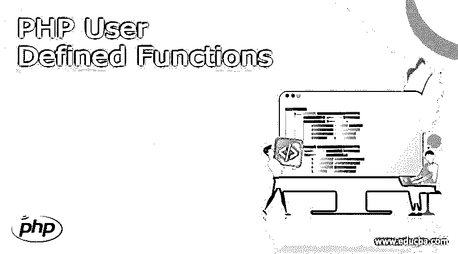
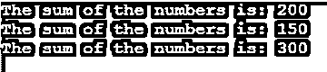

# PHP 用户自定义函数

> 原文：<https://www.educba.com/php-user-defined-functions/>

## PHP 用户定义函数介绍

PHP 允许你创建用户定义的函数，在这里你可以创建你的函数。函数是可以在程序中反复使用的语句的集合。对函数的调用将导致它运行。PHP 中有几个内置函数，比如数学、字符串、日期和数组函数。也可以定义一个函数来满足特定的要求。术语“用户定义函数”指的就是这样的函数。函数在定义时不运行；相反，它在被调用时运行。

创建 PHP 用户定义函数的语法

<small>网页开发、编程语言、软件测试&其他</small>

PHP 用户定义的函数声明以关键字 function 开始，如下所示

`function funName($arg1, $arg2, ... $argn)
{
// code to be executed inside a function
//return $val
}`

funName–这是函数的名称。函数名必须以字母或下划线开头。函数名不区分大小写。可选，但是可以使用任意数量的参数来定义函数。但是，在调用时，必须提供相同数量的参数。

调用 PHP 用户定义函数的语法

`$ret=funName($arg1, $arg2, ... $argn);`

调用函数后，函数的返回值存储到$ret 变量中。

### PHP 用户自定义函数的使用

PHP 用户自定义函数的工作原理:

用户定义函数的声明以单词 function 开始，然后是您要编写的函数名，接下来是括号()，最后是用花括号括起来的函数体或代码。函数体可以包含任何可接受的 PHP 代码，比如条件、循环等等。假设我们定义了一个函数为“function print message(){ echo”Hello World！";}".接下来，我们将调用 printMessage()函数将消息显示为“printMessage()”。代码将在屏幕上打印消息。然后，不管功能块的最后一行是否返回，程序控制在块中的语句被执行后返回到它被调用的地方。

### PHP 用户定义函数示例

不带任何参数的 PHP 用户定义函数示例:

#### 示例#1

**代码:**

`<?php
// user-defined function definition
function printMessage(){
echo "Hello, How are you?";
}
//user-defined function call
printMessage();
?>`

**输出:**

与上面的程序一样，printMessage()函数是使用关键字函数创建的。该函数打印消息“你好，你好吗？”.因此，在程序中调用函数“printMessage()”时.它打印一条消息，正如我们在上面的输出中看到的。

#### 实施例 2

带有必需和默认参数的 PHP 用户定义函数示例

**代码:**

`<?php
// user-defined function definition
function sum($n1, $n2 = 0){
echo "The sum of the two numbers is: ";
echo $n1 + $n2 . "\n";
}
//user-defined function call
sum(20, 30);
sum(20);
?>`

**输出:**

与上面的程序一样，创建了 sum()函数。该函数接受两个参数，其中一个参数是必需的，另一个参数是可选的，当我们没有为它传递值时，它将采用默认值。在程序中调用函数“sum(20，30)；”，它打印出总数 50。当它调用“sum(20)；”，它打印 sum 20，正如我们在上面的输出中看到的。

#### 实施例 3

PHP 用户定义函数从函数中返回值的示例

**代码:**

`<?php
// user-defined function definition
function sum($n1, $n2 = 0){
return $n1 + $n2;
}
//user-defined function call
$result = sum(100, 50);
echo "The sum of the two numbers is: ";
echo $result . "\n";
$result = sum(200);
echo "The sum of the two numbers is: ";
echo $result . "\n";
?>`

**输出:**

与上面的程序一样，创建了 sum()函数。该函数接受两个参数，其中一个参数是必需的，另一个参数是可选的，当我们没有为它传递值时，它将采用默认值。接下来，在执行数字求和之后，函数返回它。在程序中调用函数“sum(100，50)；”，它返回总和 150。当它调用“sum(200)；”，它返回 sum 200，正如我们在上面的输出中看到的。

#### 实施例 4

传递 n 个参数的 PHP 用户定义函数示例

**代码:**

`<?php
// user-defined function definition
function sum( ...$n ){
$sum = 0;
foreach ($n as $no){
$sum = $sum + $no;
}
return $sum;
}
//user-defined function call
$result = sum(200);
echo "The sum of the numbers is: ";
echo $result . "\n";
$result = sum(100, 50);
echo "The sum of the numbers is: ";
echo $result . "\n";
$result = sum(200, 50, 50);
echo "The sum of the numbers is: ";
echo $result . "\n";
?>`

**输出:**

与上面的程序一样，创建了 sum()函数。该函数可以接受您传递的任意多个参数。接下来，在对传递的数字执行求和之后，函数返回它，正如我们在上面的输出中看到的。

#### 实施例 5

PHP 用户定义函数示例，显示不带参数的引用调用

**代码:**

`<?php
// user-defined function definition
function Call_By_Reference( &$num ){
$nun = 0;
}
//user-defined function call
$n = 10;
echo "The value of n before calling the function is: ";
echo $n . "\n";
$result = Call_By_Reference($n);
echo "The value of n after calling the function is: ";
echo $n . "\n";
?>`

**输出:**

与上面的程序一样，创建了 sum()函数。该函数接受一个参数，该参数存储所传递变量的地址或对该变量的引用。在函数内部，传递的变量的值被更改为 0，因为变量 num 存储传递的变量 n 的地址。在程序的更远处，变量 n 的值在调用函数之前和之后被打印，并且变量 n 的值被更改，正如我们在上面的输出中所看到的。

### 结论

PHP 中有几个内置函数，但是用户仍然可以定义一个满足特定需求的函数，这就是用户自定义函数。函数是可以执行特定任务的语句的集合，可以在程序中反复使用。

### 推荐文章

这是一个 PHP 用户自定义函数的指南。在这里，我们还讨论了 PHP 用户定义函数的介绍和工作原理，以及不同的例子和代码实现。您也可以看看以下文章，了解更多信息–

1.  [PostgreSQL vs MariaDB](https://www.educba.com/postgresql-vs-mariadb/)
2.  [卡珊德拉版本](https://www.educba.com/cassandra-versions/)
3.  [主动投资与被动投资](https://www.educba.com/active-vs-passive-investing/)
4.  [SQL Server vs PostgreSQL](https://www.educba.com/sql-server-vs-postgresql/)

