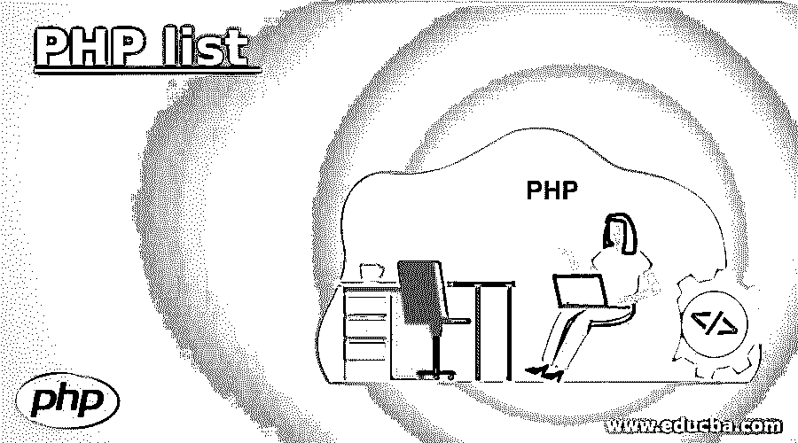
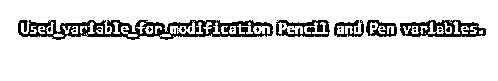
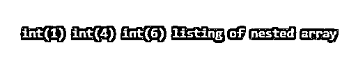

# PHP 列表

> 原文：<https://www.educba.com/php-list/>

## PHP 列表介绍

PHP 列表函数是一个重要的函数，用于在一次执行单个操作时给变量列表赋值。这个函数并不是在所有的 PHP 版本中都有，而是在 7.1 之前的 PHP 版本中专门引入的，它只对数值数组有效，同时给变量列表赋值。赋给变量的值是在 PHP 列表函数的帮助下执行后的返回类型。PHP 列表函数实际上并不是一个像数组一样的函数，而是一种赋值的语言结构。

**语法:**

<small>网页开发、编程语言、软件测试&其他</small>

`list(var_1, var_2, ...)`

语法流是这样的，其中有一个由从函数传递的参数组成的函数列表:

*   **list:** 声明了函数 list()。
*   **var_1:** 作为参数传递的变量是必需的，并且是强制性的，因为它作为第一个变量为声明的变量赋值。
*   **var_2:** 第二个变量是可选的，然后这个变量被用来给序列后面的列表赋值。

应用此语法时，返回类型为 assigned array，这意味着分配给数组的任何值都是该实例的返回类型。

### PHP 中的 list 函数是如何工作的？

list()函数是 PHP 中的一个内置函数，专门用于在执行时通过执行单个操作来为多个变量赋值。

让我们看看 PHP 中 list 函数的实际工作流程，描述如下:

*   最初，list 是一个内置函数，不需要编写，也不需要任何外部函数调用，它只是无缝地工作，没有太多的干扰。
*   在执行时，从考虑的多个值中为数组分配所需的值。
*   有一种误解认为数组被声明为赋值的变量，但这只是一个神话，实际上它只是一个语言构造。
*   在给变量赋值时，使用 list()函数在单个操作中执行所有操作。
*   这个函数只在数字数组上无缝工作，这表示用户将使用第一个变量 var_1 与数组进行交互。
*   传递给函数的第二个参数是可选参数，一旦第一个参数满足条件，就可以检索和使用该参数。
*   需要记住的一点是，变量的数量不应该超过数字数组的长度，如果它超过了数组定义的变量，那么它将给出参数类型的错误，并且在执行时不会有返回类型。
*   在执行这个列表函数时不应该引入异常，否则需求和返回类型将无法满足。
*   如果一个函数没有任何 return 语句，那么在执行时它将隐式返回 NULL 作为它的返回类型。
*   作为函数的一部分传递的参数应该以这样一种方式排列，即变量列表在代码中用空格分隔。
*   从函数传递的第一个变量是返回类型的强制变量。
*   另一个需要注意的要点是版本兼容性，这意味着 PHP 版本应该支持低于 7 的版本。
*   另外，说到 PHP 的版本兼容性，那么列表中的 PHP 版本 5 应该从最右边的参数开始赋值。
*   而 PHP 第 7 版的不同之处在于，变量的赋值将作为最左边的参数出现。
*   在使用普通变量的情况下，不需要担心给变量赋值，然后使用这些带有索引的数组来按顺序排列值。
*   但是如果必须保持从左到右或从右到左的顺序，那么就非常需要记住 PHP 版本控制。

### PHP 列表示例

下面给出了 PHP 列表的例子:

#### 示例#1

这个程序演示了 PHP 列表，其中数组被赋值给变量，变量的值如输出所示。

**代码:**

`<!DOCTYPE html>
<html>
<body>
<?php
$an_arr = array("Banana","Mango","Apple");
list($a_1, $b_2, $c_3) = $an_arr;
echo "I have many fruits, one $a_1, one $b_2 and one $c_3.";
?>
</body>
</html>`

**输出:**

#### 实施例 2

这个程序演示了 PHP 列表，其中 array 被赋予变量中的第一个和第三个值，如输出所示。

**代码:**

`<!DOCTYPE html>
<html>
<body>
<?php
$arr_b = array("Pencil","Copy","Pen");
list($k_0, , $z_1) = $arr_b;
echo "Used_variable_for_modification $k_0 and $z_1 variables.";
?>
</body>
</html>`

**输出:**

#### 实施例 3

这个程序演示了数组的声明，首先列出所有的变量，然后检索一些值，然后列出其中的一些值，第三个值被跳过。如果列表包含所有的字符串，它将返回空值，如输出所示。

**代码:**

`<!DOCTYPE html>
<html>
<body>
<?php
$in_p = array('choco', 'caramel', 'pancake');
list($choco, $cake, $caramel) = $in_p;
echo "$choco cake $color and $caramel appears relishing \n";
list( , , $caramel) = $in_p;
echo "caramel cake tastes wow $caramel!\n";
list($choco, , $cake) = $in_p;
echo "$choco has $cake.\n";
list($gi_t) = "lost_in \n";
list($choco, , $cake) = $in_p;
echo "$choco has $cake.\n";
var_dump($gi_t);
?>
</body>
</html>`

**输出:**

#### 实施例 4

这个程序通过使用输出中显示的列表函数演示了嵌套数组。

**代码:**

`<!DOCTYPE html>
<html>
<body>
<?php
list($a_1, list($b_2, $c_0)) = array(1, array(4, 6));
var_dump($a_1, $b_2, $c_0);
echo "listing of nested array";
?>
</body>
</html>`

**输出:**

**

** 

### 结论

PHP list 是一个内置函数，它给用户提供了灵活性和多功能性，可以根据需要将这个函数作为实现的一部分。使用 PHP list 使值按一定的顺序排列，这给用户提供了可视性，实现了一个用户友好的数组返回值和变量。

### 推荐文章

这是一个 PHP 列表指南。这里我们讨论一下入门，PHP 中 list 函数是如何工作的？并分别举例说明。您也可以看看以下文章，了解更多信息–

1.  [PHP 发布方法](https://www.educba.com/php-post-method/)
2.  [PHP sscanf()](https://www.educba.com/php-sscanf/)
3.  [PHP 包含并要求](https://www.educba.com/php-include-and-require/)
4.  [PHP 类型提示](https://www.educba.com/php-type-hinting/)

