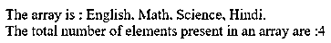
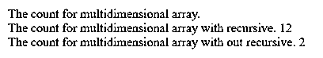
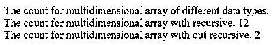

# PHP 计数

> 原文：<https://www.educba.com/php-count/>

## PHP 计数介绍

PHP count()方法用于获取数组中元素的数量。PHP count()方法是 PHP 中的一个内置方法。它执行与 size()方法相同的任务。有时我们需要知道数组或对象中元素的数量，因此 PHP 为此提供了 count()方法。PHP count()方法也可以为没有元素的数组或对象返回 0 值，或者为空数组，也可以为未设置的数组或对象返回 0 值。

**语法:**

<small>网页开发、编程语言、软件测试&其他</small>

`count( array, mode );`

**参数:**

*   array–这不是一个可选参数，它指定要对其元素进行计数的数组。
*   mode–这是一个可选参数，指定方法的模式。该参数有两个可能的值，即 0 和 1。0 表示不对数组元素进行递归计数，这是该参数的默认值。值 1 表示递归地计算数组的元素数，用于递归地计算多维数组的元素数。
*   返回值–该方法的返回值是对象或数组中存在的元素数量。

### PHP count()方法的工作原理

PHP count()方法使用数组或对象来获取特定数组中的元素数量。该阵列可以是一维的或多维的。当调用 count()方法并将数组的名称传递给它时，count()方法计算数组中有多少个元素，并返回这个计数作为结果。

### 例子

PHP count()方法的例子，用于查找数组中元素的数量。接下来，我们编写 PHP 代码，通过下面的示例更清楚地理解 PHP count()方法，其中 count()方法用于查找一维数组中的元素数，如下所示

#### 示例#1

**代码:**

`<?php
// array of languages
$Language = array( 'English', 'Math', 'Science', 'Hindi');
print( "The array is : " );
print( implode(', ', $Language ));
print(". ");
// Calculating total number of elements present in an array.
$result = count($Language);
print( "The total number of elements present in an array are :" );
print( $result );
?>`

**输出:**

如上面程序中的代码“$ result = count($ Language)；”查找并返回数组“Language”中的元素数量，我们可以在输出中看到。

PHP count()方法的例子，用于查找多维数组的计数。

接下来，我们编写 HTML 代码来理解 PHP Count()方法，其中 length 属性用于查找多维数组中某个元素的计数，如下所示

#### 实施例 2

**代码:**

`<?php
// multidimensional array of subjects
$sub = array( 'Subjects' => array( 'English', 'Math', 'Science', 'Hindi', 'Social' ),
'facultyid' => array( 'fac12', 'fac36', 'fac78', 'fac60', 'fac03' ) );
print( "The count for multidimensional array. " );
print( "  " );
// Calculating total number of elements present in an multidimensional array.
// recursive count
print( "The count for multidimensional array with recursive. " );
print( count( $sub, 1 ));
print( "  " );
print( "The count for multidimensional array with out recursive. " );
print( count( $sub ));
print( "  " );
?>`

**输出:**

与上面的程序一样，创建“sub”数组是为了存储主题和处理主题的教师 id。在代码的后面，count()方法以两种方式用于查找多维数组中的元素数量。第一种方法是“count( $sub，1)；”，这是一种递归方式，通过将模式值传递给 1 来表示，第二种方式是“count($ sub)；”，这不是递归的方式。因此，第一路的输出计数是 12，第二路的输出计数是 2。PHP count()方法，用于查找不同数据类型的多维数组的计数。

接下来，我们编写 HTML 代码来理解 PHP Count()方法，其中 length 属性用于查找多维数组中元素的计数，多维数组在不同的维度中具有不同的数据类型，如下所示

#### 实施例 3

**代码:**

`<?php
// multidimensional array of Marks
$Marks = array( 'Subjects' => array( 'English', 'Math', 'Science', 'Hindi', 'Social' ),
'rollno' => array( 89, 78, 56, 45, 67 ));
print( "The count for multidimensional array of different data types. " );
print( "  " );
// Calculating total number of elements present in an multidimensional array.
// recursive count
print( "The count for multidimensional array with recursive. " );
print( count( $Marks, 1 ));
print( "  " );
print( "The count for multidimensional array with out recursive. " );
print( count( $Marks ));
print( "  " );
?>`

**输出:**

在上面的程序中，创建“标记”数组来存储主题和相应的标记，这些标记与标记数组的主题相比具有不同的数据类型。在后面的代码中，count()方法以两种方式用于查找多维数组中的元素数，因此第一种方式的输出计数是 12，第二种方式的输出计数是 2。

### 结论

PHP count()方法是一个内置方法，用于获取数组中元素的数量。

### 推荐文章

这是一个 PHP 计数指南。这里我们分别讨论 PHP count 的描述，PHP count()方法的工作原理以及例子。您也可以看看以下文章，了解更多信息–

1.  [PHP 梁()](https://www.educba.com/php-strlen/)
2.  [PHP 异步](https://www.educba.com/php-async/)
3.  [PHP usort()](https://www.educba.com/php-usort/)
4.  [PHP 内爆](https://www.educba.com/php-implode/)

