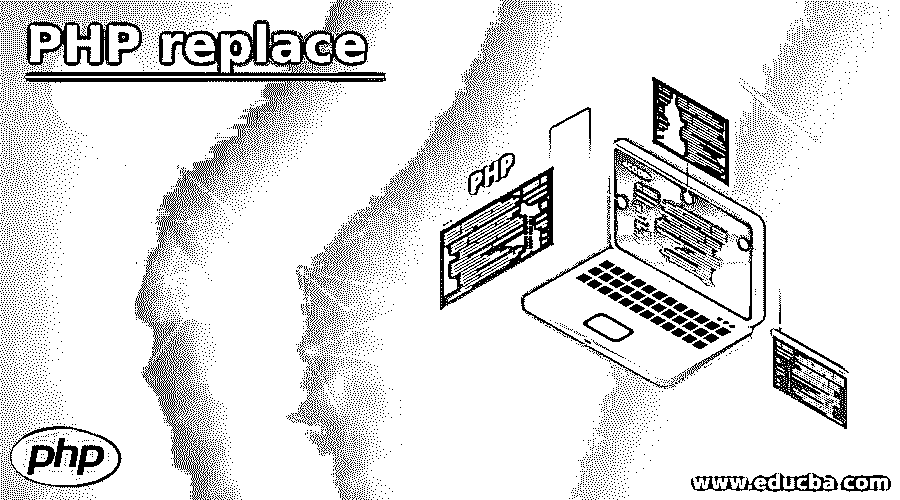
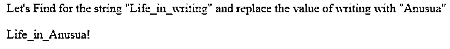
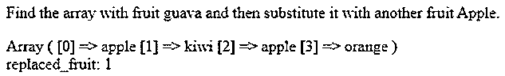
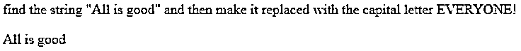

# PHP 替换

> 原文：<https://www.educba.com/php-replace/>

## PHP 替换简介

replace()函数是 PHP 中的一个函数，主要处理字符串，目的是通过搜索需要替换的字符串来替换任何字符串。搜索字符串的模式可以是整个搜索字符串需要被替换，或者它可以是在给定的字符串或数组中被搜索的替换字符串替换的数组。replace()函数是 PHP 中的一个内置函数，它返回一个包含替换值的新字符串或数组。该函数强制接受四个参数或自变量，即 search_val、replace_val、subject_val 和 count。

### PHP 替换的语法

下面给出了语法:

<small>网页开发、编程语言、软件测试&其他</small>

`str_replace(search_val, replace_val, subject_val, count)`

语法流中的参数表示如下:

*   **search_val:** search_val 参数表示字符串和数组类型。此参数指定需要搜索并由搜索到的字符串替换的字符串。
*   **replace_val:** replace_val 参数表示字符串和数组类型。此参数指定需要替换使用参数 search_val 搜索的字符串的字符串。
*   **subject_val:** subject_val 参数表示需要用 replace_val 替换和用 search_val 搜索的字符串和数组类型。
*   **count:** count 是一个可选值，当该值被设置并替换为对 subject_val 字符串执行的替换操作的总数时，将传递该值。

### PHP 中的替换函数是如何工作的？

PHP 中的 replace()函数是一个内置函数，用于替换给定字符串中需要替换的所有可能的参数，因此它有一些需要遵循的工作标准:

*   PHP 中的一些强制函数涉及到这些参数，如 search_val、replace_val、subject_val 和 count，没有这些参数，工作将无法完成。
*   需要记住一些非常重要的标准，例如，如果在 subject_val 字符串中搜索 search_val with string 和 replace_val with string，则替换为相应字符串及其参数的 replace_val arguments 字符串。
*   如果 replace_val 元素中的参数数量少于 search_val 中所需的数量，那么它将使用空字符串替换该值或元素。
*   出现的另一种情况是说替换也可以包括带有一些值的数组或字符串。
*   让我们考虑包含元素的数组或字符串，然后在 subject_val 中搜索整个字符串。
*   在 search_val 和 replace_val 的同时，Count value 也扮演了一个非常重要的角色，即该参数试图从函数中传递，其值将设置为为替换字符串而执行的操作总数，并且该字符串应该是带有 subject_val 的字符串。
*   replace 函数()的返回值是一个字符串，即一个普通字符串，或者该字符串可以是包含所有被替换值的字符串。
*   此函数被认为是区分大小写的函数，但是与 str_ireplace()函数相比，str_ireplace()函数执行不区分大小写的搜索。
*   这个函数也被认为是二进制安全的。
*   在版本 4+中，此函数支持完整的羽翼模式。
*   count 的可选值还有一个意义，就是 5.0 以上的 PHP 版本中增加了 count 函数。
*   PHP 以下的早期版本包含了很多复杂的函数，比如查找和替换，这使得字符串查找和替换的整个功能变得非常麻烦。这将导致空的查找索引和数组内部指针的相互作用。
*   PHP 版本引入了 count 函数，克服了所有这些查找和替换的复杂性。
*   搜索功能和替换功能需要大量的注意力和焦点，因为两者都将在内部使用，以便执行与搜索操作相关的功能。
*   有时在 str_replace()方法和 str_ireplace()方法之间会有误解，但是差别并不大，非常微小的差别在于两者分别使用区分大小写和不区分大小写的模式进行密封。
*   整个 string_replace()函数使用四个强制参数，在实现时为程序员提供了可重用性和灵活性。

### PHP 替换的例子

下面是提到的例子:

#### 示例#1

这个程序演示了 PHP 中的 replace()函数，它首先查找字符串，然后用定义的部分替换字符串的值。它将整个 php 字符串替换为输出中所示的值。

**代码:**

`<!DOCTYPE html>
<html>
<body>

Let's Find for the string "Life_in_writing" and replace the value of writing with "Anusua"

<?php
echo str_replace("writing","Anusua","Life_in_writing!");
?>
</body>
</html>`

**输出**

**

** 

#### 实施例 2

这个程序演示了一个水果数组，它试图用苹果来替换番石榴串等水果的特定值，如输出所示。

**代码:**

`<!DOCTYPE html>
<html>
<body>

Find the array with fruit guava and then substitute it with another fruit Apple.

<?php
$ar_ray = array("guava","kiwi","apple","orange");
print_r(str_replace("guava","apple",$ar_ray,$k));
echo " " . "replaced_fruit: $k";
?>
</body>
</html>`

**输出:**

#### 实施例 3

这个程序演示了用元素替换字符串，用 subject_val 字符串替换字符串值，因为字符串值越小，就越容易被替换，如输出所示。

**代码:**

`<!DOCTYPE html>
<html>
<body>
<?php
$search = array("Welcome","Everyone!");
$replace_str = array("Zee");
$arr_ay = array("Welcome","All",":)");
print_r(str_replace($search,$replace_str,$arr_ay));
?>
</body>
</html>`

**输出:**

#### 实例 4

这个程序演示了 ireplace_string()，与输出中所示的 replace()函数相比，它不区分大小写。

**代码:**

`<!DOCTYPE html>
<html>
<body>

find the string "All is good" and then make it replaced with the capital letter EVERYONE!

<?php
echo str_ireplace("EVERYONE!","Anusua","All is good");
?>
</body>
</html>`

**输出:**

### 结论

PHP replace()是一个函数，它给了程序员在执行时的灵活性和可重用性，并允许用户相应地使用函数来搜索和替换字符串。当涉及到采用功能时，它向用户提供了根据需求实现的视图。总的来说，这个函数在 PHP 中起着重要的作用。

### 推荐文章

这是一个 PHP 替换指南。这里我们讨论一下 PHP 中的替换函数是如何工作的？并分别举例说明。您也可以看看以下文章，了解更多信息–

1.  [PHP 发布方法](https://www.educba.com/php-post-method/)
2.  [phpMyAdmin 是什么？](https://www.educba.com/what-is-phpmyadmin/)
3.  [PHP include_once](https://www.educba.com/php-include_once/)
4.  [PHP 追加数组](https://www.educba.com/php-append-array/)

