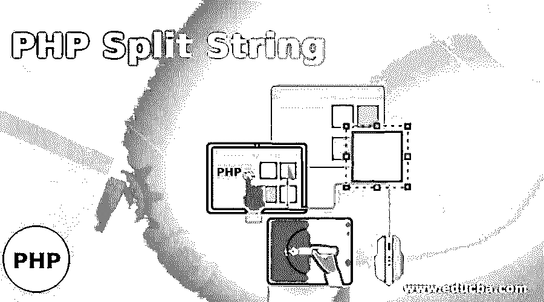
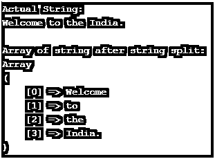
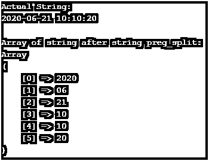
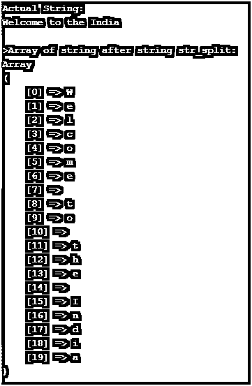
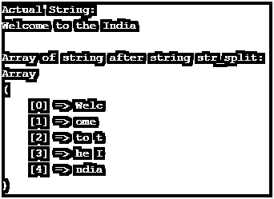
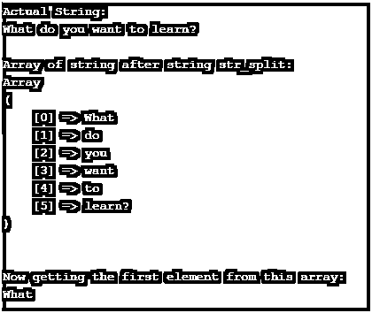

# PHP 拆分字符串

> 原文：<https://www.educba.com/php-split-string/>

## PHP 拆分字符串介绍

拆分字符串是任何编程语言的基本操作之一。PHP 中有各种内置函数来处理拆分关系操作。当我们认识分裂这个词时，我们会经历单个字符串分裂成多个字符串。根据我们的业务需求，有多种方法可以拆分字符串。换句话说，如果你想拆分一个字符串，按字符(每个字符一个)，按空格，按特殊字符等等。我们也可以在处理字符串拆分时使用大小组合。

**语法:**

<small>网页开发、编程语言、软件测试&其他</small>

`explode(Separator, String, Limit)`

*   **Separator:** Separator 是分隔符，是必选参数。
*   **字符串:**需要分成多个的字符串。同样，这是一个必需的参数。

极限是一个可选参数。

`str_split`

`str_split(String, Length)`

*   **String:** 这是一个必需的参数。
*   **长度:**这是一个可选参数。

`preg_split(RegularExpressionPattern, String, Limit, Flags)`

RegularExpressionPattern-必需的参数。

*   **String:** 必选参数。
*   **限额:**可选一项。

### PHP 拆分字符串的使用

在继续进行字符串分割之前，我们必须首先有一个字符串来对该字符串执行操作。在 string 之后，我们可以得到所需的分隔符，字符串分割操作需要在该分隔符上执行。

#### 1.explode()函数的用户

这个函数可以用来将一个字符串分解成一个字符串数组。

让我们用一个基本的例子来理解这一点:

`$string = 'Welcome to the India.'; // a string
$arrayString=  explode(" ", $string ); // split string with space (white space) as a delimiter.
Print_r($arrayString); // printing the output array…`

#### 2.preg_split()的用户

该函数可用于根据正则表达式将一个字符串拆分成多个字符串。当我们有一个字符串，比如用-分隔的日期字符串时，这很有用。我们可以用–键断开那个字符串。

`$string = "2020-06-21 10:10:20"; // a string
$outputArr= preg_split("/[-\s:]/", $string);`

上面的代码将通过–或空格来断开字符串。

#### 3.str_split 的用户

这也可以做同样的工作，将一个字符串转换成一个更小的字符串数组。

`$string = "Welcome to the India"; // a string
$outputArr = str_split("Welcome to the India");`

### 实现 PHP 拆分字符串的例子

下面是 PHP 拆分字符串的例子:

#### 示例#1

在我们找到空白的地方分开一个字符串。

**代码:**

`<?php
$string = 'Welcome to the India.'; // a string
echo "Actual String:\n";
echo $string;
echo "\n\n";
echo "Array of string after string split:\n";
$arrayString= explode(" ", $string ); // split string with space (white space) as a delimiter.
Print_r($arrayString); // printing the output array…
?>`

**输出:**

#### 实施例 2

在这个例子中，我们将看到如何使用正则表达式将一个字符串拆分成多个字符串。

**代码:**

`<?php
$string = "2020-06-21 10:10:20"; // a string
echo "Actual String:\n";
echo $string;
echo "\n\n";
echo "Array of string after string preg_split:\n";
$components = preg_split("/[-\s:]/", $string);
print_r($components);
?>`

**输出:**

#### 实施例 3

让我们看另一个非常简单的使用 str_split()函数拆分字符串的例子。

**代码:**

`<?php
$string = "Welcome to the India"; // a string
echo "Actual String:\n";
echo $string;
echo "\n\n>";
echo "Array of string after string str_split:\n";
$arrays = str_split($string);
print_r($arrays);
?>`

**输出:**

#### 实施例 4

使用 str_split()函数分割指定长度的字符串。

**代码:**

`<?php
$string = "Welcome to the India"; // a string
echo "Actual String:\n";
echo $string;
echo "\n\n";
echo "Array of string after string str_split:\n";
$arrays = str_split($string,4);
print_r($arrays);
?>`

**输出:**

**解释:**看上面程序的输出，我们可以说某个长度为 2 或 3 的字符串但是我们把长度提到了 4。这只是因为带有 2 的字符串元素带有 2 个空格，而带有 3 个字符的字符串带有一个空格。

#### 实施例 5

现在，使用 string split 方法，让我们尝试从该字符串中获取第一个字符串。

**代码:**

`<?php
$string = "What do you want to learn?"; // a string
echo "Actual String:\n";
echo $string;
echo "\n\n";
echo "Array of string after string str_split:\n";
$arrays = explode(" ",$string);
print_r($arrays);
echo "\n\nNow getting the first element from this array:\n";
echo $arrays[0];
?>`

**输出:**

**解释:**用同样的方法，我们可以访问字符串的其他元素。例如，$arrays[1]访问第 2 个和第 3 个元素。

### 结论

我们可以简单地说，在 PHP 中有各种方法来处理字符串分割。可以根据业务需求使用内置 PHP 函数来处理拆分字符串。但是代码或开发人员应该意识到使用这些方法及其利弊。string split 的大部分功能是把字符串变成一个数组，然后我们可以从那个数组中得到指定的字符串。

### 推荐文章

这是一个 PHP 拆分字符串的指南。这里我们讨论 PHP 拆分字符串的介绍及其例子和代码实现。您也可以浏览我们推荐的其他文章，了解更多信息——

1.  [Python 中抽象类概述](https://www.educba.com/abstract-class-in-python/)
2.  [PHP 中什么是抽象类？](https://www.educba.com/abstract-class-in-php/)
3.  [用方法](https://www.educba.com/socket-programming-in-php/)在 PHP 中进行套接字编程
4.  [PHP chop() |如何工作？](https://www.educba.com/php-chop/)

