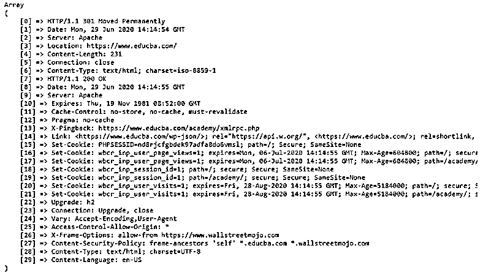
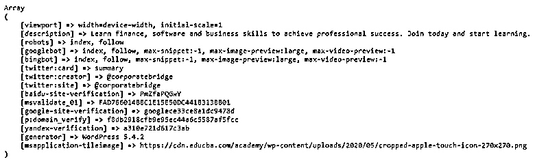
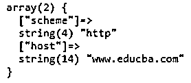
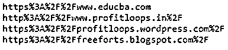
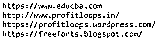
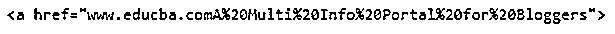

# PHP URL

> 原文：<https://www.educba.com/php-url/>

## PHP URL 的定义

通常，URL 表示统一资源定位器。同样，PHP 编程语言中的 URL 也是如此。URL 只不过是一个网站地址。当使用特定链接浏览时，它有助于连接客户端和服务器。URL 看起来很简单，但它包含特定网站地址的特定信息，实际上指向一个特定的 IP 地址，实际上指向一个特定的域名托管。这个 PHP URL 还需要处理许多 URL 函数，这些函数在处理 URL 时非常有用，比如编码、解码、解析等等。根据我们的要求。通常，会有两种类型的 URL。它们是 HTTPS 启用的网址和 HTTPS 禁用的网址，显示在下面的语法。看看下面的内容，这样你就会详细了解 PHP URL 的整个概念。

### 语法和参数

php url 的语法和参数如下所示:

<small>网页开发、编程语言、软件测试&其他</small>

`https://www.educba.com
http://www.profitloops.in`

**PHP URL 参数说明:**

*   **https 和 http 参数:**这是表示 URL 是启用 https 还是启用 HTTP 的参数。HTTP 表示超文本传输协议，而 HTTPS 表示安全的超文本传输协议。
*   **www 参数:**该参数为域名前网站 URL 任何时间的正常参数。WWW 的意思是万维网。
*   **域名参数和域名扩展名:**域名参数是特定网站的名称，它将以某个域名扩展名结尾，如。com 或者。商业还是。在或。美国等。的”。COM "对于许多网站来说是正常的，但是如果扩展名以"结尾。“那就意味着它属于印度的领地了。".“美国”是指美国域名。商业”是指商业领域等..

### PHP 中 URL 是如何工作的？

在任何类似 PHP 编程语言的 web 编程语言中，每当用户在浏览器的 URL 部分输入一个特定的 URL，该请求就会被传递到特定的域名服务器。然后，域服务器将返回到特定的分配的 IP 地址，并继续到托管博客/网站的托管服务器。然后，像 Educba Chrome/任何其他浏览器在域名服务器实际指定的 IP 地址的帮助下，从特定的 web 服务器请求特定的页面。然后，web 服务器将页面返回到特定的 IP 地址，该地址实际上是由实际请求页面的特定浏览器指定的。浏览器上出现在你面前的特定页面可能包含许多其他 URL，这些 URL 可能包含许多服务器页面、许多图像等。该网址可以是任何类似于[www.educba.com](https://www.educba.com/)或其他类似的网址。

PHP 中的 URL 函数:

有不同类型的 URL 函数可以帮助处理 URL 字符串。URL 是一个有助于识别特定网站的地址，URL 字符串文本可能类似于:https://freeforts . BlogSpot . com/2017/01/download-YouTube-clone-template-for . html。一些 URL 函数包括。

*   get_headers()
*   get_meta_tags()
*   parse_url()
*   URL encoding()
*   urldecode()
*   rawurlencode()
*   rawurldecode()

#### 1.get_header() URL 函数

get_header() URL 函数有助于获取所有由特定服务器响应 HTTP 请求而实际发送的头。

##### 例子

这是一个说明 get_headers()函数的示例，该函数帮助获取所有由特定服务器作为对 HTTP 请求的响应而实际发送的报头。这里我使用 http://www.educba.com 作为 URL 输入。在这里，我们将获得该特定 URL 的所有标题。语法:

`<?php
$url = 'http://www.educba.com';
print_r(get_headers($url));
?>`

**输出:**

#### 2.get _meta_tags() URL 函数

get_meta_tags() URL 函数有助于从返回特定数组的文件中提取所有元标记内容数据属性。

##### 例子

这是一个说明 get_meta_tags() URL 函数的例子，用于获取特定输入 URL 的所有元标记属性。这里只使用了主页的 URL，所以没有 meta 标签，在数组中显示为空。

`<?php
$url = "https://www.educba.com/";
$metas = get_meta_tags($url);
print_r($metas);
?>`

**输出:**

#### 3.parse URL()URL 函数

url 函数帮助解析 URL，并帮助返回它的组成部分。

##### 例子

这是根据我们的需求解析特定输入 URL 的例子。这里我们解析的是 http://www.educba.com 的网址。查看输出，以便了解输入 URL 是如何解析的。

`<?php
$url = 'http://www.educba.com';
var_dump(parse_url($url));
?>`

**输出:**

#### 4.urlencode() URL 函数

urlencode() URL 函数有助于对 URL 进行编码。

##### 例子

这是说明 urlencode() URL 函数的例子。这里我使用了四种不同类型的 URL。在 urlencode() URL 函数的帮助下，每个 URL 将被编码成不同的类型，但只有字符串类型。您可以检查输出，以便了解不同类型的 URL 是如何编码的。带有 echo 语句的
标签仅用于显示换行符，而

* * *

标签用于在执行语法时显示水平线。

`<?php
// This is the PHP program of illustrating the urlencode functionality
echo urlencode("https://www.educba.com") . "\n";
echo urlencode("http://www.profitloops.in/") . "\n";
echo urlencode("https://profitloops.wordpress.com/") . "\n";
echo urlencode("https://freeforts.blogspot.com/") . "\n";
?>`

**输出:**

#### 5.urldecode() URL 函数

urldecode() URL 函数有助于解码编码的 URL。

##### 例子

这是说明 urldecode() URL 函数的例子。为了解码 URL，我们需要已经编码的代码，这意味着 urldecode()的特定输入 URL 应该是 urlencode()函数的输出。这里我使用了上面例子输出的编码 URL。然后在执行之后，您将得到上面示例的输入。检查输出，这样您将知道解码功能是如何工作的。

`<?php
//This is the program of illustrating URL Decode() function of PHP
echo urldecode("https%3A%2F%2Fwww.educba.com");
echo "\n";
echo urldecode("http%3A%2F%2Fwww.profitloops.in%2F");
echo "\n";
echo urldecode("https%3A%2F%2Fprofitloops.wordpress.com%2F");
echo "\n";
echo urldecode("https%3A%2F%2Ffreeforts.blogspot.com%2F");
echo "\n";
?>`

**输出:**

#### 6.rawurlencode() URL 函数

rawurlencode() URL 函数有助于根据 RFC 1738 对 URL 进行编码。

##### 例子

这是说明 rawurlencode()函数的示例。在 rawurlencode()函数的帮助下，对于特定的 URL，只对字符串进行编码。

`<?php
echo '<a href="www.educba.com',
rawurlencode('A Multi Info Portal for Bloggers'), '">';
?>`

**输出:**

#### 7.rawurldecode() URL 函数

rawurldecode() URL 函数有助于对根据 RFC 1738 解码的 URL 进行解码。

##### 例子

这是解码 rawurlencode()输入的示例。看看上面的例子和这个例子，这样你就会明白发生了什么，也可以看看输出。

`<?php
echo rawurldecode('A%20Multi%20Info%20Portal%20for%20Bloggers');
?>`

**输出:**

### 推荐文章

这是一个 PHP URL 指南。在这里，我们还讨论了 php 中 url 的介绍和工作原理，以及不同的例子和代码实现。您也可以看看以下文章，了解更多信息–

1.  [PHP 拆分数组](https://www.educba.com/php-split-array/)
2.  [PHP include_once](https://www.educba.com/php-include_once/)
3.  [PHP 数组搜索](https://www.educba.com/php-array-search/)
4.  [PHP 获取方法](https://www.educba.com/php-get-method/)

