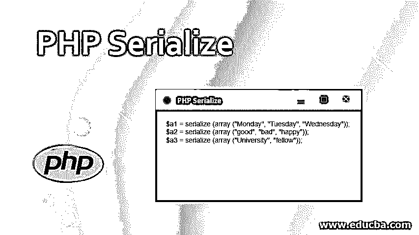
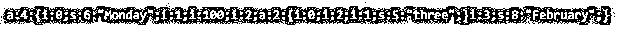
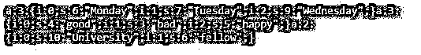

# PHP 序列化

> 原文：<https://www.educba.com/serialize-in-php/>




## PHP 序列化简介

serialize 是 PHP 中使用的一个函数，用于改变值的格式，并将值存储在变量中。序列化值表示一个位，这样一个位的集合称为序列化数据。这个函数以这样一种方式转换位，使得位可以被存储在存储缓冲器中。serialize 函数在将值转换为位的过程中起着关键作用，并使它们易于存储在内存中。我们使用这个函数的版本通常是 PHP4。

**语法**

<small>网页开发、编程语言、软件测试&其他</small>

serialize()的语法是:

```
serialize(variable1)
```

### PHP 中序列化是如何工作的？

假设我们想把字符串值存储在内存中，它们必须以一种可以存储在内存中的方式被改变。为此，我们使用 serialize 函数。首先使用 serialize()函数将数组中的字符串值赋给名为序列化值的变量。然后使用 print 打印输出。

### 实现 PHP 序列化的示例

下面是用 PHP 实现 Serialize()的例子

#### 示例#1

**代码:**

```
<?php
$serialized_value = serialize(array ('Dell', 'Laptop', 'Good'));
echo $serialized_value;
?>
```

**Output:** 这里 s 是计算字符串中字母个数的字母，根据它在内存中分配位。I 字母是字符串在内存中的位置。


**解释:**正如我们已经知道的，如果我们想在一个变量中存储一些字符串数组，它必须是按照位的格式。为了将包含字符串数组的变量转换为可存储的格式，我们使用 serialize 函数，该函数将变量值转换为位并存储在内存中，最后我们可以使用 echo 检索输出值。上面的例子可以用来解释 serialize 函数。这里，我们首先将一个字符串数组赋给变量 serialize 值。

**代码:**

```
$serialized_value = serialize(array ('Dell', 'Laptop', 'Good')); 
```

*   serialize 函数将它们转换成位并存储到内存中。
*   可以使用以下命令显示输出

```
echo $serialized_value;
```

*   echo 用于显示输出

#### 实施例 2

**代码:**

```
<?php
$variable1 = array ('Monday',  100,array(2, 'three'),  'February');
$variable2 = serialize($variable1);
echo $variable2;
?>
```

**输出:**这里 s 是用来计算存储在存储器中的位数的字母，I 是分配给存储器的位置。




**解释:**这里，我们将不同数据类型的值存储在一个变量中，为了将它们转换成适合存储在内存中的格式，我们使用了 serialize 函数。它将值转换为位，并在内存中分配存储这些值的位置。首先，我们将字符串和数字数组赋给变量 1。

**代码:**

```
$variable1 = array (‘Monday',  100,array(2, 'three'),  'February’);
```

**Code:** 接下来，我们使用如下所示的 serialize 函数将变量 1 转换成适合将位存储到内存中的格式。

```
$variable2= serialize($variable1);
```

*   接下来，我们使用 echo 关键字打印输出。

```
echo $variable2;
```

#### 实施例 3

**代码:**

```
<?php
$a1 = serialize (array ("Monday", "Tuesday", "Wednesday"));
$a2 = serialize (array ("good", "bad", "happy"));
$a3 = serialize (array ("University", "fellow"));
echo $a1;
echo $a2;
echo $a3;
?>
```

**输出:**这里 s 是在内存中存储位的字母，I 字母分配字符串的位置。




**解释:**这里我们要将字符串存储在内存中并显示出来。首先我们把数组中不同的字符串分配给不同的变量，比如 a1，a2，a3。然后，我们使用 serialize 函数将值转换为位，并将其存储在内存中，因为我们使用 serialize 函数。值的分配如下所示。

**代码:**

```
$a1 = serialize (array ("Monday", "Tuesday", "Wednesday"));
$a2 = serialize (array ("good", "bad", "happy"));
$a3 = serialize (array ("University", "fellow"));
```

*   然后，我们使用如下所示的回显显示输出

```
echo $a1;
echo $a2;
echo $a3;
```

### 结论

PHP 很容易安装。PHP 是动态的。serialize 函数用于更改变量的格式，使其适合存储在内存中。这里，字母 s 用于计算存储在存储器中的位数，I 用于存储该值的存储位置。代码以脚本格式编写，输出显示在 web 浏览器中。很好理解。有 8 种数据类型。有 5 种不同类型的运算符。

### 推荐文章

这是一个 PHP 序列化指南。在这里，我们讨论 PHP Serialize 的介绍，以及它的工作，适当的语法和相应的例子。您也可以浏览我们的其他相关文章，了解更多信息——

1.  [PHP 框架](https://www.educba.com/php-frameworks/)
2.  [PHP 引用](https://www.educba.com/php-references/)
3.  [PHP 日志错误](https://www.educba.com/php-log-errors/)
4.  [PHP 数组搜索](https://www.educba.com/php-array-search/)


