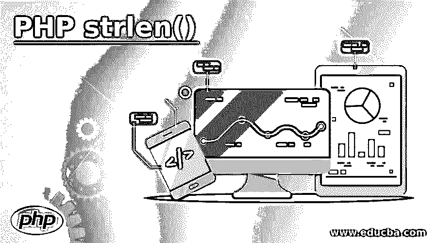
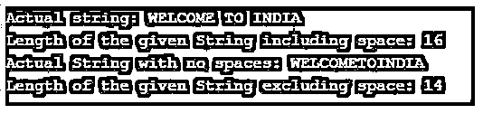
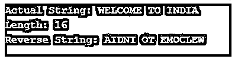
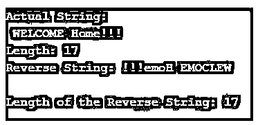

# PHP strlen()

> 原文：<https://www.educba.com/php-strlen/>

## PHP strlen()简介

大量的内置函数使得程序员或开发者更容易处理 PHP 中与字符串相关的操作。strlen()是 PHP 字符串中最流行的函数之一，用来获取字符串的长度。因为它的名字是由两个单词 str 和 len 组合而成的，str 指的是单词 string，而 length 是长度本身。这个函数将返回给定字符串的长度。这可用于在程序需要时获取任何子字符串的长度。

**语法:**

<small>网页开发、编程语言、软件测试&其他</small>

`strlen(String)`

**参数:**

*   **strlen:** 是函数本身。
*   **String:** 这是唯一一个将作为字符串的参数。

**返回类型:**

这将返回字符串的长度，它将始终是一个整数。这个函数的语法没什么特别的。

### PHP 中 strlen()函数是如何工作的？

在继续处理 strlen 之前，我们必须首先有一个字符串，这个函数将应用于这个字符串。它将字符串作为参数，并返回给定字符串的长度。我们可以使用字符、特殊字符、URL、数值和特殊序列字符作为给定字符串的一部分。

**strlen()的用户**

**代码:**

`$string = "WELCOME TO INDIA"; // a string
echo "Lenght of the given String is: ";
echo strlen($string); // lenghtof the string`

上面的代码行给出的长度输出为 16“WELCOME TO INDIA”包含 16 个字符，包括空格。

**使用 strlen()和特殊序列字符作为字符串**

当我们传递包含特殊序列字符如\n，\t，\r 等的字符串时，我们应该足够小心。正如我们所看到的，我们包含了 2 个字符，但是当我们将它作为 strlen()函数的参数传递时，它将被计为一个字符。

**代码:**

`$string = "\rHello"; // a string
$length = strlen($string); // lenghtof the string
echo " Length: ".$length;`

上面的代码行给出的输出是 6，而不是 7。如果我们将\替换为任何其他字符，那么我们将看到长度为 7 的输出。在 php 中使用 string strlen()函数编码时，这可能有点棘手。

### PHP strlen()示例

下面是提到的例子:

#### 示例#1

获取给定字符串的长度。

**代码:**

`<?php
$string = "WELCOME TO INDIA"; // a string
$Length = strlen($string); // lenghtof the string
echo "Length of the given String is: ".$Length;
?>`

**输出:**

正如我们所见，由于这个字符串函数的简单性，使用这个函数没什么大不了的。我们可以认为这个函数是 PHP 字符串中最简单的函数之一，将字符串作为参数传递以获得长度。

#### 实施例 2

从给定字符串中移除所有空格后，获取该字符串的长度。

**代码:**

`<?php
$string = "WELCOME TO INDIA"; // a string
$lenght = strlen($string); // lenghtof the string
echo "Actual string: ".$string;
echo "\nLength of the given String including space: ".$lenght;
$stringAfterRemovedSpace = str_replace(" ","",$string);
echo "\nActual String with no spaces: ".$stringAfterRemovedSpace;
echo "\nLength of the given String excluding space: ".strlen($stringAfterRemovedSpace);
?>`

**输出:**

#### 实施例 3

一个示例程序演示了 strlen()函数与包含特殊字符和转义字符的字符串的用法。

**代码:**

`<?php
$string = "\n WELCOME TO INDIA"; // a string
$Length = strlen($string); // lenghtof the string
echo "Length of the given String is: ".$Length;
?>`

**输出:**

在上面的程序中，当我们手动计算字符数时，它会出现 19，但在程序输出中，我们可以看到长度显示为 18。长度显示少了一个字符，因为\n 被计为一个字符。

#### 实施例 4

在程序中使用 strlen()函数来反转给定的字符串。

**代码:**

`<?php
$string = "WELCOME TO INDIA"; // a string
$length = strlen($string); // lenghtof the string
echo "Actual String: ".$string;
echo "\nLength: ".$length;
echo "\nReverse String: ";
for ($i=($length-1) ; $i >= 0 ; $i--)
{
echo $string[$i];
}
?>`

**输出:**

在上面的示例代码中，我们可以看到 php 中的反向字符串有不同的阶段，其中也包括获取字符串的长度。因为给定字符串的长度有助于编码器的开发人员从末尾循环到字符串的第一个位置。

#### 实施例 5

字符串的长度和反向字符串的长度相同。

**代码:**

`<?php
$string = "\n WELCOME Home!!!"; // a string
$length = strlen($string); // lenghtof the string
echo "Actual String: ".$string;
echo "\nLength: ".$length;
echo "\nReverse String: ";
$reverseString = "";
for ($i=($length-1) ; $i >= 0 ; $i--)
{
$reverseString .= $string[$i];
}
echo $reverseString;
echo "\nLength of the Reverse String: ".strlen($reverseString);
?>`

**输出:**

### 结论

内置函数 strlen()可以用来获取字符串的长度。开发者应该对这个函数的功能有足够的了解。例如，if \n，\t 等。包含在一个字符串中，那么这个 2 字符的特殊序列可以被认为是一个。这个函数可以用来获得一个字符串的长度，以便进行进一步的操作。如果我们正在编写自己的自定义字符串反向代码，那么我们可以使用这个函数来计算字符串的实际长度。

### 推荐文章

这是一个 PHP strlen()的指南。这里我们讨论 PHP strlen()的介绍，这个函数是如何工作的，并给出了编程例子。您也可以看看以下文章，了解更多信息–

1.  [PHP 数组搜索](https://www.educba.com/php-array-search/)
2.  [PHP include_once](https://www.educba.com/php-include_once/)
3.  [PHP 写文件](https://www.educba.com/php-write-file/)
4.  [PHP substr_count()](https://www.educba.com/php-substr_count/)

