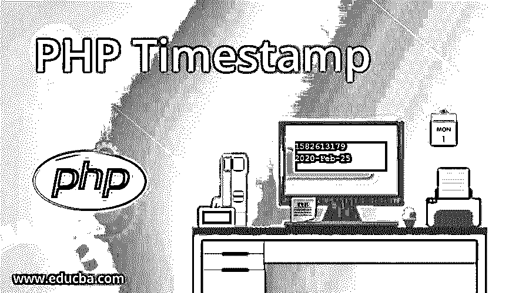
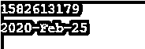

# PHP 时间戳

> 原文：<https://www.educba.com/php-timestamp/>

## PHP 中时间戳的介绍

时间戳一般是以秒为单位的值，其格式与格林威治时间相同。但是这里的时间戳与格林威治时间的唯一区别是，它的第一项是月、日和年，第二项是带有小时、分钟和秒的时间。在这个主题中，我们将学习 PHP 时间戳。

**语法:**

<small>网页开发、编程语言、软件测试&其他</small>

时间戳的语法是

`time()`

### 在 PHP 中使用时间戳

PHP 中的 Time()函数用于显示当前日期和时间。在时间戳函数中，我们不会包含任何参数。时间函数的输出通常是整数。它包含所有值，也包括第二个值。

**举例:**

`<?php
$a=time();
print($a);
?>`

**输出:**

**说明:**

如果我们想要今天的时间和日期，我们使用函数 time()。首先，将它赋给变量 a，然后显示它。我们使用印刷品。它会产生一个我们无法理解的输出。输出被称为时间戳。我们使用 PHP 工具将获得的输出转换成可理解的类型，以便清楚地理解输出。

我们通常使用 getdata()函数将时间戳转换为日期。如果我们给出时间戳，它只是将输出作为时间返回。

### PHP 时间戳的关键字

时间戳创建期间使用的一些关键字是:

**答:**用来写上午或下午的时间

例如:凌晨 12 点

**A:** 用大写字母写上午或下午的时间。

例如:下午 1 点

**D:** 用来写一个月中的某一天。

示例:15

**d:** 用于显示一周中的某一天。

例如:周三

**F:** 用于显示月份名称

例如:一月

**S:** 用于显示秒

示例:20

**Y:** 用于显示年份

例如:2020 年

**i:** 用来显示分钟。

例如:20 分钟

**G:** 用于显示小时。它的格式是 24 小时制。

例如:14 小时

### PHP 时间戳的例子

下面提到了不同的例子:

#### 示例#1

`<?php
$a=time();
echo ($a. "\n");
echo (date ("Y-M-d", $a));
?>`

**输出:**

**说明:**

这里我们需要今天的日期、年份和月份的输出。首先，我们给变量分配了一个时间函数。这里我们使用 date 函数来获取日期格式的时间。如上所述，我们需要年、月和日，所以我们使用关键字 Y、D 和 M，最后，我们将得到如下输出

2020 年 2 月 25 日

意思是今天的日期是 25，年份是 2020，月份是 2 月。

#### 实施例 2

`<?php
$A =date ("y/m/D G:i:s", time());
print($A)
?>`

**输出:**

**说明:**

这里我们需要以月、日、年、小时、分钟和秒为单位的输出。所以我们使用关键字 m、D、y、G、I 和 s。首先，我们将日期格式赋给一个名为 a 的变量。显示的输出格式为 20/02/Tue 6:52:28；意思是今天是 2020 年，月份是二月，日子是星期二。它会立即分配时间，并显示当前的小时、分钟和秒。

#### 实施例 3

`<?php
$A =date ("y/m/j G:i:s", time());
print($A)
?>`

**输出:**

**说明:**

这里，我们希望输出包含年、月、日以及小时、分钟和秒的时间。首先，我们将时间函数赋给变量 a。获得的输出如下所示

20/02/25 6:55:23

这意味着今天是 2020 年 2 月 25 日。获得的时间包含 6 小时 55 分 23 秒作为输出。输出包含日期和时间的组合。

### 要记住的事情

*   PHP 很容易安装。
*   PHP 是动态的。
*   时间戳用于打印时间。
*   代码以脚本格式编写，输出显示在 web 浏览器中。
*   很好理解。
*   有 8 种数据类型。
*   有五种不同类型的运算符。
*   时间戳是用函数 time()编写的
*   为了将其转换成可理解的输出，我们使用函数 get()
*   时间戳易于学习和理解。

### 推荐文章

这是一个 PHP 时间戳指南。在这里，我们讨论 PHP 时间戳的工作，例子和输出。您也可以看看以下文章，了解更多信息–

1.  [PHP readfile](https://www.educba.com/php-readfile/)
2.  [PHP 中的三元运算符](https://www.educba.com/ternary-operator-in-php/)
3.  [PHP ucfirst()](https://www.educba.com/php-ucfirst/)
4.  [斐波那契数列 PHP](https://www.educba.com/fibonacci-series-php/)

