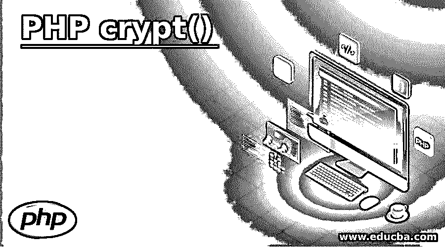
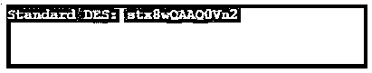
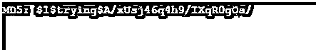
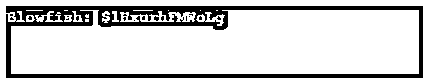
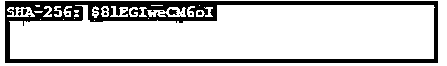
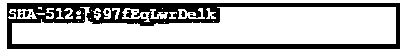

# PHP crypt()

> 原文：<https://www.educba.com/php-crypt/>

## PHP crypt()简介

PHP crypt()函数是 PHP 字符串引用的一部分，它的主要功能是使用一些特殊的算法返回一个散列字符串。PHP crypt()函数与 DES、Blowfish 或 MD5 等算法相关联，用于整个网络，并对 crypt()函数传递的字符串进行加密和解密。Crypt()函数从一个函数到另一个函数会有所不同，其行为会根据不同操作系统进行相应的转换。它检查所有可用的算法，或者是否需要安装新的加密算法。

**语法:**

<small>网页开发、编程语言、软件测试&其他</small>

`crypt(str,salt)`

*   语法以这样的方式流动，crypt 函数是一个传递字符串和 salt 作为参数的函数。
*   str 是必需的字符串，它指定该字符串需要以单向方式进行哈希运算。
*   salt 是另一个可选参数，散列所基于的 salt 字符串。
*   但是 5+版本的 PHP 将 salt 作为参数来传递不同的算法，如 blowfish 节点、标准 des 算法、扩展 DES 和 blowfish 算法。

### PHP 中 crypt()函数是如何工作的？

*   Crypt 是一种单向字符串哈希算法。
*   Salt 作为参数传递给 crypt()函数是可选的。但是如果 salt 参数没有被传递，那么该键将被认为是弱散列。
*   为了实现良好的安全性，传递一个非常强的散列密钥是很重要的。用于生成强 salt 并随后以循环方式应用适当的散列密钥循环的强散列使用 password_hash。
*   使用 password_hash 是一种推荐的方法，在某种程度上，它充当算法之上的包装器，并使算法与单向散列字符串兼容。
*   如上所述，这些 crypt()函数在支持许多不同操作系统的操作系统上工作，充当密钥。
*   与字符串一起传递给 crypt 函数的 salt 参数触发 salt 算法。这些功能适用于 PHP 4 版本，但也适用于 5 版本以上的版本。
*   如果没有 DES salt 参数，PHP 可以创建一个自动生成的密钥。如果它与十二字符密钥相关，那么 MD5 算法将创建一个单向散列密钥。

### PHP crypt()常量

crypt()函数有以下常量，根据给定类型的 crypt 常量是否可用，这些常量的某些值被设置为 0 或 1。

#### 1.加密 _ 标准 _ 加密

第一个常数，它有一个从字母表传递来的两个字符的 salt 参数。此外，对支持数字为大写 0-9 的数字和大写字母 a-z 以及小写字母 A-Z 的值的支持。如果在传递 salt 参数时使用了一些无效字符，crypt 函数将会失败。

**例**:说明 CRYPT_STD_DES 常量的程序。

**代码:**

`<?php
if (CRYPT_STD_DES == 1)
{
echo "Standard DES: ".crypt('educba','string')."\n";
}
else
{
echo "Do not support standard DES.\n";
}
?>`

**输出:**

#### 2.CRYPT_EXT_DES

该常量是基于 DES 的散列函数的一种扩展。如果传递的 salt 参数有一个 9 个字符的字符串，后跟 4 个字节的参数，那么只有算法会满意。

**例**:说明 CRYPT_EXT_DES 常量的程序。

**代码:**

`<?php
if (CRYPT_EXT_DES == 1)
{
echo "Extended DES: ".crypt('anu','_D8..dutta')."\n";
}
else
{
echo "It do not support for Extended DES.\n";
}
?>`

**输出:**

#### 3.CRYPT_MD5

该常数 MD5 与散列函数一起工作，该散列函数包括与长度为 12 个字符的盐参数的字符并行的 crypt。

**例子**:说明 CRYPT_MD5 常数的程序。

**代码:**

`<?php
if (CRYPT_MD5 == 1)
{
echo "MD5: ".crypt('mansi','$1$trying$')."\n";
}
else
{
echo "Do not support for MD5.\n";
}
?>`

**输出:**

#### 4.地穴 _ 河豚

这种对带有 salt 参数的函数的持续支持包含从“$”到 22 的一些成本参数。如果参数值不在指定的范围内，那么它将返回一个零长度的字符串。如果所示的基于 blowfish 的散列算法的对数值的基数，则成本参数被认为是两倍。5 及以上版本的 PHP 支持给定的常量。

**示例**:说明 CRYPT_BLOWFISH 常量的程序。

**代码:**

`<?php
if (CRYPT_BLOWFISH == 1)
{
echo "Blowfish: ".crypt('sunrise','$1b$08$mkstringexforsaltparam$')."\n";
}
else
{
echo "It do not support for Blowfish.\n";
}
?>`

**输出:**

#### 5.CRYPT_SHA256

SHA-256 是一个常量，它是算法的一部分，哈希值为 16 个字符。如果字符串以$N 开始，那么它表示散列函数被调用的次数，并使用优化和成本因子(如 Blowfish 算法)执行。此外，如果选择的数字不在该范围之外，则该范围的下一个值将接近该范围的最接近值。

**举例:**一个说明 CRYPT_SHA256 常量的程序。

**代码:**

`<?php
if (CRYPT_SHA256 == 1)
{
echo "SHA-256: ".crypt('sunfeast','$8$rounds=8000$examplestringforsaltofsalt$')."\n"; }
else
{
echo "It do not support for CRYPT_SHA256.\n";
}
?>`

**输出:**

#### 6.CRYPT_SHA512

这是一个常量，其前缀为某个值，如 6 美元。如果 round 函数从盐数的取值开始，则它指向与 Blowfish 函数相同的优化值。也可以说，常数的行为是相同的 SHA-256 常数，只有一些纯粹的区别。

**示例**:说明 CRYPT_SHA512 常量的程序。

**代码:**

`<?php
if (CRYPT_SHA512 == 1)
{
echo "SHA-512: ".crypt('things','$9$rounds=9000$xamplestringof90salt$');
}
else
{
echo " It donot support for CRYPT_SHA512 .";
}
?>`

**输出**:

**Note:** The system with version of 5.3.0 contains implementation of its own type and will use that implementation if that system lacks the install then it will look for the constant and its related algorithm for self-installation and implementation.

### 结论

PHP crypt()函数可以加密散列字符串，是一种支持上述算法的单向加密方法，它特别支持加密而不是解密，这就是为什么它被称为单向算法。

### 推荐文章

这是 PHP crypt()的指南。这里我们讨论 PHP crypt()的介绍，crypt()函数是如何和它的常量一起工作的。您也可以看看以下文章，了解更多信息–

1.  [在 PHP 中验证](https://www.educba.com/validation-in-php/)
2.  [PHP 序列化](https://www.educba.com/serialize-in-php/)
3.  PHP levenshtein()
4.  [PHP parse_str()](https://www.educba.com/php-parse_str/)

