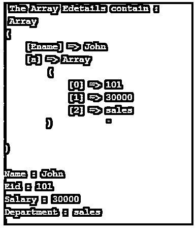
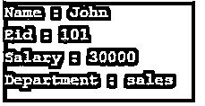

# PHP parse_str()

> 原文：<https://www.educba.com/php-parse_str/>

")

## PHP parse_str()简介

PHP 的 parse_str()函数用于将字符串解析成变量。函数是一个内置函数。传递给 parse_str()函数的字符串被转换成变量及其相关值。parse_str()函数接受两个参数，其中第一个参数是必需的，第二个参数是可选的。

**语法:**

<small>网页开发、编程语言、软件测试&其他</small>

`parse_str(string,array);`

**参数:**

*   **string:** string 参数接受一个 string 数据类型的参数，这里的 string 是通过一个 URL 以 string 查询的格式传递的。该参数必须通过。
*   **array:** array 参数指定存储变量的数组的名称。所以它指定所有的变量都存储在一个数组中。此参数是可选参数。如果一个数组名没有被传递，那么所有由函数本身设置的变量都会被同名的变量覆盖。

**返回值:**

没有返回值。

### PHP parse_str()的例子

下面是 PHP parse_str()的例子:

#### 示例#1

parse_str()函数接受双参数的示例。这里我们使用 parse_str()函数来接受一个包含两个变量的字符串，这些变量将被存储到给定的数组中。

**代码:**

`<?php
parse_str("Ename=John&Eid=101&Esalary=30000&dept=sales", $Edetails);
echo "Name : $Edetails[Ename] \n";
echo "Eid : $Edetails[Eid] \n";
echo "Salary : $Edetails[Esalary] \n";
echo "Department : $Edetails[dept] \n";
echo "$Edetails[Ename] having $Edetails[Eid] employee id, salary is $Edetails[Esalary] and working in $Edetails[dept] department." ;
?>`

**输出:**

 1")

与上面的代码一样，parse_str()函数通过 URL 接受了四个变量，如“埃纳姆=约翰& Eid = 101 & Esalary = 30000 & dept =销售”,而$ Edetailsis 是一个数组，它将所有变量作为单独的元素存储在其中，所有变量都从这里打印出来。

#### 实施例 2

parse_str()函数接受一个参数的示例。

这里我们使用 parse_str()函数接受一个四个变量的字符串的两个参数，我们将看到一个数组如何在内部存储所有的变量。

**代码:**

`<?php
parse_str("Ename=John&Eid=101&Esalary=30000&dept=sales", $Edetails);
echo " The Array Edetailscontain : \n ";
print_r($Edetails);
?>`

**输出:**

 2")

在上面的代码中，parse_str()函数通过 URL 接受四个变量，在输出中，它显示了一个数组如何存储所有变量。

#### 实施例 3

在这里，我们使用 parse_str()函数只接受一个由四个变量组成字符串中的一个参数，这四个变量是按照它们的名字存储的。

**代码:**

`<?php
parse_str("Ename=John&Eid=101&Esalary=30000&dept=sales");
echo "Name : $Ename \n";
echo "Eid : $Eid \n";
echo "Salary : $Esalary \n";
echo "Department : $dept \n";
echo "$Ename having $Eid employee id, salary is $Esalary and working in $dept department." ;
?>`

**输出:**

在上面的代码中，parse_str()函数通过 URL 接受了四个变量，如“埃纳姆=约翰& Eid = 101 & Esalary = 30000 & dept =销售”,并且没有给出数组名，所以所有的变量都以它们自己的名字存储，并直接打印出来。

#### 实施例 4

这里，我们使用 parse_str()函数来接受一个数组元素字符串，并将其存储在一个数组中。

**代码:**

`<?php
parse_str( "a[]=John&a[]=101&a[]=30000&a[]=sales", $Edetails);
// Display array
echo " The Array Edetailscontain : \n ";
print_r($Edetails);
// Display each elements of an array
echo "\n";
echo "Name : ";
echo $Edetails[ 'a' ][0];
echo "\n";
echo "Eid : ";
echo $Edetails[ 'a' ][1];
echo "\n";
echo "Salary : ";
echo $Edetails[ 'a' ][2];
echo "\n";
echo "Department : ";
echo $Edetails[ 'a' ][3];
?>`

**输出:**

 4")

在上面的代码中，parse_str()函数通过 URL 接受了数组元素的四个变量，如“a[]= John & a[]= 101 & a[]= 30000 & a[]= sales ”,所有这些元素都存储在一个数组 Edetails 中，并从数组中打印出来。

#### 实施例 5

在这里，我们使用 parse_str()函数接受一个变量字符串和一个数组的元素，并将它们存储在一个数组中。

**代码:**

`<?php
// passing variable and array elements
parse_str( "Ename=John&a[]=101&a[]=30000&a[]=sales", $Edetails);
// Display array
echo " The Array Edetailscontain : \n ";
print_r($Edetails);
// Display each elements of an array
echo "\n";
echo "Name : ";
echo $Edetails['Ename'];
echo "\n";
echo "Eid : ";
echo $Edetails[ 'a' ][0];
echo "\n";
echo "Salary : ";
echo $Edetails[ 'a' ][1];
echo "\n";
echo "Department : ";
echo $Edetails[ 'a' ][2];
?>`

**输出:**

与上面的代码一样，parse_str()函数通过 URL 接受一个变量和三个数组元素，如“埃纳姆=约翰& a[]= 101 & a[]= 30000 & a[]=销售”,所有这些元素都存储在一个数组 Edetails 中，并从数组中打印出来。

#### 实施例 6

这里我们看到 parse_str()函数传递并存储一个可能包含空格的变量。

**代码:**

`<?php
parse_str("E name=John&E id=101&E salary=30000&dept=sales");
// Display array elements
echo "Name : $E_name \n";
echo "Eid : $E_id \n";
echo "Salary : $E_salary \n";
echo "Department : $dept \n";
?>`

**输出:**

在上面的代码中，parse_str()函数接受一个变量，其中一个变量包含空格作为“E name”。所以要打印这个变量，我们应该用“_”代替空格，作为“$E_id”。

### 结论

PHP parse_str()函数是一个内置函数，用于将字符串解析成变量。我们可以通过 URL 传递查询字符串格式的变量、数组元素以及变量和数组的组合。

### 推荐文章

这是 PHP parse_str()的指南。在这里我们讨论 PHP parse_str()的介绍以及例子。您也可以看看以下文章，了解更多信息–

1.  [PHP 分页](https://www.educba.com/php-pagination/)
2.  [PHP header()](https://www.educba.com/php-header/)
3.  [PHP wordwrap()](https://www.educba.com/php-wordwrap/)
4.  PHP levenshtein()

