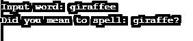

# PHP levenshtein()

> 原文：<https://www.educba.com/php-levenshtein/>

")

## PHP levenshtein()简介

levenshtein()是 PHP 中的一个内置函数，用于确定一个距离单位，称为 Levenshtein 距离，与两个字符串进行比较。Levenshtein 距离的定义代表要修改的字符总数，例如替换、插入或删除输入字符串以将其转换为另一个字符串。

在 PHP 中，默认情况下，上述三个修改(替换、删除、插入)的权重是相等的。但是我们可以选择输入这些操作的成本或权重，方法是给出上述操作的可选参数。用于该函数的算法具有 O(a*b)的复杂度，其中 a 和 b 分别是字符串 str1 和 str2 的长度。

<small>网页开发、编程语言、软件测试&其他</small>

不过，这个函数有几点需要注意:

*   这个 levenshtein()函数不区分大小写。
*   有一个与 levenshtein 类似的函数，称为 similar_text()函数。相比之下，levenshtein()函数要快一些，但是 simiar_text()函数返回的结果更准确，并且只需要进行有限的更改。还有，levenshtein()更贵。

### 语法和参数

这里我们讨论语法和参数:

**语法**:

`levenshtein(str1,str2,insert,replace,delete)`

**参数:**

*   **str1:** 必需的输入参数，是要比较的第一个字符串。
*   **str2:** 这是要比较的第二个字符串，也是强制参数。
*   **insert:** 可选参数，表示插入字符的代价。
*   替换:也是可选的，代表一个角色被替换的代价。
*   **delete:** 另一个可选参数，表示删除一个角色的代价。

最后 3 个参数的默认值都是 1。

**返回值:**这个函数输出两个输入字符串之间的 Levenshtein 距离。如果字符串字符总数中的任何一个超过 255，它将返回值-1。

### PHP levenshtein()的例子

让我们举几个例子来理解 levenshtein 函数的工作原理。

#### 示例#1

**代码:**

`<?php
// PHP code to determine levenshtein distance
// between 2 strings $s1 and $s2
$s1 = 'rdo';
$s2 = 'rst';
print_r(levenshtein($s1, $s2));
?>`

**输出:**

-1.1")

这是一个基本示例，其中 2 个输入字符串 s1 和 s2 各有一个由 3 个不同字母组成的单词。现在，levenshtein 函数逐个字符地比较这两个字符串，并找出字符数的差异。这里有两个字母在三个字母中是不相同的。因此，为了使第一个字符串与第二个字符串相同，我们需要向它添加两个字母“s，t ”,因此输出为 2。

#### 实施例 2

**代码:**

`<?php
// PHP code to determine levenshtein distance
// between 2 strings $s1 and $s2
$s1 = 'first string';
$s2 = 'second string';
print_r(levenshtein($s1, $s2));
?>`

**输出:**

-1.2")

在这个基本示例中，我们可以找出这里由 s1 和 s2 表示的两个输入字符串之间的 levenshtein 距离。如果我们比较两个字符串的字符，我们可以看到它们有一个共同的词，即“字符串”。在其余的词中，它与第一、第二词进行了比较，也与常用词“串”进行了比较。这里唯一不同的字母是“f，e，c，o，d”和额外的“s”。因此 levenshtein 函数将输出返回为 6，这意味着这 6 个字母是这 2 个输入字符串之间的差，使用这 6 个字母可以使这 2 个字符串在字符方面相等。

#### 实施例 3

**代码:**

`<?php
// PHP code to determine levenshtein distance
// between $s1 and $s2
$s1 = 'Common Three Words';
$s2 = 'Common Words';
echo("The Levenshtein distance is: ");
print_r(levenshtein($s1, $s2));
?>`

**输出:**

在这个例子中，我们可以看到第一个字符串有 3 个单词，而第二个字符串只有 2 个单词。我们可以注意到，第二个字符串中的这两个单词已经出现在第一个字符串中了。因此，这里唯一不同的字符将是单词“三”这 5 个字符。有趣的是，这里的输出给出了 6，这意味着即使是额外的空格也被认为是一个字符。

#### 实施例 4

`<?php
// Giving a misspelled word as input
$ip = 'giraffee';
// sample set array to compare with
$word_list = array('cat','dog','cow','elephant',
'giraffe','eagle','pigeon','parrot','rabbit');
// Since shortest distance is not found yet
$short = -1;
// Looping through array to find the closest word
foreach ($word_list as $word_list) {
// Calculating the levenshtein distance between
// input word and the current word
$levn = levenshtein($ip, $word_list);
// To check for the matching word
if ($levn == 0) {
// This is the closest one which is an perfect match
$closest = $word_list;
$short = 0;
// Here we break from foreach loop
// when the exact match is found
break;
}
// When the distance shown here is less than shortest distance
// found in next iteration or if the next shortest word is
// yet to be found
if ($levn <= $short || $short < 0) {
// Setting the shortest distance and one having
// closest match to the input word
$close = $word_list;
$short = $levn;
}
}
echo "Input word: $ip\n";
if ($short == 0) {
echo "The closest/exact match found to the input word is: $close\n";
} else {
echo "Did you mean to spell: $close?\n";
}
?>`

**输出:**

上面的例子向我们展示了可以实现 levenshtein 函数的不同情况之一。在这里，我们通过将拼写错误的单词与预定义的包含正确单词列表的数组进行比较，来帮助用户纠正拼写错误的单词。

因此，首先，我们接受来自用户的输入单词，这个单词通常是拼错的(giraffee)。我们正在定义一组正确的动物名称数组，如图所示，它也有输入单词(长颈鹿)的正确拼写。foreach 循环用于遍历数组列表并找到与输入匹配的最近的单词，这是在 levenshtein 函数的帮助下完成的。当找到完全匹配或最接近的匹配时，循环中断。最后，我们将距离与短参数进行比较，如果距离为 0，则意味着找到了输入单词的精确匹配，然后将它打印在输出中。

### 结论

因此，基本上 levenshtein 函数返回的距离是整数值，它是通过逐个字符地比较两个输入字符串得出的。前两个参数是强制的输入字符串，后三个参数是可选的，表示删除、插入或替换操作的开销。

### 推荐文章

这是 PHP levenshtein()的指南。在这里，我们还将讨论 php levenshtein()的介绍、语法和参数，以及不同的示例和代码实现。您也可以看看以下文章，了解更多信息–

1.  [PHP 分页](https://www.educba.com/php-pagination/)
2.  [PHP header()](https://www.educba.com/php-header/)
3.  [PHP parse_str()](https://www.educba.com/php-parse_str/)
4.  [PHP wordwrap()](https://www.educba.com/php-wordwrap/)
5.  [PHP strtok()](https://www.educba.com/php-strtok/)

