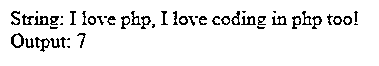
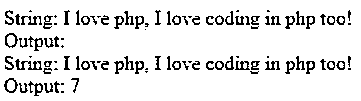
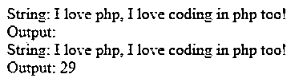
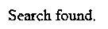
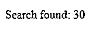

# PHP strpos

> 原文：<https://www.educba.com/php-strpos/>

## PHP strpos 简介

下面的文章提供了 PHP strpos 的概要。对于编码人员或开发人员来说，有大量的内置函数可以使与字符串相关的操作变得更加容易。strops()是一个流行的字符串函数，我们可以根据需要使用它，正如它的名字所暗示的那样，用于处理 PHP 中任何字符串的位置。使用这个函数，我们可以得到一个字符串在另一个字符串中的位置。这个函数可以在不同的场景中以不同的方式使用，比如我们可以得到一个字符串在另一个字符串中的第一个出现位置。我们可以得到这个字符串在另一个字符串中最后出现的位置。这个函数也可以用来从一个字符串搜索到另一个字符串。

**PHP strpos 的语法**

<small>网页开发、编程语言、软件测试&其他</small>

由于这可以以各种方式使用，我们可以看到各种语法:

`strpos($string, $toBeSearched)`

**参数描述:**

*   $string:这是需要进行搜索的字符串。
*   $toBeSearched:这是一个需要在上述字符串内部搜索的字符串。

**返回类型:**

如果搜索找到它，它将返回数值；否则它会给出 false。

`stripos($string, $toBeSearched, $startPostion)`

除了先前的参数，我们还可以看到一个额外的参数。$ startPostion 什么都不是，但它是关于搜索将从哪里开始的。

`strrpos($string, $toBeSearched, $startPostion)`

这个函数可以用来将一个字符串搜索成另一个字符串。这个开始是以相反的顺序搜索的。这个函数中间的单词“r”的作用是以相反的顺序从一个字符串搜索到另一个字符串。

### strpos()函数在 PHP 中是如何工作的？

*   要使用 strpos()函数和其他与之相关的函数，我们需要有两个字符串，一个字符串将被搜索到另一个字符串中。
*   我们有各种其他内置函数，如 stripos()、strrpos()、strripos()等。stripos()可用于搜索不区分大小写的搜索字符串。Strrpos()可以用来以相反的顺序搜索字符串。
*   strripos()可用于以不区分大小写的搜索字符串的相反顺序搜索字符串。

### PHP strpos()的示例

下面是提到的例子:

#### 示例#1

一个使用 strops()函数的基本程序，只有两个参数，字符串一和搜索字符串。

**代码:**

`<?php
$string = "I love php, I love coding in php too!";
$searchString = "php";
$output =  strpos($string, $searchString);
echo "String:. “ $string;
echo " Output: ". $output;
?>`

**输出:**

在上面的例子中，我们可以看到，在一个字符串中，我们试图搜索一个 PHP 字符串，使用 strops()搜索 PHP 单词给出了输出 7。7 是 PHP 单词第一次出现的索引。strops()是一个区分大小写的函数，用于查找另一个字符串中的任何字符串。

#### 实施例 2

让我们尝试复制与示例 1 相同的内容，但使用 PHP 的不同大小写(大写或小写)。

**代码:**

`<?php
$string = "I love php, I love coding in php too!";
$searchString = "PHP";
$output =  strpos($string, $searchString); // this will give the false result
echo "String: ". $string;
echo " Output: ". $output;
$output1 =  stripos($string, $searchString); // this will give the the 7 as a result
echo " String: ". $string;
echo " Output: ". $output1;
?>`

**输出:**

在上面的例子中，我们可以看到，如果情况不匹配，在这种情况下，strops()将不会执行这项工作，为此，我们使用了具有相同语法和参数的 stripos()来执行相同的工作。

#### 实施例 3

让我们看一个使用第三个参数和 strops()的例子。

**代码:**

`<?php
$string = "I love php, I love coding in php too!";
$searchString = "PHP";
$output =  strpos($string, $searchString,8); // this will give the false result
echo "String: ". $string;
echo " Output: ". $output;
$output1 =  stripos($string, $searchString,8); // this will give the the 7 as a result
echo " String: ". $string;
echo " Output: ". $output1;
?>`

**输出:**

正如我们在结果中看到的那样，与上一个示例稍有不同就会产生巨大的差异。我们把 8 作为第三个参数。使用 8 作为第三个参数意味着搜索将从位置 8 开始，而不是从位置 0 开始。

#### 实施例 4

让我们看一个专业的例子(处理返回类型)。

**代码:**

`<?php
$string = "https://www.educba.com/tutorials/?source=menu";
$searchString = "tutorials";
$output =  strpos($string, $searchString); // this will give the false result
if($output==false){
echo "Search not found.";
}else{
echo "Search found.";
}
?>`

**输出:**

#### 实施例 5

strrpos()可以用来以相反的顺序在另一个字符串中搜索字符串的位置。

**代码:**

`<?php
$string = "I love PHP; I like to code in PHP";
$searchString = "PHP";
$output =  strrpos($string, $searchString); // this will give the false result
if($output==false){
echo "Search not found.";
}else{
echo "Search found: ".$output;
}
?>`

**输出:**

同样，我们可以使用 strripos()函数将字符串搜索为另一个不区分大小写的搜索字符串。现在，我们已经看到了根据业务需求可以使用的所有 strops()类型的示例。

### 结论

在 PHP 编程语言中，我们可以使用 strpose()和 stripos()内置函数将一个字符串搜索到另一个字符串。strops()是一个区分大小写的函数，用于处理搜索，在 PHP stripos()中，可以使用不区分大小写的函数来完成与 strops()相同的工作。stripos()不检查相同的情况。开发人员在使用这些函数时必须足够小心，因为如果搜索匹配，它会给出数字作为结果，但如果没有找到搜索，它会返回 false。

**推荐文章**

这是一个 PHP strpos 指南。这里我们讨论了 PHP strpos 的介绍，以及 strpos()函数如何与示例一起工作。您也可以看看以下文章，了解更多信息–

1.  PHP URL
2.  [PHP ob_start()](https://www.educba.com/php-ob_start/)
3.  [PHP 发布方法](https://www.educba.com/php-post-method/)
4.  [PHP sscanf()](https://www.educba.com/php-sscanf/)

