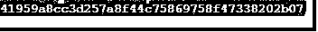
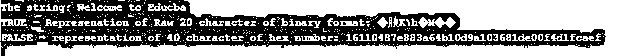
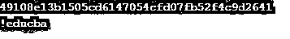
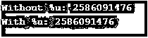
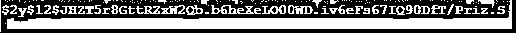
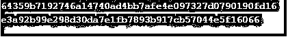

# PHP sha1()

> 原文：<https://www.educba.com/php-sha1/>

## PHP sha1()简介

PHP sha1()函数作为 PHP 的一部分是一个非常重要的函数，因为它是一种受支持的服务器端脚本语言，需要更加强调安全性。PHP sha1()处理安全和散列函数，它计算和计算字符串散列的 SHA-1 值。在内部，PHP sha1()使用了美国安全散列算法 1 的一个子类型。Sha1()函数产生一个值为 160 个字符的散列字符串，然后当这个散列字符串作为函数的输入时，它产生一个高度安全的消息摘要输出。

### 句法

`sha1(string, raw)`

<small>网页开发、编程语言、软件测试&其他</small>

**说明:** sha1()函数使用了 string 和 raw 两种类型的参数，用于生成字符串和计算带有某个值的字符串的长度。raw 是另一个变量或参数，它是可选的，如果用 sha1()函数指定，则它传递带有可选值(如 true 或 false)的参数，然后传递剩余的值来指定和描述十六进制或二进制值输出格式。如果可选值显示为 Raw 20，则它是 20 个字符的二进制格式，否则它是默认的 40 个字符的十六进制数和一些特定值。

### sha1()函数在 PHP 中是如何工作的？

由于 PHP 是一种面向服务器的脚本语言，它被用来保存和保护后端相关的数据和操作。sha1()函数解决了与密码和用户管理相关的数据安全问题。sha1()函数及其子算法(如 US-Secure Hash 算法 1)用于生成消息摘要和数字签名。

SHA-1()函数利用美国安全散列算法 1，该算法的使用方式是将字符串作为输入，然后将消息摘要作为输出。输入被馈送到签名算法，该算法检查和验证消息的签名。如果签名消息被用作输入而不是实际的消息，那么它有很大的机会提高整个算法的效率。

与作为签名算法输入的普通散列字符串消息相比，该过程将优化和压缩消息输入和消息输出功能。此外，如果验证者使用该算法，则数字签名的创建者可以使用数字签名。

sha_file()函数是 sha1()函数的另一个子组件，它使用 file 函数的散列。

文件名的这个文件函数用于计算文件的散列值，并将给出一个原始输出，该输出将用于返回消息或值为 true 或 false 的字符串。函数中的 Md5()算法和函数中的 crc32()也将用于生成字符串的多项式。并且将有助于生成具有某种改进的数字签名的更安全的字符串。

### 实现 PHP sha1()函数的例子

下面是提到的例子:

#### 示例#1

他的程序表示在传递一个字符串值以获得字符串的散列值之后，计算字符串的 SHA-1 散列值。

**代码:**

`<?php
$str = "welcome to educba";
echo sha1($str);
?>`

**输出:**

#### 实施例 2

该程序表示在传递一个字符串值以获得字符串的散列值之后，计算字符串的 SHA-1 散列值，然后打印 sha1 字符串的值，如输出所示。字符串的输入为“Welcome to Educba ”,输出显示字符串值。

**代码:**

`<?php
$str = "Welcome to Educba";
echo "The string: ".$str."\n";
echo "TRUE - Represenation of Raw 20 character of binary format: ".sha1($str, TRUE)."\n";
echo "FALSE - representation of 40 character of hex number: ".sha1($str)."\n";
?>`

**输出:**

#### 实施例 3

该程序表示在传递一个字符串值以获得字符串的散列值之后，计算字符串的 SHA-1 散列值，然后打印 sha1 字符串的值，如输出所示。字符串的输入为“Welcome to Educba ”,输出显示字符串值。然后测试作为输出的输入字符串。

**代码:**

`<?php
$str = "educba";
echo sha1($str);
if (sha1($str) == "49108e13b1505cd6147054cfd07fb52f4c9d2641")
{
echo "\n!educba";
exit;
}
?>`

**输出:**

#### 实施例 4

该程序也是 CRC 32 算法的 sha1()函数关联函数的一部分，该函数将字符串“Hello World”作为输入，然后回显输出中所示的不带和带% u 值字符串的值。

**代码:**

`<?php
$str = crc32("Hello educba!");
echo 'Without %u: '.$str."\n";
echo 'With %u: ';
printf("%u",$str);
?>`

**输出:**

#### 实施例 5

该程序使用 password_hash 函数作为 sha1()函数的一部分，并帮助生成带有所示输出值的 password_hash，并通过将成本参数设为 12 来使用散列函数，以获得优化的消息摘要作为最终输出，从而优化并提高程序的整体效率。

**代码:**

`<?php
$options = [
'cost' => 12,
];
echo password_hash("educba_is_a_laerning_portal", PASSWORD_BCRYPT, $options);
?>`

**输出:**

#### 实施例 6

该程序利用 hash()函数来生成给定函数的消息摘要，该消息摘要将进一步用于转换为数字签名以进行优化。

**代码:**

`<?php
function lion($data = "", $width=182, $rounds = 4) {
return substr(
implode(
array_map(
function ($h) {
return str_pad(bin2hex(strrev($h)), 16, "0");
},
str_split(hash("tiger192,$rounds", $data, true), 8)
)
),
0, 48-(192-$width)/4
);
}
echo hash('tiger192,3', 'a-string'), PHP_EOL;
echo lion('a-string'), PHP_EOL;
?>`

**输出:**

#### 实施例 7

这个程序演示了作为输入字符串的 md5 算法，它也是 sha1()算法的补充部分之一。

**代码:**

`<?php
$str = 'apple';
if (md5($str) === '1f3870be274f6c49b3e31a0c6728957f') {
echo " i want to have a green or red apple?";
}
?>`

**输出:**

### 结论

sha1()函数是 PHP 字符串引用的一部分，它包括许多安全和加密算法，这对于后端服务和服务器来说是非常必要的，以便继续解决整体安全违规相关问题以及密码和用户管理相关数据的安全。

### 推荐文章

这是 PHP sha1()的指南。在这里，我们讨论 PHP sha1()的介绍，语法，它是如何工作的，代码和输出的例子。您也可以浏览我们的其他相关文章，了解更多信息——

1.  [PHP header()](https://www.educba.com/php-header/)
2.  [PHP setlocale()](https://www.educba.com/php-setlocale/)
3.  [PHP strtotime](https://www.educba.com/php-strtotime/)
4.  [PHP preg_replace()](https://www.educba.com/php-preg_replace/)

