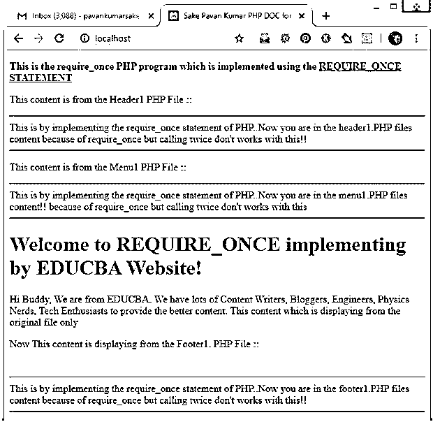
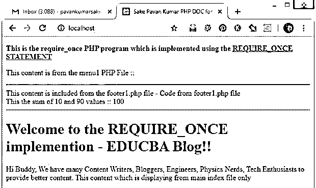

# PHP 要求 _once

> 原文：<https://www.educba.com/php-require_once/>

## PHP 简介 require_once

PHP 编程语言的 require_once 函数有助于将一个 PHP 文件包含在另一个 PHP 文件中，当这个特定的 PHP 文件被多次包含时，我们可以将它视为 include 函数的替代函数。如果一个 PHP 脚本文件已经包含在我们需要的 PHP 文件中，那么这个包含将被忽略，新的 PHP 文件将被调用，只需忽略进一步的包含。假设如果 a1.php 是一个用 require_once()函数调用 b1.php 的 PHP 脚本文件，而它没有找到 b1.php，a1.php 将停止执行并导致致命错误。

**语法:**

<small>网页开发、编程语言、软件测试&其他</small>

`require_once(‘ PHP file with the path ’);`

### require_once 在 PHP 中是如何工作的？

PHP 语言的 require_once 函数只工作一次，即使我们在主 PHP 脚本文件中包含了一个或多个特定的 PHP 文件。我们可以根据需要多次包含一个/多个 PHP 脚本文件，但只有一次特定的 PHP 将被包含并执行以显示程序的输出。这个 require_once 概念只适用于 PHP 4、PHP 5、PHP 7 版本，可能适用于 PHP 7+版本。这首先检查是否具体。PHP 文件是否已经包含在内。如果已经包含，那么 require_once 函数将保留包含相同的内容。PHP 文件。如果没有，具体的。PHP 文件将包括在内。这是 PHP 编程语言中非常有用的语句。

### 例子

以下是实现相同功能的示例:

#### 示例#1

这是一个在 PHP 中实现 require_once()函数的例子。这里输入了一些字符串文本，只是为了在段落“

”标记和其他一些标记中显示。然后，require_once()函数用于 header1.php 文件、menu1.php 文件、footer1.file 两次，但由于 require_once()函数的作用，代码将只实现一次。在每个地方。用于包含的 PHP 文件只有一些字符串文本，在 echo 语句的帮助下打印出来，以便了解 require_once()函数是如何工作的。查看下面的输出，以便更好地理解。

**主 PHP 文件的语法:**

`<!DOCTYPE html>
<html lang="en">
<head>
<title>Sake Pavan Kumar PHP DOC for EDUCBA - Implementing require_once() function </title>
</head&gt
<body>

<b>This is the require_once PHP program which is implemented using the <u>REQUIRE_ONCE STATEMENT</u></b>

This content is from the Header1 PHP File :: 

<?php require_once('header1.php');?>
<?php require_once('header1.php');?>

This content is from the Menu1 PHP File :: 

<?php require_once('menu1.php');?>
<?php require_once('menu1.php');?>
<h1>Welcome to REQUIRE_ONCE implementing by EDUCBA Website!</h1>

Hi Buddy, We are from EDUCBA. We have lots of Content Writers, Bloggers,
Engineers, Physics Nerds, Tech Enthusiasts to provide the better content.
This content which is displaying from the original file only

Now This content is displaying from the Footer1\. PHP File :: 

 
<?php require_once('footer1.php');?>
<?php require_once('footer1.php');?>
</body>
</html>`

**menu1.php 文件的语法:**

`<html>
<body>

<?php
echo "This is by implementing the require_once statement of PHP..";
echo "Now you are in the menu1.PHP files content!! because of require_once but calling twice don't works with this";
?>

</body>
</html>`

**header1.php 文件的语法:**

`<html>
<body>

<?php
echo "This is by implementing the require_once statement of PHP..";
echo "Now you are in the header1.PHP files content because of require_once but calling twice don't works with this!!";
?>

</body>
</html>`

**footer1.php 文件的语法:**

`<html>
<body>

<?php
echo "This is by implementing the require_once statement of PHP..";
echo "Now you are in the footer1.PHP files content because of require_once but calling twice don't works with this!!";
?>

</body>
</html>`

**输出:**

#### 实施例 2

这也是实现这个功能的另一个例子。这里在主原始文件(index.php)文件中，require_once()函数被使用了 7 次来包含 menu1.php。在 menu1.php 文件中，只有 header1.php 文件使用该方法几次。后来在 header1.php 的文件中，只有 footer1.php 的文件有几次是包括 footer1.php 的内容的。这里我们没有提到 sub.PHP 文件中的任何文本，但是最后在 footer1.php 文件中只实现了 sum 代码，这些代码将与主要的原始 PHP 文件的内容/代码一起执行和显示。页脚代码将显示在水平线内。您可以检查输出，以便更好地理解。

**主 index.php 文件的语法:**

`<!DOCTYPE html>
<html lang="en">
<head>
<title>Sake Pavan Kumar PHP DOC for EDUCBA- Implementing require_once() function </title>
</head>
<body>

<b>This is the require_once PHP program which is implemented using the <u>REQUIRE_ONCE STATEMENT</u></b>

This content is from the menu1 PHP File :: 

<hrgt;
<?php require_once('menu1.php');?>
<?php require_once('menu1.php');?>
<?php require_once('menu1.php');?>
<?php require_once('menu1.php');?>
<?php require_once('menu1.php');?>
<?php require_once('menu1.php');?>
<?php require_once('menu1.php');?>

<h1>Welcome to the REQUIRE_ONCE implementation - EDUCBA Blog!!</h1>

Hi Buddy, We have many Content Writers, Bloggers,
Engineers, Physics Nerds, Tech Enthusiasts to provide better content.
This content which is displaying from main index file only

</body>
</html>`

**menu1.php 文件的语法:**

`<?php
require_once 'header1.php';
require_once 'header1.php';
require_once 'header1.php';
?>`

**header1.php 文件的语法:**

`<?php
require_once 'footer1.php';
require_once 'footer1.php';
require_once 'footer1.php';
require_once 'footer1.php';
?>`

**footer1.php 文件的语法:**

`<html>
<body>
<?php
$i=10;
$j=90;
$k = $i + $j;
echo "This content is included from the footer1.php file - Code from footer1.php file";
echo " ";
echo "This the sum of $i and $j values :: ";
echo $k;
?>
</body>
</html>`

**输出:**

### 优势

在这个函数的帮助下，我们可以在任何时候在任何 PHP 文件中重用 HTML 代码或一些 PHP 脚本。我们一次只能使用 specific.PHP 文件一次。当网页需要编辑时，你可以修改特定文件中的任何内容，我们只需要编辑一个 PHP 文件代码，而不是每次都编辑所有代码，如果我们没有使用相同的或 include()或其他函数包含文件的话。所以代码的可重用性和易于编辑的特性是这个函数的优点。这个函数将减少在需要时输入代码的工作量。

### 结论

我希望您已经了解了 PHP 编程语言 require_once 函数的定义及其语法，PHP require_once 函数是如何工作的，以及一些说明其功能、优点等的示例。更好更容易地理解这个概念。

### 推荐文章

这是一个 PHP require_once 的指南。这里我们讨论一个 PHP require_once 的介绍，语法，它是如何工作的，用例子来实现。您也可以浏览我们的其他相关文章，了解更多信息——

1.  [PHP 文件处理](https://www.educba.com/php-file-handling/)
2.  [PHP 推动器()](https://www.educba.com/php-strtoupper/)
3.  [PHP 文件函数](https://www.educba.com/php-file-functions/)
4.  [PHP 接口](https://www.educba.com/php-interface/?source=leftnav)

