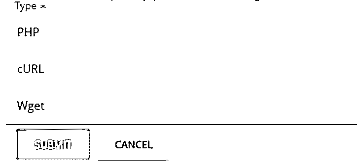
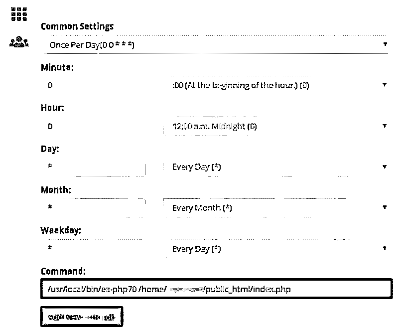
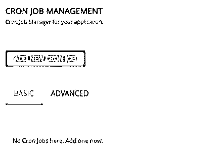
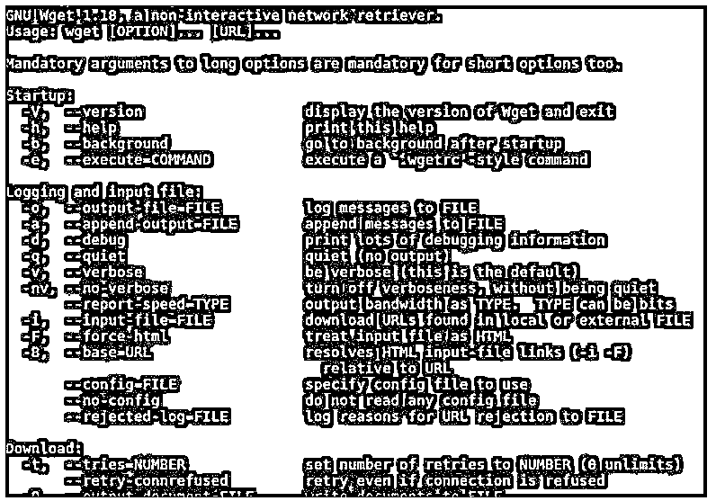

# PHP 中的 Cron

> 原文：<https://www.educba.com/cron-in-php/>

## PHP 中的 Cron 简介

用户可以通过使用 cron 作业来调度特定的重复任务，并在特定时间间隔后执行，cron 作业负责执行以 PHP 等任何编程语言编写的脚本中编写的任务。Cron 作业在日常生活场景中有着广泛的应用。在这里，我们将了解 PHP 中的 cron 作业是什么，它们是如何创建的，以及如何与一些可以在 PHP 中使用的 cron 命令一起运行。

### PHP 中的 Cron 是什么？

*   Cron 在 linux 平台上是给调度任务的名称，而在 windows 平台上，它也被称为调度任务。cron 这个词的来源可以追溯到代表时间顺序的 chronology。在用 PHP 编程语言编写的应用程序中，cron 作业可用于确保某些关键任务(可能是需要执行和调度的代码片段)及时执行。
*   cron 作业在系统维护和应用程序级别都有很好的实现。在广泛使用 PHP 的 web 应用程序中，会出现许多这样的情况，我们需要调度很少的任务。
*   Cron 提供了一个后台持续运行的守护程序，它扮演着执行 cron 中调度的任务的角色。此外，还存在一个名为 crontab 的配置文件，该文件存在于时间表中，其中包含有关任务和计时器的所有信息。

### 如何在 PHP 中创建 Cron？

在添加 cron 作业时，您必须了解以下参数，这些参数在 PHP 中执行 cron 作业时起着重要作用。

<small>网页开发、编程语言、软件测试&其他</small>

*   **脚本路径:**执行任务写在脚本文件中，运行任务时需要指定脚本文件的位置和路径。
*   **Execute:** 创建的 cron 作业应该在用 php 编写的程序中调用，因为它们位于名为 PHP 的文件夹中的 usr/in 中。
*   **Time:** 当您希望执行 cron 作业时，周期、间隔或时间应以月、工作日、小时、天或分钟为单位进行设置。
*   **Output:** 我们可以丢弃所有 cron 作业输出，或者将它们导航到位于指定目的地的特定文件。

有许多编辑器和工具提供了在 PHP 中添加 cron 作业的接口。其中之一就是 Cpanel。

下面给出了使用 Cpanel 为 PHP 程序创建 cron 作业的步骤:

*   Cpanel 只有首先登录平台才能访问。
*   您必须首先打开 Cpanel，然后导航到 Home 选项。此外，您可以转到高级选项，然后转到 cron 作业。界面将如下图所示。
*   此外，您可以输入电子邮件地址来接收所有与 cron 相关的通知。之后，你必须点击更新电子邮件按钮。如果您不想接收来自 cron 的任何通知并禁用该功能，那么您可以将该字段留空。
*   单击 Add New Cron job 按钮，输入下面提到的时间任务和命令的详细信息。
*   请注意，您可以指定自己的域来代替 usr/local/…字符串，并且可以检索您的域所使用的 php 版本。为了使用多用途管理器，你必须了解你的域名所使用的 PHP 版本。
*   在为 php 创建 cron 作业时，您必须创建一个 php 脚本，您必须运行该脚本并选择下图所示的 php 选项。

*   创建一个 php 文件，其中包含需要使用 cron 作业进行调度的脚本。例如，假设我们已经创建了名为 index.php 的文件，其中包含以下内容。

**代码:**

`<?php
echo "Educba is the best edutech site present on internet";
?>`

*   您可以在命令文本框中输入您希望在 php 脚本路径中执行的命令。

### 在 PHP 中运行 Cron 作业

添加 cron 作业后，运行它就非常简单了。您可以执行命令行指令，甚至可以使用任何提供相同接口的工具。

如果您正在使用 cpanel 工具，那么为了运行您已经创建的 php 的 cron 作业，您可以遵循下面提到的步骤:

*   在您提到关于执行频率、需要执行的 php 脚本的路径以及相应的链接的所有细节之后，您可以简单地单击 Apply 按钮。
*   cron 工作申请需要几分钟，之后，您就可以开始工作了。最后，您的 cron 作业将被设置并准备运行。
*   如果您希望手动设置 cron 作业，您可以单击菜单部分中的高级选项。

### PHP 中的命令 Cron

为了在 php 中使用 cron 作业，我们可以手动检查是否存在名为 wget 的配置属性，这是 cron 使用 PHP 所必需的。

在基于 RPM 的系统(如 Mandrake 或 redhat)中检查此配置的命令使用以下命令。

**代码:**

`# wget –help`

**输出:**

此外，您可以执行您作为脚本创建的 PHP 文件，并且可以通过遵循 wget 命令来完成调用。

**代码:**

`# wget (URL to php file)`

### 结论

PHP 中的 Cron 可用于根据我们的要求，以重复模式调度 PHP 脚本中指定的特定任务的执行，这可以手动完成，也可以使用任何提供此类接口的工具，如 cpanel。

### 推荐文章

这是一个 PHP 中的 Cron 指南。这里我们讨论一下入门，如何在 PHP 中创建 cron？分别运行和命令 cron。您也可以看看以下文章，了解更多信息–

1.  [PHP ziparchive](https://www.educba.com/php-ziparchive/)
2.  [PHP base64_decode](https://www.educba.com/php-base64_decode/)
3.  PHP 获取数组的最后一个元素
4.  [PHP 对象序列化](https://www.educba.com/php-object-serialization/)

