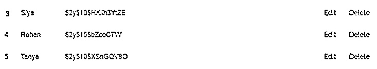
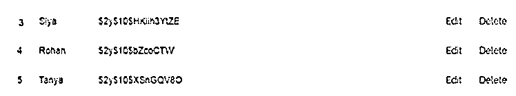
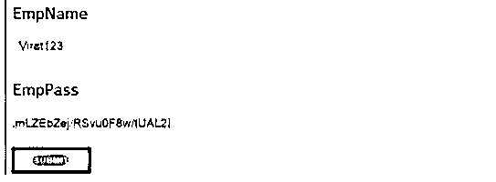
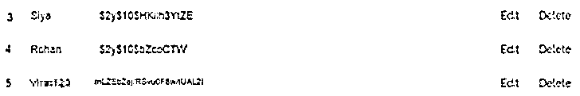

# CakePHP 保存

> 原文：<https://www.educba.com/cakephp-save/>

## CakePHP 保存简介

CakePHP 是实现动态编程的开源工具；CakePHP 中有多种保存记录的方法。我们也可以向表中添加新记录。我们试图更新当时的记录；我们还需要根据我们的要求执行保存操作。一件重要的事情是，我们可以说现有应用程序中的常见错误是，继承代码意味着当我们有不止一个关系时。我们试图保存记录，因此可以通过使用多种方法来解决这个错误，这取决于开发人员。

### CakePHP 保存概述

我们在对现有应用程序进行代码审查或简单地处理获得的代码时发现的一个常见错误是 HasMany 关系信息是如何保存的。我们已经看到，拯救有许多关系；少数设计师保留了客观联系。之后，当 ID 在保存之后被恢复时，他们为“多”连接中的每个人和每件事保存一个。没有令人信服的理由这样做，因为 CakePHP 可以做到这一点，在一个单一的“保存”！您将不会有任何信息冲突的问题，因为所有这些都将在一次交换中被处理掉，并且您的代码将看起来更加整洁。

<small>网页开发、编程语言、软件测试&其他</small>

在保存操作之前，我们需要使用一个带有表注册表的表类。我们可以利用 get()技术从保险库中获取机会。get()技术将信息库表的名称作为争用。这个新案例用于获取我们需要刷新的特定记录。接下来，我们必须在多种情况下执行级联等保存操作。利用这个例子来设置需要刷新的新属性，最后，使用 TableRegistry 类的实例调用 save()策略来刷新记录。

### 如何在 CakePHP 中保存数据？

现在让我们看看如何在 CakePHP 中保存数据，如下所示:

首先，我们需要创建一个新表，并将一些记录放入表中，如下所示:

**代码:**

`CREATE TABLE IF NOT EXISTS `sampledemo` (
`id` char(30) NOT NULL,
`EmpName` varchar(250) DEFAULT NULL,
`EmpPass` varchar(40) DEFAULT NULL,
PRIMARY KEY (`id`)
) ENGINE=MyISAM DEFAULT CHARSET=latin1;`

现在，在新创建的表中插入记录，如下所示:

**代码:**

`INSERT INTO `sampledemo` (`id`, `EmpName`, `EmpPass`) VALUES
('3', 'Siya','$2y$10$HKLH3YiZE'),
('4', 'Rohan','$2y$10$bZcoCTW'),
('5', 'Tanya','$2y$10$SnGQV8O');`

**说明:**

*   在执行上述查询后，我们将得到如下结果，如截图所示。

这是将记录插入表中的一种简单方法，但是让我们考虑一下我们需要更新记录并进行如下配置。

现在，我们需要在 route.php 进行如下所示的更改:

**代码:**

`<?php
use Cake\Http\Middleware\CsrfProtectionMiddleware;
use Cake\Routing\Route\DashedRoute;
use Cake\Routing\RouteBuilder;
$routes->setRouteClass(DashedRoute::class);
$routes->scope('/', function (RouteBuilder $builder) {
$builder->registerMiddleware('csrf', new CsrfProtectionMiddleware([
'httpOnly' => true,
]));
$builder->applyMiddleware('csrf');
$builder->connect('/users/delete', ['controller' => 'sam, 'action' => 'delete']);
$builder->fallbacks();
});`

现在我们需要创建一个 usercontroller.php 文件并编写以下代码。

**代码:**

`?php
namespace App\Controller;
use App\Controller\AppController;
use Cake\ORM\TableRegistry;
use Cake\Datasource\ConnectionManager;
class UsersController extends AppController{
public function sequence (){
$users = TableRegistry::get('users');
$query = $users->find();
$this->set('output',$query);
}
public function delete($id){
$users_table = TableRegistry::get('users');
$users = $users_table->get($id);
$users_table->delete($users);
echo "deleted successfully.";
$this->setAction('sequence');
}
}
?>`

现在我们需要为用户创建一个目录，这个文件我们称之为 ctp 文件，或者是序列或者是索引；根据我们的要求，我们可以更改文件名并编写以下代码。

**代码:**

`<a href="add"> User</a>
<table>
<tr>
<td>Id</td>
<td>EmpNamee</td>
<td>EmpPass</td>
<td>Edit</td>
<td>Delete</td>
</tr>
<?php
foreach ($Output as $row):
echo "<tr><td>".$row->id."</td>";
echo "<td>".$row->Empname."</td>";
echo "<td>".$rows->EmpPass."</td>";
echo "<td><a href='".$this->Url->build(["controller" => "Users","action" => "edit",$row->id])."'>Edit</a></td>";
echo "<td><a href='".$this->Url->build(["controller" => "Users","action" => "delete",$row->id])."'>Delete</a></td></tr>";
endforeach;
?>
</table>`

现在在 localhost 中运行脚本并查看输出；这是我们用截图展示的上述实现的结果。

现在点击编辑按钮；我们得到如下屏幕，如屏幕截图所示。

假设我们需要更改 Tanya 的名称和密码，那么我们需要单击 Edit 按钮并输入所需的详细信息，如下图所示。

现在单击 save 按钮，并在表中查看 update 命令的反映；在这里，我们用下面的截图来说明这一点。

### CakePHP HABTM 保存

*   保存来自与 CakePHP 的 HasAndBelongsToMany (HABTM)关系的信息并不是利用这种结构的最简单的部分。
*   最根本的问题是，无论您是需要将现有记录关联在一起(更新连接表中的段落)，还是需要创建新记录并将它们配对(在模型表和连接表中创建新记录)，HABTM 信息的配置都不相似。

### 关联保存

下面给出了 CakePHP 中与关联一起保存的内容:

每当保存一个元素时，都可以保存一些或相关的物质。当然，所有第一级元素都将被保存。例如，保存一篇文章将刷新任何与文章表格直接相关的不良元素。

CakePHP 为开发人员提供了如下相关选项:

**$指定表名- >保存($entity，[' associated ' =>[' Comments '])；**

在保存关联时，我们可以实现不同实体之间的嵌套关联，如下所示:

**$指定表名- >保存($entity，[' associated ' =>[指定列名]])；**

这样，我们就可以用关联来实现保存，CakePHP 也向开发者提供了不同的关联。

### 结论

从上面的文章中，我们已经了解了 CakePHP 保存的基本思想，并看到了 CakePHP 保存的表示和示例。此外，我们从本文中了解了如何以及何时使用 CakePHP save。

### 推荐文章

这是一个 CakePHP 保存指南。这里我们讨论一下入门，如何在 CakePHP 中保存数据。和关联保存。您也可以看看以下文章，了解更多信息–

1.  [PHP 中迄今为止的时间戳](https://www.educba.com/timestamp-to-date-in-php/)
2.  [PHP ksort](https://www.educba.com/php-ksort/)
3.  [PHP 异或](https://www.educba.com/php-xor/)
4.  PHP 获取数组的第一个元素

