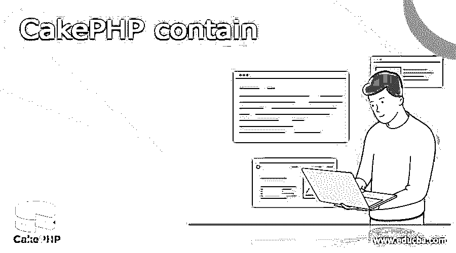

# CakePHP 容器

> 原文：<https://www.educba.com/cakephp-contain/>

## CakePHP 容器的定义

CakePHP 是一个开源框架，提供编程的动态行为。此外，CakePHP 提供了可包含的行为，这有助于过滤操作并允许我们限制模型。换句话说，我们可以说，根据我们的需求，我们可以将数据库削减为双模式磨损。此外，在实现 CakePHP contains 后，应用程序的整体性能将得到提高。此外，通过使用 CakePHP 容器，我们在软件实现过程中实现了精简和绑定，这有助于提高应用程序的性能。

### CakePHP 包含什么？

可包含的行为。这种模范行为允许您引导和限制模型追踪任务。利用 Containable 将帮助您消除数据集上不必要的里程，加速应用程序的一般执行。此外，这个课程将帮助你为你的客户完美地、可预测地搜索和传递你的信息。Containable 可让您理顺并改进您的模特领带流程。它的工作原理是短暂地或永久地修改模型之间的关系。它通过利用提供的控件产生一系列 bindModel 和 unbindModel 调用来实现这一点。然而，由于 Containable 改变了现有的连接，它不允许你通过遥远的联系来限制结果。相反，你应该提到加入表。

<small>网页开发、编程语言、软件测试&其他</small>

### 如何使用 CakePHP contains 方法？

让我们看看如何在 CakePHP 中使用 contain 方法。

CakePHP 3.0 中的基本查询与 CakePHP 2.0 中的不同。在 3.0 中，用于信息库管理相关任务的 ORM(对象-社会规划)发生了变化。例如，如果“Emp”是一个模型，并且我们需要利用查询制造商获得一部分字段，那么问题看起来如下:

`$results=$emp->find()
where(['id >'=>1])
toArray();`

**解释**

使用上面的查询，我们将找到 id 大于或等于 1 的所有记录。我们使用下面的屏幕截图来说明上述实现的最终结果。

现在我们来看另一个例子如下。

我们买这个模型怎么样？有两个表，例如“Dept”和“Emp”，有许多连接。万一我们想带来与 Emp 相关的 Dept 数据，那么，在这一点上，我们有可能为 CakePHP 提供“包含”技术。在表单 3.0 中，我们可以完全控制相关的模型。以下是调查结果:

`$results=$emp->find()
contain([‘Emp’, Dept])
where(['id >'=>1])
toArray();`

**解释**

在上面的例子中，我们试图实现如下所示的 contain 方法；这里，我们将两个不同的连接起来，并将结果放入一个表中。上面的实现我们用下面的截图来说明。

这样，我们可以实现 contain 方法，也可以根据需要添加更多的方法，例如升序、降序，或者有时我们需要过滤与另一个表相关联的记录，这时我们也可以使用 contain 方法。

### CakePHP 包含一个 find 语句

现在让我们看看如何在 CakePHP 中使用 find 语句，如下所示。

如前所述，模型层的工作之一是从不同的容量中获取信息。CakePHP 模型类附带了一些功能，可以帮助您查找、排序、分页和引导这些信息。您将在模型中使用的最广为人知的工作是 model:find()

**语法**

`find (string $specified type = ‘specified type’, array $params = array())`

**解释**

使用上面的语法，我们可以实现 find 语句；Find 是所有模型信息恢复能力中的多功能主力。$type 可以是' all '，' first '，' count '，' list '，' neighbors '或' strung '，或者任何您可以表征的自定义定位器。记住$type 是区分大小写的。使用大写字符(例如，all)不会产生预期的结果。

$params 用于将所有边界传递给不同种类的 find()并附带可能的键，当然，这些键都是任意的:

现在让我们看看不同的查找方法如下。

`Find(first)`

如果当时需要打印第一个结果或者说那个单个结果，可以用这个方法。

**语法**

`find(‘first’, $All parameter)`

**解释**

在上面的语法中，我们首先使用 find 方法；此外，我们需要传递所有参数。

**例子**

`$result = $this -> Emp-> find(‘first’);`

**解释**

执行上述语句后，它从 Emp 表中返回单个记录；使用下面的屏幕截图说明了上述语句的实现。

`find(count)`

它用于根据我们的要求返回整数值。

**语法**

`find(‘count’, $All parameter)`

**解释**

在上面的语法中，我们将 find 方法与 count 方法一起使用，同样在这里，我们需要传递所有参数。

**例子**

`$result = $this -> Emp-> find(‘count’);`

**解释**

我们用下面的截图展示了上述语句的最终结果。

`find(‘all’)`

它用于返回各种不同的可能结果。事实上，它是所有 find()变体和分页所使用的组件。

**语法**

`find ('all', $All parameter)
find(‘list’)`

它用于返回一个有序的集群，对任何需要缩减的地方都有帮助，例如，填充输入选择框。

**语法**

`find ('list’, $All parameter)
find(‘threaded’)`

它用于返回已确定的分类，适合利用模型信息的 parent_id 字段来制造已确定的结果。

**语法**

`find ('threaded’, $All parameter)`

这样，我们可以按照我们的要求实现 find 语句；根据需要，我们也可以在函数内部编写上述语句。

### 结论

我们希望从这篇文章中你能学到更多关于 CakePHP 容器的知识。从上面的文章中，我们已经理解了 CakePHP 容器的基本思想，我们也看到了 CakePHP 容器的表示和例子。此外，我们还学习了如何以及何时使用本文中包含的 CakePHP。

### 推荐文章

这是 CakePHP 容器指南。这里我们讨论一下简介，CakePHP 包含什么，以及如何使用 CakePHP contain 方法。您也可以看看以下文章，了解更多信息–

如何使用 CakePHP contains 方法？

1.  [CakePHP](https://www.educba.com/cakephp/)
2.  [如何安装 CakePHP？](https://www.educba.com/install-cakephp/)
3.  [Laravel vs CakePHP](https://www.educba.com/laravel-vs-cakephp/)
4.  [CakePHP 面试问题](https://www.educba.com/cakephp-interview-questions/)

