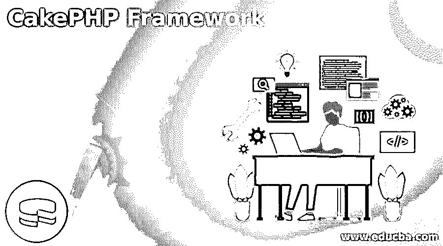
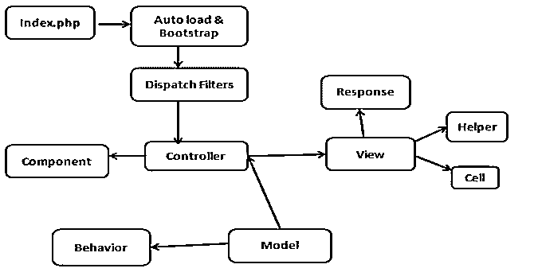
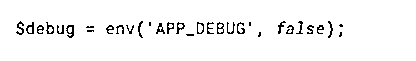

# CakePHP 框架

> 原文：<https://www.educba.com/cakephp-framework/>

## CakePHP 框架简介

CakePHP 是一个用于开发动态编程或动态 web 应用程序的开源工具。CakePHP 框架使用模型视图控制器模块来制作一个交互式的、灵活的 web 应用程序。CakePHP 框架支持 PostgreSQL、MySQL 等不同的数据库。2005 年开始 CakePHP 我们可以使用具有一些高级特性的不同版本的 CakePHP，这有助于在最短的时间内开发应用程序，因为从开发人员的角度来看，模型视图控制器易于使用和实现。

### 什么是 CakePHP 框架？

CakePHP 框架使用和实现非常简单；CakePHP 最重要的一点是它结构良好。这意味着我们可以说它是一个结构化的合适的框架。在该框架的帮助下，我们可以在最短的时间内轻松开发动态分配。此外，如果需要迁移，我们可以根据我们的需求轻松地迁移代码。

<small>网页开发、编程语言、软件测试&其他</small>

CakePHP 的主要优点是，它在本地机器上为开发人员提供了一种不同的功能，并使您免于重新检查，利用 CakePHP 意味着您的应用程序的中心已经被尝试过了，并且大体上是不断移动的。它依赖于 MVC 设计的思想，这有助于用更少的代码简单地构建 PHP web 应用程序。CakePHP 同样帮助你从信息中分离出业务原理并显示层次。

### 为什么要用 CakePHP 框架？

*   从长远来看，CakePHP 是网络进步最快的阶段之一。
*   CakePHP 允许设计者监督数据集和 SQL 问题。
*   它帮助客户创建强大的 web 应用程序，而不会很快失去对当前环境的适应性。
*   支持一个数据集反射库，一个数据集反射库，支持 PostgreSQL，SQLite，MySQL，PEAR-DB for ADODB。
*   使用网页索引友好的网址。
*   重点介绍使应用安全的信息批准和消毒设备。
*   用自然 PHP 编程语言制作模板。
*   它还为开发人员提供了内置的验证功能。
*   它有不同的组件，如电子邮件、cookies 和安全性。

### CakePHP 框架结构

CakePHP 构造了控制器、模型和视图类，但它同样包含了一些额外的类和项目，使 MVC 的发展更快更有魅力。部件、行为和助手是提供可扩展性和可重用性的类，可以快速增加应用程序中基本 MVC 类的有用性。

#### 1.应用程序扩展

AppController(位于/application/Controller/app Controller . PHP)、AppHelper(位于/application/View/Helper/app Helper . PHP)和 AppModel(位于/application/Model/app Model . PHP)是放置您需要在所有监管者、助手或模型之间划分的策略的绝佳位置。尽管课程不是类或记录，但它们承担了 CakePHP 需求的一部分。例如，课程定义建议 CakePHP 如何为监管者活动规划 URL。默认行为期望 URL/regulator/activity/var 1/var 2 引导到 Controller::action($var1，$ var 2)；但是，您可以利用课程来修改 URL 以及它们如何被您的应用程序解密。

#### 2.成分

组件是指导调节器基本原理的类。一个器件通常是在调节器(或应用)之间分配的可靠匹配。例如，中心 EmailComponent 类使制作和发送邮件变得轻而易举。不要在一个单独的调节器中组合一个调节器技术来实现这个基本原理，你可以捆绑这个基本原理，这样它就可以被共享。监管机构还配备了回调功能。如果您想在 CakePHP 的中心活动之间嵌入一些基本原理，您可以使用这些回调。

可访问的回调包括:

*   过滤之前()
*   后置过滤器()
*   beforeRender()

#### 3 .行为

本质上，行为作为增加正常的方式填充；让我们考虑一棵树的例子；在树形结构下，我们可以存储用户的数据，以便于访问。在你的基本树形结构中删除、添加和移动中枢的有用性。

*   在查找之前()
*   afterFind()
*   验证之前()
*   afterValidate()
*   保存前()
*   afterSave()
*   删除前()
*   afterDelete()

#### 4.助手

助手是一个引导视图基本原理的类。与监管机构之间使用的部分类似，合作伙伴允许在 see 之间获取和分配演示原理。例如，其中一个中心助手 JsHelper 在内部发出 AJAX 请求，看得更直截了当，并附带 jQuery(默认)、Prototype 和 Mootools 支持。

CakePHP 请求周期如下图所示:

### CakePHP 框架配置

我们需要配置不同的组件，如下所示:

#### 1.环境变量

众多先进的云供应商，如 Heroku，让您描述安排信息的气候因素。您可以在 12 因素应用程序风格中通过气候因素来安排您的 CakePHP。气候因素允许您的应用程序要求更少的状态，使得在各种条件下发送时更容易监控，如下面的屏幕截图所示。

#### 2.一般配置

在常规配置中，我们需要如下配置不同的变量:

*   **调试:**检查调试输出。
*   **App，命名空间:**查找该类下的应用。

app . base URL .
app . base .
app . encoding .
app . webroot .
app . wwwroot

之后，我们需要按照我们的要求配置数据库、缓存、错误和异常以及日志。

### CakePHP 框架模型

模型是 CakePHP 应用程序中用于信息访问的信息库表的动态描述。他们可以与你的信息库相关联，如果监管机构要求他们这样做，他们可以对信息库进行查询，并将信息保存到数据集。

**举例:**

**代码:**

`<?php
Specified class name extends AppModel
{
#need to define name of model
var $specified name variable = 'required name';
}
?>`

### 结论

从上面的文章中，我们已经理解了 CakePHP 框架的基本思想，我们也看到了 CakePHP 框架的表示和例子。从本文中我们看到了如何以及何时使用 CakePHP 框架。

### 推荐文章

这是 CakePHP 框架指南。这里我们讨论引言；为什么要使用 CakePHP 框架？结构、配置和型号。您也可以看看以下文章，了解更多信息–

1.  [PHP 中迄今为止的时间戳](https://www.educba.com/timestamp-to-date-in-php/)
2.  [PHP ksort](https://www.educba.com/php-ksort/)
3.  [PHP 异或](https://www.educba.com/php-xor/)
4.  PHP 获取数组的第一个元素

