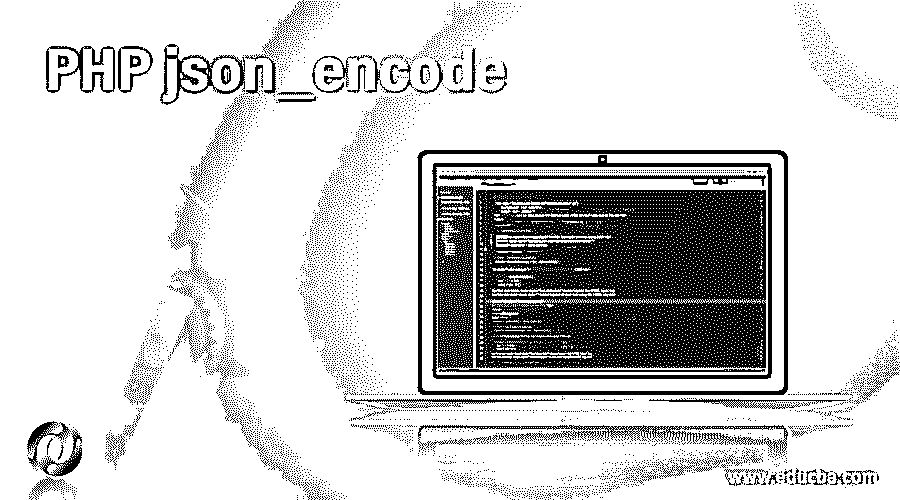
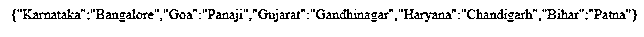
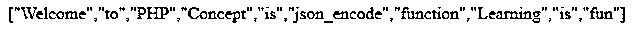
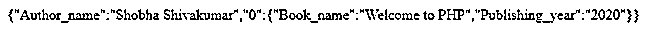
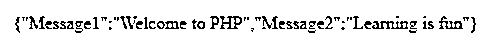

# PHP json_encode

> 原文：<https://www.educba.com/php-json_encode/>

## PHP json_encode 简介

有处理 JSON 的内置函数，用于将对象转换成 JSON 的函数在 PHP 中称为 json_encode 函数。JSON 是用来从 web 服务器读取数据并在网页上显示读取的数据的东西。当使用 json_encode 函数对 PHP 值进行 json 格式的编码时，如果成功，json_encode 函数将返回 JSON 中的编码字符串，如果失败，json_encode 函数将返回 FALSE，此 json_encode 函数在 5.2 版以后的所有 PHP 版本中都可用。

**语法:**

<small>网页开发、编程语言、软件测试&其他</small>

`json_encode(value, options, depth)`

其中 value 是要以 JSON 格式编码的值，bitmask 由 options 指定，这是可选的，最大深度由 depth 指定，这是可选的。

### PHP json_encode 函数的使用

json_encode 函数的工作原理如下:

*   每当需要使用内置函数在 PHP 中处理 JSON 时，可以使用的函数之一就是 json_encode()函数。
*   JSON 是用来从 web 服务器读取数据并在 web 页面上显示读取的数据的东西。
*   用于将对象转换成 JSON 的函数在 PHP 中称为 json_encode 函数。
*   当使用 json_encode 函数对 json 格式的值进行编码时，如果成功，json_encode 函数返回 JSON 中的编码字符串，如果失败，json_encode 函数返回 FALSE。
*   json_encode 函数在 5.2 版之后的所有版本中都可用。

### 例子

下面是一些例子:

#### 示例#1

PHP 程序演示 json_encode 程序将给定的 PHP 数组编码成 json 数组:

**代码:**

`<?php
// a PHP array is declared and the capital cities of the states of India is stored in an array which is represented by a variable
$val = array(
"Karnataka"=>"Bangalore",
"Goa"=>"Panaji",
"Gujarat"=>"Gandhinagar",
"Haryana"=>"Chandigarh",
"Bihar"=>"Patna");
// json_encode() function is used to convert the PHP array into JSON array
$object = json_encode($val);
// the converted PHP array is displayed in JSON array on the screen
echo($object);
?>`

**输出:**

在上面的程序中，声明了一个 PHP 数组，印度各邦的首府都存储在这个数组中，这个数组由一个变量表示。然后用 json_encode()函数将 PHP 数组转换成 json 表示。然后，转换后的 PHP 数组以 JSON 表示显示在屏幕上。

#### 实施例 2

PHP 程序演示 json_encode 程序将给定的索引数组编码成 json 数组:

**代码:**

`<?php
// a PHP indexed array is declared and the statements to be converted into JSON array is stored in an array which is represented by a variable
$val = array(
"Welcome","to",
"PHP","Concept",
"is","json_encode",
"function","Learning",
"is","fun");
// json_encode() function is used to convert the PHP array into JSON array
$object = json_encode($val);
// the converted PHP array is displayed in JSON array on the screen
echo($object);
?>`

**输出:**

在上面的程序中，声明了一个 PHP 数组，要转换成 JSON 数组的语句存储在这个由变量表示的数组中。然后用 json_encode()函数将数组转换成 json 数组。然后转换后的数组作为屏幕上的输出显示在 JSON array 中。输出显示在上面的快照中。

#### 实施例 3

PHP 程序演示 json_encode 程序将给定的多维数组编码成 json 数组:

**代码:**

`<?php
// a multi dimensional PHP array is declared and the author of the book, name of the book and the publishing year of the book is stored in a multi dimensional array which is represented by a variable
$val = array(
"Author_name"=>"ShobhaShivakumar",
array(
"Book_name"=>"Welcome to PHP",
"Publishing_year"=>"2020"
)
);
// json_encode() function is used to convert the PHP multi dimensional array into JSON array
$object = json_encode($val);
// the converted multi dimensional PHP array is displayed in JSON array on the screen
echo($object);
?>`

**输出:**

在上面的程序中，声明了一个多维数组，并将图书的作者、图书的名称和图书的出版年份存储在一个由变量表示的多维数组中。然后使用 json_encode()函数将多维数组转换成 json 数组。然后转换后的多维数组作为屏幕上的输出显示在 JSON array 中。输出显示在上面的快照中。

#### 实施例 4

演示 json_encode 程序的 PHP 程序，它将给定的对象转换成 json 对象:

**代码:**

`<?php
//an object is created in PHP to store two messages
$firstobject->Message1 = "Welcome to PHP";
$firstobject->Message2 = "Learning is fun";
//json_encode() function is used to convert the objects in PHP to JSON object
$Convertedobject = json_encode($firstobject);
//the converted object is displayed on the screen
echo $Convertedobject;
?>`

**输出:**

在上面的程序中，创建对象来存储两条消息。然后用 json_encode()函数将 PHP 中的对象转换成 json 对象。然后，转换后的对象显示在屏幕上。输出显示在上面的快照中。

### 推荐文章

这是一个 PHP json_encode 的指南。在这里，我们还讨论了函数的介绍和工作，以及不同的例子和它的代码实现。您也可以看看以下文章，了解更多信息–

1.  [PHP 拆分字符串](https://www.educba.com/php-split-string/)
2.  PHP URL
3.  [JavaScript JSON](https://www.educba.com/javascript-json/)
4.  [PHP 数组 _push()](https://www.educba.com/php-array_push/)
5.  [JSON 解析器](https://www.educba.com/json-parser/)
6.  [将对象转换为 JSON C#](https://www.educba.com/convert-object-to-json-c-sharp/)

