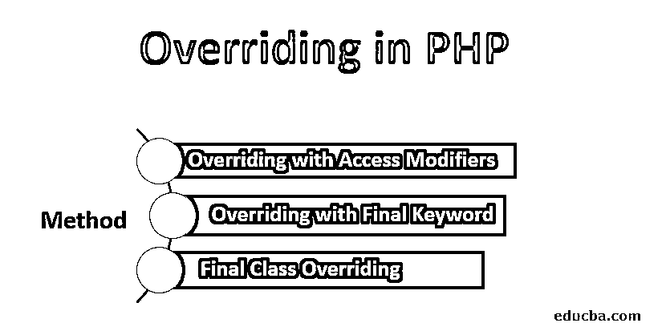
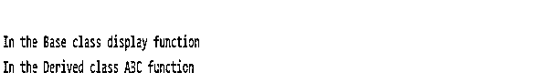
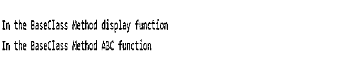

# 在 PHP 中重写

> 原文：<https://www.educba.com/overriding-in-php/>




## PHP 中什么是覆盖？

Overriding 是一个面向对象的编程概念，类似于 PHP 中的类、对象、[封装](https://www.educba.com/encapsulation-in-php/)、多态、[重载](https://www.educba.com/overloading-in-php/)等概念。当派生类中的方法与基类或父类中的方法相同时，就完成了函数和类的重写。这两种方法具有相同的名称和相同数量的参数。

### 覆盖是如何工作的？

让我们探索一下 PHP 中的覆盖是如何工作的。

<small>网页开发、编程语言、软件测试&其他</small>

*   重写是一个概念，其中基类的派生类执行与基类相同的操作。这种重写可以在方法或类上进行。如果是方法重写，那么方法的名称是参数，访问说明符与父类方法的访问说明符相同。如果在从基类派生的子类中的方法实现中没有发现任何变化，那么就说子类的方法覆盖了基类的方法。
*   假设有一个名为 Person 的类，它有自己的数据属性和方法。这是父类或基类 Person，它有一个叫做 speak()的方法。现在又多了一个名为 Employee 的类，它扩展了 Person 类。现在，这个 Employee 类有了自己的数据属性和方法，也有了一个与父类相同的方法，如 speak()。
*   这个，speaks()方法存在于基类和派生类中。
*   现在发生的是当类被实例化或对象被创建时，将执行哪个 speak()方法，这意味着基类的 speak 或派生类的 speak 被执行取决于被调用的类的对象。
*   换句话说，如果创建了 Person 类的对象，那么 Person 类的 speak()方法将被调用并执行。但是如果创建了 Employee 类的对象，那么将执行派生类的 speak()方法，这将覆盖父类的 speak()类。
*   下面是一个例子，说明重写是如何发生的
*   在下面的例子中，有两个类，基类和派生类。派生类扩展了基类。这些类被初始化，并创建了两个对象$obj1 和$obj2。$obj1 是基类的对象，而$obj2 是派生类的对象。这些对象进一步调用在它们各自的类中声明的方法。
*   这里你会发现基类和派生类有相同的方法，叫做 ABC()。当您执行这个程序时，您会注意到 ABC()方法已经覆盖了基类方法 ABC()。

#### 方法重写的示例

下面是方法重写的示例。

**代码:**

```
class BaseClass {
public function ABC() {
echo "<br /> In the base class";
}
}
class DerivedClass extends BaseClass {
// override the method ABC() of base class
public function ABC() {
echo "<br />In the derived class";
}
}
$obj1 = new BaseClass;
$obj1->ABC();
$obj2 = new DerivedClass;
$obj2->ABC();
```

**输出:**


### 用访问修饰符重写

有三种访问修饰符。

1.  **public:** 可从程序中的任何地方访问。
2.  **private:** 只能从父类访问。
3.  **protected:** 可从基类和派生类访问。

正如我们所知，受保护的方法可以从基类和派生类中访问，它可以在子类中成为公共的，但不能成为私有的，因为私有的只能在父类中访问。同样，如果一个类方法的访问说明符是 public，那么派生类中的重写方法不能被声明为 private 和 protected

#### 使用访问修饰符重写方法的示例

下面是一个使用访问修饰符重写的例子。

**代码:**

```
class BaseClass {
private function ABC() {
echo "<br/>In the base class Method : ABC";
}
protected function XYZ() {
echo "<br/>In the base class Method : XYZ";
}
}
class DerivedClass extends BaseClass {
// overriding with public for wider accessibility
public function ABC() {
echo "<br/> In the derived class Method : ABC";
}
// overriding method
// with more accessibility
public function XYZ() {
echo "<br/>In the derived class Method : XYZ";
}
}
//$obj1 = new BaseClass;
//$obj1->ABC();   //throws fatal error
//$obj1->XYZ();          //throws fatal error
$obj2 = new DerivedClass;
$obj2->ABC();
$obj2->XYZ();
```

**输出:**


### 用 Final 关键字覆盖

[final 关键字](https://www.educba.com/final-keyword-in-java/)用于类和方法。方法和类，而不是变量可以被覆盖。

#### 最终方法覆盖

当一个方法或者一个类被声明为 final 时，那么在那个方法或者类上的重写就不能被执行，同样继承类也是不可能的。

#### 使用 Final 关键字重写的方法示例

下面是使用 final 关键字重写的示例。

**代码:**

```
class BaseClass {
// Final method – display
// this cannot be overridden in base class
final function display() {
echo "<br /> In the Base class display function";
}
/// method - ABC
function ABC() {
echo "<br /> In the Base cLass ABC function";
}
}
class DerivedClass extends BaseClass {
function ABC() {
echo "<br /> In the Derived class ABC function";
}
}
$obj1 = new DerivedClass;
$obj1->display();
$obj1->ABC();
```

**输出:**




### 最终类覆盖

声明为 final 的类不能被继承。final 类还包含 Final 方法和其他方法。但是因为类本身被声明为 final，所以在 final 类中声明 final 方法是没有用的。

#### 使用 Final 关键字重写类的示例

下面是使用 final 关键字重写类的示例。

**代码:**

```
// class declared as final cannot be overridden
final class BaseClass {
// method - ABC
function ABC() {
echo "<br> In the BaseClass Method ABC function";
}
// Final method - display
function display() {
echo "<br> In the BaseClass Method display function";
}
}
// here you cannot extend the base class
// as the base class is declared as final
$obj1 = new BaseClass;
$obj1->display();
$obj1->ABC();
```

**输出:**




### 推荐文章

这是一个在 PHP 中重写的指南。在这里，我们讨论了 PHP 的基本概念和不同方法的工作原理，以及代码实现和输出。您也可以阅读以下文章，了解更多信息——

1.  [核心 PHP 面试问题](https://www.educba.com/core-php-interview-questions/)
2.  [PHP 的优势](https://www.educba.com/advantages-of-php/)
3.  [PHP 职业](https://www.educba.com/career-in-php/)
4.  [PHP 命令](https://www.educba.com/php-commands/)


