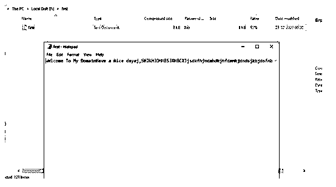

# PHP 压缩文件

> 原文：<https://www.educba.com/php-zip/>

## PHP Zip 简介

PHP Zip 是 PHP 中的默认方法之一，用于使用类似。zip，。焦油，。rar 等。基于上述格式，数据被压缩在单一格式文件夹中；这是一种方便的方法，可以将一堆数据连接在一起，存储在相同的存储区域，并共享相同的文件，还可以根据操作系统支持归档文件扩展名。T. T .这些函数将根据相应的库提供支持。请注意，zip 方法或其他一些默认方法的扩展名对于 to 插件更为必要。相比之下，我们在 PHP 代码中使用它。

**语法:**

<small>网页开发、编程语言、软件测试&其他</small>

PHP 代码的每种方法都有不同的用法，并且功能可能会根据需求而有所不同。同样，zip 是 PHP 中的内置方法之一；它包含一个或多个要压缩的文件。

`<?php
$zip=new ZipArchive;
----some php code logics----
$zip -> close();
?>`

以上代码是 zip 方法用法的基本语法，ZipArchive 是创建 zip 方法实例的默认类。使用 ZipArchive 类方法，它将与 zip 方法协调执行。

### PHP 中 Zip 方法是如何工作的？

*   zip 是一种压缩文件的存档方法，可以与其他格式的文件一起保存，并且使用提取选项对数据进行加密；我们将把数据提取到机器中相同的位置或定制的路径。这是一种方便的方法，可以用来保持一堆文件连接在一起，与存储和检索数据。PHP zip 文件函数允许脚本处理 zip 文件；使用这些功能；相应的库将被导入到 PHP 脚本中。使用 PHP zip 扩展，支持 pho 版本 5 及以上。在运行 php 脚本之前，必须在 PHP 安装中启用一些默认的 PHP dll 和 ini 文件。
*   zip 方法来自 ziparchive 类；这些调用包含实现压缩和提取 zip 文件夹的默认方法。zip_close()用于关闭 PHP 中的 zip 文件，zip_entry_close()用于关闭 PHP zip 文件中的特定条目。使用 zip_entry_compressedsize()用于返回 PHP zip 条目的大小，其已经压缩的文件夹 zip_entry_compressionmethod()将总是返回 PHP zip 文件的压缩方法。PHP $zip 方法有一些额外的子方法，如 zip_entry_filesize()将计算压缩文件的大小，并返回 PHP zip 文件中已经创建的确切文件大小。同样，zip_entry_name()、open()、read()、zip_entry_open()和 zip_entry_read()是一些默认的方法，用于在 PHP 代码中执行有关压缩概念的操作。也可以创建一个包含多个文件的 zip 文件，它总是将 zip 文件发送到浏览器，以便下载或提取文件夹。
*   一旦我们创建了 ZipArchive 类的实例，我们就可以使用默认的方法 open (datatype filename，datatype flag)函数来打开用于 crud 操作的 zip 文件。ziparchive 有一些标志，用于覆盖文件中已经存在的 zip 文件。使用 create a flag，ziparchive 类在不存在该方法的情况下创建了 zip 文件。打开 zip 文件后，我们可以使用 addFile(datatype path，datatype filename)方法将文件添加到 zip 文件中。如果文件中已经存在 zip 文件，ZipArchive 类将识别这些文件并从代码中删除它们。

### 例子

下面提到了不同的例子:

#### 示例#1

**代码:**

`<!DOCTYPE html>
<html>
<body>
<?php
$zi = new ZipArchive();
$zippaths = 'F:\first.zip';
$fg = (file_exists($zippaths))? ZIPARCHIVE::OVERWRITE : ZIPARCHIVE::CREATE;
if($zi->open($zippaths, $fg) === true){
$zi->addFromString('first.txt', 'wWlcome To My Domain.', 'Have a Nice dayej,SHJKHJDHHBSJXNBCXJjsdkfhjndmhdkjhfdmnkjdndsjkbjdsfnbdndfbHNZBXHjhbjnhsabshjhmbsjnsm');
$zi->addFromString('first.txt', 'wWlcome To My Domain.', 'Have a Nice dayej,SHJKHJDHHBSJXNBCXJHNZBXHjhyteeeuikjwqhkjqmnk12323443bjnhsabshjhmbsjnsm');
$zi->addFromString('first.txt', 'wWlcome To My Domain.', 'Have a Nice dayej,SHJKHJDHHBSJXNBCXJHNZBXHjhbjrrreeewnhsabshjhmbsjnsm');
$zi->addFromString('first.txt', 'wWlcome To My Domain.', 'Have a Nice dayej,SHJKHJDHHBSJXNBCXJHNZBrttyyyyyXHjhbjnh5sabshjhmbsjnsm');
$zi->addFromString('first.txt', 'wWlcome To My Domain.', 'Have a Nice dayej,SHJKHJDHHBSJXNBCXJHNZBXHjhbjnhsabshjhmbsjnsm');
$zi->addFromString('first.txt', 'wWlcome To My Domain.', 'Have a Nice dayej,SHJKHJDHHBSJXNBgfghghyyytyyyyyyyyyyyyyyyyyyyyyyyyyyyuiueuiohjhiouoikjkuikjhiukCXJHN45rty6565656ZBXHjhbjnhsabshjhmbsjnsm');
$zi->addFromString('first.txt', 'wWlcome To My Domain.','Have a Nice dayej,SHJKHJDHHBSJXNBCXJHNZBXHjhbjnhsabshjhmbsjnsm');
$zi->close();
}
else{
echo "Thank you user have a nice day";
}
?>
</body>
</html>`

**输出:**

#### 实施例 2

**代码:**

`<!DOCTYPE html>
<html>
<body>
<?php
$z1 = new ZipArchive();
$filep = 'F:\second.zip';
$f1 = (file_exists($filep))? ZIPARCHIVE::OVERWRITE : ZIPARCHIVE::CREATE;
do
{
if($z1->open($filep, $f1) === true){
$z1->addFile('second.txt', '82365o97429032bIf the directory of the zip file is not exist, then it will throw an error. If you will not set the local name, then the default name and directory of the file will be the first parameter. And if the file doesnt exist, nothing will happen and it will return a false value.So you should create first a valid directory before you open or add a zip file.');
$z1->close();
}
else{
echo "Thank you user have a nice day";
}
}
while(!is_null($z1));
?>
</body>
</html>`

**输出:**

#### 

例三

**代码:**

`<!DOCTYPE html>
<html>
<body>
<?php
$zq = zip_open("F:\third.zip");
if ($zq) {
while ($zip_entry = zip_read($zq)) {
echo "
";
echo "Welcome To My DOmainNull is a special data type which can have only one value: NULL. A variable of data type NULL is a variable that has no value assigned to it. Tip: If a variable is created without a value, it is automatically assigned a value of NULL " . zip_entry_name($zip_entry) . " ";
echo "Have a Nice Day: loop will always execute the block of code once, it will then check the condition, and repeat the loop while the specified condition is true. " .zip_entry_filesize($zip_entry);
echo "
";
}
zip_close($zq);
}
?>
</body>
</html>`

**输出:**

### 结论

在 php_zip 文件中，方法是在服务器端脚本上完全压缩的；如果我们需要解压缩数据，它将用于从客户端传输数据。带有扩展名的文件数据也可以不间断地传输。因此可以避免从客户端到服务器的数据丢失，反之亦然。

### 推荐文章

这是一个 PHP 压缩指南。这里我们讨论一下介绍，zip 方法在 PHP 中是如何工作的？并分别举例说明。您也可以看看以下文章，了解更多信息–

1.  [PHP 梁()](https://www.educba.com/php-strlen/)
2.  [PHP 拆分数组](https://www.educba.com/php-split-array/)
3.  [PHP 发布方法](https://www.educba.com/php-post-method/)
4.  [PHP include_once](https://www.educba.com/php-include_once/)

