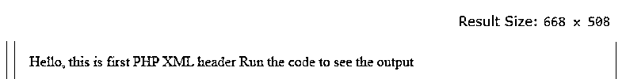
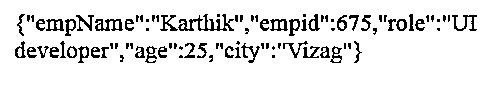
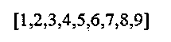

# PHP XML 头

> 原文：<https://www.educba.com/php-xml-header/>

## PHP XML 头介绍

PHP XML header 是 PHP 文件输出的 XML 内容类型，而不是 text/html 的默认头内容。将标题内容类型设置为 XML 表示浏览器的输出是 XML 格式的。XML 代表可扩展标记语言，它表示文档编码的规则。PHP 是一种开源编程语言，用于在服务器端动态设置 web 内容和应用程序。类似于动态 HTML 内容在 PHP 中的生成方式，动态 XML 内容也可以在 PHP 中生成。

### 句法

下面给出了 PHP XML 头的语法:

<small>网页开发、编程语言、软件测试&其他</small>

`<?php header(‘Content-Type: text/xml’); ?>`

以上是在使用 PHP XML header 时要转换成 XML 的内容类型的基本语法。

`header(header, replace, http_response_code)`

基本的 Header 函数向客户端发送原始的 HTTP 头；它在输出发送之前被调用。

**自变量:**

*   **header:** 指定要发送的头字符串，必选参数。
*   **replace:** 表示表头是否要替换之前的表头，或者添加一个相同类型的新表头。这是一个可选参数，默认值为 TRUE，即，将替换。Boolean FALSE 允许多个标题具有相同的类型。
*   **http_response_code:** 强制 http 响应代码为特定值，可选参数。

`<?php
header ("Content-Type:text/xml");
?>
<xml_content>
…………………………
</xml_content>`

在 PHP 中，在 header()发送到浏览器之前，不会有任何输出。头的内容类型告诉浏览器如何处理内容。例如，如果有一个浏览器不支持的 PDF 文件，它会给出一个使用其他应用程序的选项。它会告诉使用我们系统上的其他应用程序，或者会要求下载特定的应用程序。

如果内容类型是 text/xml，则不指定字符集，因为文件被视为 us-ascii。对于不同的字符集，需要在头中指定。对于 PHP 中的 XML 使用，内容类型被指定为“application/xml”，字符集为“utf-8”。Content-type 头是 HTTP 协议的一部分，它告诉客户机或服务器预期的数据类型以及如何解释它。

### PHP XML 头的例子

下面提到了不同的例子:

#### 示例#1

**代码:**

`<!DOCTYPE html>
<html>
<body>
<?php
header("Content-type: text/xml");
echo "<?xml version='1.0' encoding='UTF-8'?>";
echo "<note>";
echo "Hello, this is first PHP XML header";
echo "\n";
echo "<message>Run the code to see the output</message>";
echo "</note>";
?>
</body>
</html>`

**输出:**

这里的内容类型是 header，现在是 XML 格式。

XML 得到了广泛的网络用户和 XML 工具的支持，它们是设备中立的、厂商中立的和平台中立的。

`Content-type: text/xml; charset="utf-8"
<?xml version="1.0" encoding="utf-8"?>`

以上是推荐用于 text/xml 的字符集值。MIME 和 xml 处理器将实体视为 UTF-8 封装的。如果使用 SMTP 请求发送数据，xml 必须使用内容传输编码或 base64 编码。对于其他类型的请求，如 ESMTP、NNTP、HTTP 等。不需要内容传输编码。

`Content-type: text/xml; charset="utf-16"
{BOM}<?xml version='1.0' encoding='utf-16'?>`

utf-16 字符集仅在 xml 通过 HTTP 使用二进制 clean 协议传输而不执行任何 CR 和 LF 转换时使用。由于 HTTP 是一种二进制协议，因此这里不需要内容传输编码。

`Content-type: text/xml
{BOM}<?xml version="1.0" encoding="utf-16"?>`

这里省略了 charset 参数。在这种情况下，xml 处理器因此假定字符集为“us-ascii”。对于使用 HTTP 请求传输的文本/xml 来说，这个缺省值是正确的。

但是，对于 text/xml 头，完全不建议省略字符集。

`Content-type: application/xml; charset="utf-16"
{BOM}<?xml version="1.0"?>`

建议与标题内容类型(如 application/xml)一起使用。由于这里提供了字符集，xml 处理器将实体视为 utf-16 编码的。

`Content-type: application/xml
<?xml version='1.0'?>`

这里既没有 BOM 参数，也没有 charset 参数。不知道处理器的 XML 不应该对 XML 实体的字符集做任何假设。

#### 实施例 2

**代码:**

`<!DOCTYPE html>
<html>
<body>
<?php
header("Content-type: application/xml");
$arr =[
"empName" => "Karthik",
"empid" => 675,
"role" => "UI developer",
"age" => 25,
"city" => "Vizag"
];
echo json_encode($arr);
?>
</body>
</html>`

**输出:**

#### 实施例 3

**代码:**

`<!DOCTYPE html>
<html>
<body>
<?php
header("Content-type: text/xml");
echo "<?xml version='1.0' encoding='UTF-8'?>";
$data = [1,2,3,4,5,6,7,8,9];
echo json_encode($data);
?>
</body>
</html>`

**输出:**

### 结论

至此，我们结束了我们的主题“PHP XML header”。我们已经看到了 PHP XML header 是什么；将内容类型更改为 XML 给 http 请求-响应带来了很大的不同。我们已经分析了在 PHP 代码中声明 xml 头的语法。字符集是 PHP 的重要组成部分之一，它描述了发送数据的形式。我看到了各种字符集，比如 utf-8 和 utf-16，默认的 us-ascii 字符集。还看到了 php xml header 如何与上面列出的一些例子一起工作。

### 推荐文章

这是一个 PHP XML 头的指南。在这里，我们讨论 PHP XML header 的介绍以及一些例子，以便更好地理解。您也可以看看以下文章，了解更多信息–

1.  [PHP 输出缓冲](https://www.educba.com/php-output-buffering/)
2.  [PHP json_decode](https://www.educba.com/php-json_decode/)
3.  [PHP mail()](https://www.educba.com/php-mail/)
4.  [PHP 全局变量](https://www.educba.com/php-global-variable/)

