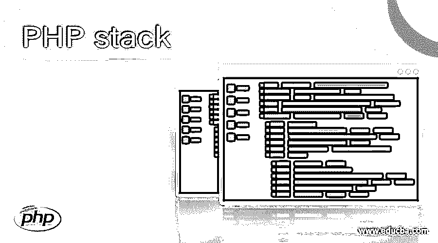
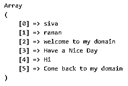
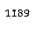
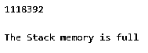

# PHP 堆栈

> 原文：<https://www.educba.com/php-stack/>

## PHP 堆栈介绍

php 堆栈被定义为将用于在堆栈内存中存储元素的类。堆栈是基于特定属性的连续集合集。数据可以使用 LIFO(后进先出)属性来存储和检索它，这样输入元素就被称为放在堆栈内存中的对象。所以在一些默认方法的帮助下，对象的第一个位置被从堆栈中移除。每当我们在 pop()方法的帮助下使用 push()和 removed element 在堆栈中插入元素时，都会实现这一点。

**语法**

<small>网页开发、编程语言、软件测试&其他</small>

在 php 中，stack 是每当我们想在 Php 中实现堆栈内存时使用的类；在这些类的帮助下，我们将构建它。通过使用构造函数，我们可以创建它的一个实例。php 堆栈使用一些默认方法从堆栈内存中存储和检索数据。此外，它还可以用于 php 中的其他一些数据结构操作。

`<?php
class classname {
Access modifier $var;
$var = new Stack();
$var -> push(argument);
$var -> pop(argument);
$var -> default methods for accessing the elements for stack memory;
----some php logics based on the requirement---
}`

上述代码是使用堆栈类和预定义方法从内存中存储和检索数据的基本语法。

### PHP 中堆栈是如何工作的？

stack 类主要用于从内存中存储和检索数据。因此，可以遵循 LIFO(后进先出)这样的原则和属性，所以插入到最后一个位置的元素(即第一个元素)将通过使用 pop()方法弹出。所以，每当我们想用栈的概念实现数据结构时，这些默认的方法被用来处理这些任务，它们将与数据库相关。一般来说，堆栈是通常可以用某种层来排列的一堆对象，因此堆栈是顺序的集合，使用特定的一组属性来存储或推入堆栈的每组值，它创建引用，并且每当从堆栈存储器中移除堆栈元素时，该引用将被移除。

每一组值都包含它的引用，所以如果我们想从堆栈中推出或弹出元素，可以用最大的容量来实现。因此，如果堆栈存储器溢出，则称之为溢出，即)抛出堆栈溢出错误；这是为了插入元素，如果我们使用弹出空栈抛出命名栈下溢错误。

### PHP 堆栈示例

下面是 PHP 堆栈的不同例子:

#### 示例#1

`<?php
$var=array("siva","raman", "welcome to my domain", "Have a Nice Day" );
array_push($var,"Hi","Come back to my domain");
print_r($var);
?>`

**输出:**

在上面的例子中，我们使用了基本的 array_push()方法，它继承自 stack 类。这种将元素插入堆栈内存的推送方法。我们使用 arary_push()方法在数组容器中存储元素。它可以从索引 0 开始，以指定的索引结束；每个字符串都将被插入到内存的指定位置。它是一个顺序存储的内存位置；如果我们想在 pop()方法的帮助下移除数组中的特定元素，它将在堆栈内存中弹出。

#### 实施例 2

`<?php
class Demo
{
protected $vars;
protected $vars1;
public function __construct($vars1 = 47) {
$this->vars = array();
$this->vars1  = $vars1;
}
public function push($eg) {
if(count($this->vars) < $this->vars1) {
array_unshift($this->vars, $eg);
} else {
throw new RuntimeException("Welcome To My Domain");
}
}
public function pop() {
if (empty($this->vars)) {
throw new RuntimeException("Please try user again");
} else
return array_shift($this->vars);
}
}
}
$vars = new Demo();
$vars->push(7);
$vars->push(9);
$vars->push(11);
echo $vars->pop();
$vars->push(7);
$vars->push(9);
$vars->push(8);
echo $vars->pop();
echo $vars->pop();
?>`

**输出:**

在第二个例子中，我们以不同的方式使用了 stack 类；我们可以调用默认的方法，比如 push()、pop()方法来插入和删除内存中的元素。此外，我们可以使用其他方法，如 array_shift()方法，从数组中移除第一个元素，并返回被移除元素的值。所有数字数组将使用的键将被修改，并在使用文字键时开始计算零值。如果元素被移除，那么一旦我们从堆栈中弹出，引用变量也会从内存中移除。

#### 实施例 3

`<?php
class Example
{
protected $vars;
protected $vars1;
function __construct($vars1 = 19) {
$this->vars = array();
$this->vars1  = $vars1;
}
function push($eg1) {
if(count($this->vars) < $this->vars1) {
array_unshift($this->vars, $eg1);
} else {
throw new RuntimeException("Welcome To Third example");
}
}
function pop() {
if (empty($this->vars)) {
throw new RuntimeException("Please try user again");
} else {
return array_shift($this->vars);
}
}
function top() {
return current($this->vars);
}
function isEmpty() {
return empty($this->vars);
echo $vars;
}
}
$vars = new Example();
$vars->push(1);
$vars->push(11);
$vars->push(111);
echo $vars->pop();
$vars->push(72);
$vars->push(92);
$vars->push(83);
echo $vars->pop();
echo $vars->pop();
echo "\n \n";
echo "The Stack memory is full \n";
?>`

**输出:**

在上面的第三个示例中，我们使用了与前面的示例 2 相同的方法，但是这里我们使用了另外两个方法，比如 top()和 isEmpty()来检查内存中的数组列表值。这两种默认方法将用于通过使用 LIFO 属性算法来验证数组大小和堆栈内存；最后一个元素从内存中删除。通过使用 array_shit()方法，我们可以从第一个元素的最后一个位置开始遍历并弹出这些元素。

### 结论

php 中的堆栈用于理解堆栈跟踪，内存用于封装用户预期中的数据。通过使用默认方法，如 push()、pop()，甚至其他方法来存储堆栈中的元素。填充后，如果元素被插入到堆栈内存中，它会抛出堆栈溢出错误。如果假设我们必须使用 pop()移除元素，它会抛出堆栈溢出错误。

### 推荐文章

这是一个 PHP 堆栈的指南。在这里，我们讨论了如何在 PHP 和例子中堆栈工作，以及代码和输出。您也可以看看以下文章，了解更多信息–

1.  [PHP 附加文件](https://www.educba.com/php-append-file/)
2.  [PHP 删除文件](https://www.educba.com/php-delete-file/)
3.  PHP URL
4.  [PHP json_decode](https://www.educba.com/php-json_decode/)

