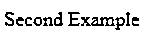
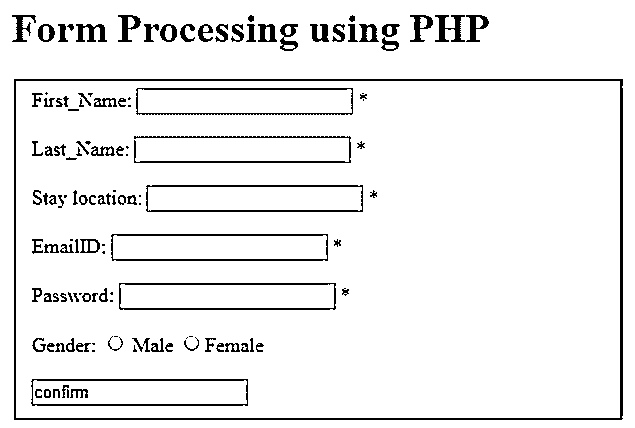

# PHP 注释

> 原文：<https://www.educba.com/php-annotations/>

## PHP 注释简介

PHP 注释基本上是元数据，可以包含在源代码中，也可以包含在类、函数、属性和方法之间。无论在哪里声明它们，它们都以前缀@开始，并且它们表示特定的东西。他们提供的这些信息对编码人员非常有用，有助于文档化，ide 也可以用这些信息来显示某些弹出提示之类的东西。除了验证之外，相同的注释还可以用于其他目的，例如确定表单中需要给出什么类型的输入，以及用于自动化目的。有各种类型的注释，如@var 和@int 类型，正如它们的名字本身所暗示的那样，可以用于特定的用途。

**语法**:

<small>网页开发、编程语言、软件测试&其他</small>

PHP 注释通过给出@前缀来使用，其语法如下:

`class Example
{
// @var integer
public $new;
}`

这里的注释是@var，每当它出现在任何代码段之前(例如这里的 public $new ),它就表示$new 将具有一个整数类型的值，正如注释所告诉的那样。

`class Example
{
// @var integer
// @range(0, 51)
// @label('Count of shops')
public $shop;
}`

注释也可用于指定显示最大值和最小值的范围，这些值将作为整数值用于该函数，标签给出了该函数的用途。

### PHP 注释的类型

下面给出了这些类型:

#### 1.内置注释

注释中有两个内置函数，如下所示:

**a .编译:**这个注释表示方法/函数是否应该 JIT 编译。它也是一种函数作用域类型的注释。

**b. SuppressWarnings:** 这是另一个内置的注释，这意味着在它下面的后续代码的执行过程中抛出的任何警告都必须被抑制。

#### 2.元注释

这些是可以用于应用其他注释的注释类型。它们用于配置注释。

**答. @注释**

有一种注释类将包含@annotation。

**代码:**

`[@Annotation] class MyAnnoExample {
// piece of code
}`

**b . @目标**

顾名思义，这个注释指出了那些类型的类元素或者注释适用的方法。

在此基础上，我们可以描述一个或多个目标:

*   属性批注就在属性类声明之前。
*   在声明类之前允许的类。
*   函数在函数声明之前声明。
*   方法注释允许进行方法声明。
*   允许注释继续进行注释类的声明。

**c . @可重复**

这个注释意味着它在使用时可以重复任意次。

**d . @继承了**

这也可以作为元注释用于其他用户定义的注释类。当在超类上使用这些继承的注释时，它们被自动继承到各自的子类。

#### 3.自定义注释

这些非常类似于普通类的声明。注释类型的每个元素都由每个属性声明定义。

### PHP 注释的例子

下面是提到的例子:

#### 示例#1

**代码:**

`// namespace declaration here
[@Annotation] [@Target("class")] class MyAnnoEx {
[@Required] public string $prop;
public array $arrayProp = [];
public embedAnno $embed;
}
[@Annotation] // code for embedded annotation goes here
[@Target(["class", "annotation"])] class embedAnno {
}
[@Annotation] // example for target annotation
[@Target("property")] class propAnno {
}
@Annotation
// code for method annotation goes here
@Target("method")
class methodAnno {
public string $val;
public function __construct(string $val) {
$this->val = $val;
}
}`

这只是一个基本示例，显示了上面显示的所有不同类型的注释的用法。示例中的所有注释，如嵌入注释、属性注释、方法注释都是自定义注释。

#### 实施例 2

**代码:**

`<!DOCTYPE html>
<html>
<body>
<?php
/**
* @Replace("exmaple", "for", "annotation")
*/
class MyNamedComponent
{
}
echo str_replace("First", "Second", "First Example");
?>
</body>
</html>`

**输出**:

在这个例子中，我们将注释命名为 replace，因为下面的代码代表了字符串替换函数 str_replace 的用法，这是 PHP 的一个内置函数。使用这个函数，函数中传递的第一个参数被第二个参数替换。

#### 实施例 3

**代码:**

`<!DOCTYPE html>
<html>
<head>
<title>Simple Form Processing</title>
</head>
<body>
<h1>Form Processing using PHP</h1>
<fieldset>
<form id="formex1" method="post" action="formexample.php">
<!--Declaring First name for the form
@Annotation text first_name-->
First_Name:
<input type="text" name="First_Name"/>
<!--@var style color-->
*
 
 
<!--Declaring Last_Name for the form
@Annotation text last_name-->
Last_Name:
<input type="text" name="last_name"/>
*
 
 
<!--Declaring Location for the form
@Annotation text location-->
Stay location:
<input type="text" name="location"/>
*
 
 
<!--Declaring EMAILID for the form
@Annotation text email-->
EmailID:
<input type="email" name="emailID"/>
*
 
 
<!--Declaring Password for the form
@Annotation password-->
Password:
<input type="password" name="password"/>
*
 
 
<!--Declaring Password for the form
@Radio button password-->
Gender:
<!-- Gender to be selected as either male or female -->
<input type="radio"
value="Male"
name="gender"> Male
<input type="radio"
value="Female"
name="gender">Female
 
 
<input type="confirm" value="confirm" name="confirm" />
</form>
</fieldset>
<?php
if(example($_POST['confirm']))
{
if(!example($error))
{
echo"<h1>DETAILS RECEIVED</h1> ";
echo "<table border='2'>";
echo "<thead>";
echo "<th>Argument</th>";
echo "<th>Value</th>";
echo "</thead>";
echo "<tr>";
echo "<td>First Name</td>";
echo "<td>".$First_Name."</td>";
echo "</tr>";
echo "<tr>";
echo "<td>Last_Name</td>";
echo "<td>".$last_name."</td>";
echo "</tr>";
echo "<tr>";
echo "<td>Stay location</td>";
echo "<td>".$location."</td>";
echo "</tr>";
echo "<tr>";
echo "<td>Email Stay location</td>";
echo "<td>" .$emailID."</td>";
echo "</tr>";
echo "<tr>";
echo "<td>Password</td>";
echo "<td>".$password."</td>";
echo "</tr>";
echo "<tr>";
echo "<td>Gender</td>";
echo "<td>".$gender."</td>";
echo "</tr>";
echo "</table>";
}
}
?>
</body>
</html>`

**输出:**

在这个例子中，我们展示了注释和 PHP 中的表单验证。使用注释，我们标记所有需要作为表单输入参数的参数，如名字和姓氏、电子邮件、位置和密码。

### 结论

通过上面的例子，我们已经注意到注释是如何成为一个强大的工具来使用和表达关于我们的方法、类或属性的元数据。我们还看到了如何组合不同种类的注释，通过编写一些元数据来声明将执行特定任务的工人。这使得它们很容易被找到，并给出关于它们是否可以被使用的实际信息。

### 推荐文章

这是 PHP 注释指南。这里我们讨论 PHP 注释的介绍，注释的类型和各自的例子。您也可以看看以下文章，了解更多信息–

1.  [PHP 日志错误](https://www.educba.com/php-log-errors/)
2.  [PHP preg_split()](https://www.educba.com/php-preg_split/)
3.  [PHP 引用](https://www.educba.com/php-references/)
4.  [PHP 匿名函数](https://www.educba.com/php-anonymous-function/)

