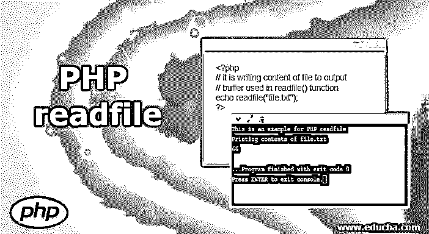
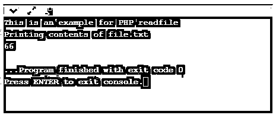
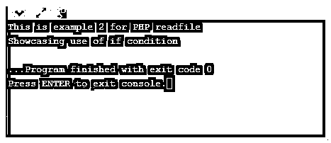

# PHP readfile

> 原文：<https://www.educba.com/php-readfile/>




## PHP readfile 简介

PHP readfile 基本上是 PHP 库中的一个内置函数，用于读取文件，然后将其写入输出缓冲区。

**语法**:

<small>网页开发、编程语言、软件测试&其他</small>

```
readfile ( string $file_name [, boolean $path = FALSE [, resource $context ]] ) : int
```

语法中使用的参数:

*   **filename:** 这是一个必填字段，我们在其中提供要读取的文件的名称。
*   **path:** 这是一个可选参数，是一个布尔值，如果需要在提供的路径中搜索文件，可以设置为 true 或 false。
*   **context:** 这也是一个可选字段，用于指定文件句柄的上下文。基本上，上下文是能够改变流行为的对象的集合。如果成功，则返回从文件中读取的字节数，如果读取失败，则返回 false。

### PHP readfile 的方法

除了 readfile()函数之外，下面是一些可以用来对文件执行各种操作的其他函数。

#### 1.文件()

这个函数也用来读取一个文件，它将整个文件读入一个数组。

**语法:**

```
file ( string $file_name [, int $flag = 0 [, resource $context ]] ) : array
```

其中，文件名是要读取的文件的路径。标志是可选字段，可从以下常量中选择:

*   **文件使用包含路径:**在给定路径中搜索各个文件。
*   **FILE_IGNORE_NEW_LINES:** 在每个数组元素的最后省略一个新行。
*   **FILE_SKIP_EMPTY_LINES:** 跳过空行。

成功时返回数组中的文件，失败时返回 false。

#### 2.fopen()

这个函数可以用来打开一个文件和一个 URL。

```
fopen ( string $file_name , string $mode [, bool $use_include_path = FALSE [, resource $context ]] ) : resource
```

*   其中，如果文件名是一个 URL，那么 PHP 会搜索一个协议处理程序(也称为包装器)来查找它。PHP 将发布一个通知来帮助跟踪脚本中可能存在的问题，然后继续将其视为一个正常的常规文件名。
*   假设如果 file_name 是一个本地文件，那么 PHP 试图在该文件上打开相同的流。只有在被授予了所需的访问权限时，PHP 才能访问该文件。
*   假设给定的文件名是一个注册的协议，如果该协议注册为网络 URL，那么第一个 PHP 确保 allow_url_fopen 被启用。如果被禁用，它将发出警告并失败。

**模式:**该参数表示需要给予流的访问类型。以下是几种重要的模式:

*   r–只读模式
*   r+–只读和只写
*   w–仅写模式

如果成功，它将返回一个文件指针资源；如果失败，它将返回 false。

#### 3.弗雷德()

这个函数用于二进制安全文件读取。

**语法:**

```
fread ( resource $handle , int $length ) : string
```

其中句柄用于引用文件指针。

文件被读取，直到它达到以下条件之一:*长度*字节必须已经被读取，e of 到达，套接字超时发生。fgets()、fscanf()、ftell()、fwrite()、fopen()、fsockopen()是 PHP 中用于文件操作的一些其他函数。

### PHP readfile 示例

下面是 PHP readfile 的例子:

#### 示例#1

**代码:**

```
<?php
// it is writing content of file to output
// buffer used in readfile() function
echo readfile("file.txt");
?>
```

**输出:**




这显示了一个读取本地路径中存在的文件的基本示例。确保 readfile()函数的参数中指定的文件名已创建，并且文件中存在要读取的内容。当使用 readfile()函数时，它读取文件的内容并输出。

#### 实施例 2

**代码:**

```
<?php
/ file contents written on output
// buffer by readfile() function
$file = @readfile("file.txt");
if (!$file)
{
print "File could not be opened";
}
?>
```

**输出:**




前面的输出是一个简单的例子，没有任何条件。在这个例子中，让我们看看如何通过使用某些条件来读取和显示文件的输出。假设文件不存在，我们使用 if 语句来打印。

#### 实施例 3

**代码:**

```
<?php
$file_name = "file.txt";
$fh = fopen($file_name, 'r');
$data = fread($fh, filesize($file_name));
fclose($fh);
echo $data;
?>
```

**输出:**


在本例中，我们结合使用了多个文件读取功能。和上面所有的例子一样，首先，我们给出需要读取的文件名。然后，操作模式“r”被提供给他们，表示它只能被读取。filesize()函数获取文件名，返回文件的大小及其数据，并将其赋给$data 变量。通过使用 fclose()函数，我们正在关闭该文件。最后，数据作为输出打印出来。

#### 实施例 4

**代码:**

```
<?php
$file_name = "file.txt";
$file = fopen( $file_name , "r" );
if( $file == false ) {
echo ( "Error in opening file" );
exit();
}
$size = filesize( $file_name );
$filetext = fread( $file, $size);
fclose( $file );
echo ( "The size of input file in bytes is : $size\n" );
echo ("Printing details of file:\n");
echo ( $filetext );
?>
```

**输出:**


在运行代码之前，确保要读取的文件 file.txt 是在本地文件路径中创建的[。首先在这个例子中，我们声明要读取的文件名，并用函数 fopen()打开它。假设文件不存在，使用 if 条件我们抛出一个错误消息。最后，我们打印输入文件中的文件大小和内容。](https://www.educba.com/file-path-in-html/)

### 结论

从上面的例子可以看出，readfile()是 PHP 的主要函数之一，用于读取该函数中指定的文件名。除了 readfile()之外，我们还介绍了其他一些执行类似操作的文件操作，如 fopen、file、fread、fgets、fgetss、ftell 等。所有这些的组合基本上用于访问输入文件和对输入文件执行操作。

### 推荐文章

这是一个 PHP readfile 指南。这里我们讨论 php readfile 的介绍、方法和例子以及代码实现。您也可以看看以下文章，了解更多信息–

1.  [PHP 加密](https://www.educba.com/php-encryption/)
2.  [PHP 超全局变量](https://www.educba.com/php-superglobal-variables/)
3.  [PHP 获取方法](https://www.educba.com/php-get-method/)
4.  [PHP 写文件](https://www.educba.com/php-write-file/)


