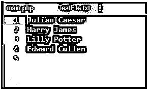

# PHP 写文件

> 原文：<https://www.educba.com/php-write-file/>

## PHP 写文件简介

PHP 中有各种内置函数，用于对文件执行各种操作。他们可能对文件进行创建、打开、读、写等操作。

### PHP 写文件的函数

下面是 PHP 中默认可用的主要函数:

<small>网页开发、编程语言、软件测试&其他</small>

#### 1.fopen()

首先，为了写入文件，我们必须知道如何创建该文件。这是借助 open()函数完成的。这个名字可能会误导打开文件，但是在 PHP 中，相同的函数用于创建和打开文件，就像 Linux 中的 vi 函数一样。这个函数一旦执行，就会检查文件是否存在，然后只创建它。下面的示例演示了同样的情况:

**代码:**

`<?php
// Creating a file for test
$myfile = fopen("test.txt", "w")
?>`

**输出:**

#### 2\. fwrite()

在创建一个文件后，我们必须将所需的内容写入其中，因此我们使用这个函数来完成同样的任务。这个函数只有在到达文件末尾(EOF)或我们根据先来的顺序指定的长度时才会停止。

**语法:**

`fwrite(file, string, length)`

*   其中，文件是描述我们应该写入的文件的必填字段
*   string 是另一个必需的参数，它告诉字符串写入打开的文件
*   length 是一个可选参数，它给出了要写入的最大字节数

**代码:**

`<?php
// Your code here!
$f = fopen("testfile.txt", "w");
$text = "Random data here\n";
fwrite($f, $text);
?>`

**输出:**

这里 testfile.txt 是创建的文件，分配给$text 的字符串值将被写入该文件。

#### 3.文件内容()

这是另一个函数，可以用来在 PHP 中将内容写入文件。当访问文件时，有一些相同顺序的规则需要遵循:

*   有一个名为 FILE_USE_INCLUDE_PATH 的属性，它会在设置时检查路径是否包含文件名的副本。
*   检查文件是否存在后创建文件
*   接下来，它打开文件
*   如果设置了属性 LOCK_EX，那么它会锁定文件
*   当属性 FILE_APPEND 被设置时，它移动到文件的末尾，否则清除文件的内容。
*   现在，它将所需的数据写入文件。
*   如果存在锁，关闭文件并释放

**Note:** The property FILE_APPEND should be used in order to save data from getting fully erased as it appends data to the end of the file.

**语法:**

`file_put_contents(filename, text, mode, context)`

*   其中 filename 是强制参数，它告诉我们必须写入的文件的完整路径，因此该函数检查并创建一个文件。
*   文本是另一个必填字段，是我们必须写入文件的数据。它可以是简单字符串、字符串数组或数据流的形式。
*   模式是可选字段，它为我们提供了各种操作文件的方法。其可能值为:

*   context 是可选参数，给出文件的上下文。它基本上是一堆可以改变流行为的选项。

**返回值:**如果成功，该函数返回写入文件的总字节数，如果失败，返回值 FALSE。

下面是一个例子:

**代码:**

`<?php
echo file_put_contents("filetest.txt","Testing for file write");
?>`

**输出:**

这里，我们创建的文件作为第一个参数给出，下一个参数是写入该文件的文本。

#### 4.重写

我们可以覆盖上面已经写入数据的文件。文件中已经存在的数据将被清除，它将作为一个全新的空文件启动。在下面的例子中，我们将打开一个现有的文件，并尝试在其上写入新数据。

下面是一个例子:

**代码:**

`<?php
$f = fopen("testfile.txt", "w");
$text = "Random data here\n";
$filetext = "Over writing the data\n";
fwrite($f, $filetext);
$filetext = "File Dummy Data\n";
fwrite($f, $filetext);
fclose($f);
?>`

**输出:**

这里我们正在覆盖 testfile.txt 中的数据，所以无论$filetext 字符串值中提到什么，都将被写入文件中。当我们通过更改提供给$filetext 的数据再次使用相同的 write 命令时，旧数据将被清除，并被提供的最新文本值占用。

在文件的末尾，我们总是应该使用 close()函数关闭它，我们已经使用 fwrite()函数打开了它。如上例所示，我们还使用了\n，它表示相当于按键盘上的 enter 键的换行符。

现在让我们举个例子，看看如何在我们的文件中包含更多的数据。

### PHP 写文件的实现实例

下面是 PHP 写文件的例子:

#### 示例#1

首先，我们使用下面的代码添加两行数据:

**代码:**

`<?php
$testf = "TestFile.txt";
$filehandle = fopen($testf, 'w');
$fdata = "Julian Caesar\n";
fwrite($filehandle, $fdata);
$fdata = "Harry James\n";
fwrite($filehandle, $fdata);
print "Data writing completed";
fclose($filehandle);
?>`

**输出:**

这创建了一个文件 TestFile.txt，它有 2 行数据，如上所述。

#### 实施例 2

我们将在同一个文件中添加另外两个名称，如下所示:

**代码:**

`<?php
$testf = "TestFile.txt";
$filehandle = fopen($testf, 'a');
$fdata = "Lilly Potter\n";
fwrite($filehandle, $fdata);
$fdata = "Edward Cullen\n";
fwrite($filehandle, $fdata);
print "Data has been appended";
fclose($filehandle);
?>`

**输出:**

此示例将给定的名称附加到与第一个示例相同的文件中。

### 结论

如上所示，当我们想用 PHP 写一个文件时，有各种各样的方法和步骤需要遵循。fwrite()是完成这项工作的主要函数之一，主要用于将数据写入文件。它们可以对我们的文件进行基本的数据写入，但是应该与其他强制函数结合使用，如 open()和 close()，如果文件不存在，没有这些函数就不可能对文件执行操作。

### 推荐文章

这是一个 PHP 写文件的指南。这里我们讨论 PHP 写文件的介绍和它的功能，以及例子和代码实现。你也可以浏览我们推荐的其他文章来了解更多信息-

1.  [Python 中抽象类概述](https://www.educba.com/abstract-class-in-python/)
2.  [PHP 中什么是抽象类？](https://www.educba.com/abstract-class-in-php/)
3.  [用方法](https://www.educba.com/socket-programming-in-php/)在 PHP 中进行套接字编程
4.  [PHP chop() |如何工作？](https://www.educba.com/php-chop/)

