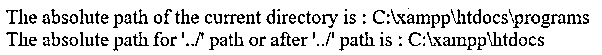
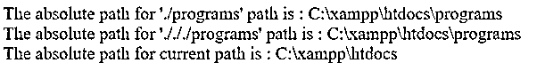

# PHP 真实路径

> 原文：<https://www.educba.com/php-realpath/>

## PHP realpath 简介

函数的作用是返回绝对路径名。realpath()函数是 PHP 中的内置函数。realpath()函数可以删除所有像“/”这样的符号链接。/', '/../'和额外字符'/'，并返回不包括这些符号的绝对路径名。realpath()函数接受路径作为参数，如果成功则返回路径的绝对路径名，如果失败则返回 false。

**语法:**

<small>网页开发、编程语言、软件测试&其他</small>

`realpath( path );`

**参数:**

*   **path:** 这不是一个可选的参数字符串类型，它指定带有符号链接的路径，这些符号链接的绝对路径将被返回。如果路径为空，则该路径被解释为当前目录。

**返回值:**该方法的返回值为绝对路径名，成功时不带符号链接，失败时为 false。

### PHP realpath()函数的工作原理

*   它接受一个参数作为(path)，这是必需的参数。
*   假设我们有一条路。/././programs '，我们希望获得其绝对路径，因此我们需要通过调用 realpath(')函数来传递此路径。/././programs’)，它以“C:\xampp\htdocs\programs”的形式返回绝对路径，不带任何符号链接。

### 例子

下面是提到的例子:

#### 示例#1

PHP realpath()函数获取文件绝对路径的例子。

接下来，我们编写 PHP 代码，通过下面的示例更清楚地了解 PHP realpath()函数，其中 realpath()函数用于获取文件的绝对路径。

**代码:**

`<?php
// file to get its real path
$file_path = "Ex.txt";
// return an absolute path using realpath() function
$abs_path = realpath( $file_path );
// printing the absolute path of the file
print( "The absolute path of the file is : " );
print( $abs_path );
print( " ");
?>`

**输出:**

在上面的代码中，绝对路径名是在 realpath()函数的帮助下作为“realpath( $file_path)”生成的其中$file_path 变量包含文件的名称，该文件与正在运行的程序文件位于同一目录中。

#### 实施例 2

PHP realpath()函数获取给定路径的绝对路径的示例。

接下来，我们编写 PHP 代码，通过下面的例子更清楚地了解这个函数，其中 realpath()函数用于获取给定路径的绝对路径，它包含符号链接。

**代码:**

`<?php
// file to get its real path
$path = "../";
// return an absolute path
// of the current directory
// using realpath() function with NULL
$curr_path = realpath( NULL );
// return an absolute path after "../" path using realpath() function
$abs_path = realpath( $path );
// printing the absolute path of current directory
print( "The absolute path of the current directory is : " );
print( $curr_path );
print( " ");
// printing the absolute path for "../" path
print( "The absolute path for '../' path or after '../' path is : " );
print( $abs_path );
print( " ");
?>`

**输出:**

如上面的代码所示，当前的绝对路径名是借助 realpath()函数打印成“realpath(NULL)；”如果值为 NULL，那么 realpath()函数返回当前目录的绝对路径，即“C:\xampp\htdocs\programs”，接下来运行的路径是“../”这意味着回到上一个目录，所以现在路径是“C:\xampp\htdocs”，我们可以在输出中看到。

#### 实施例 3

PHP realpath()函数获取给定路径的绝对路径的例子。

接下来，我们编写 PHP 代码，通过下面的示例更清楚地了解该函数，其中 realpath()函数用于获取给定路径的绝对路径，该路径包含与更改目录的符号链接。

**代码:**

`<?php
// change directory to /xampp/htdocs/
chdir( '/xampp/htdocs/' );
// move to next dirctory programs
// with './' symbolic linnk
$chdr = realpath( './programs' );
// Now printing the absolute path after './programs'
print( "The absolute path for './programs' path  is : " );
print( $chdr  );
print( " " );
// move to back previous dirctory
// with './././programs' symbolic linnk and directory name
$path = realpath( './././programs' ) ;
print( "The absolute path for './././programs' path  is : " );
print( $path );
print( " " );
$curr_path = realpath( NULL );
print( "The absolute path for current path  is : " );
print($curr_path);
?>`

**输出:**

与上面的代码一样，使用 chdir()函数将当前目录(如“C:\xampp\htdocs\programs”)更改为“\xampp\htdocs”。接下来，路径包含一个符号链接。/programs”，它被赋给了 realpath()函数，因此该函数返回其绝对路径为“C:\xampp\htdocs\programs”，其中不包含任何符号链接(如。/' ).同理，对于路径”。/././programs”还从“C”驱动器以“C:\xampp\htdocs\programs”的形式返回绝对路径，该路径不包含任何符号链接(如。/././' ).

### 结论

它是 PHP 中的一个内置函数，用于获取给定路径的不包含任何符号链接的绝对路径名，包含符号链接。

### 推荐文章

这是一个 PHP realpath 的指南。这里我们分别讨论 PHP realpath()函数的介绍、工作原理和例子。您也可以看看以下文章，了解更多信息–

1.  [PHP 对象到字符串](https://www.educba.com/php-object-to-string/)
2.  [PHP XML 阅读器](https://www.educba.com/php-xml-reader/)
3.  [PHP XMLWriter](https://www.educba.com/php-xmlwriter/)
4.  [PHP usort()](https://www.educba.com/php-usort/)

