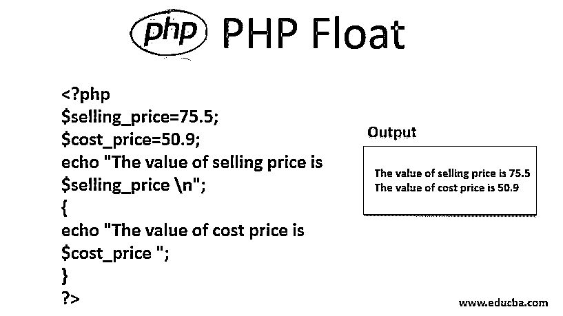
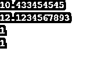
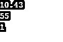
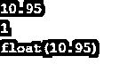

# PHP 浮动

> 原文：<https://www.educba.com/php-float/>




## PHP 浮点简介

在 PHP 中，Float 数据类型用于设置小数值。浮点数是带小数点的数字，可以扩展为指数形式。Float 也称为浮点数。表示浮点值的各种方式有 3.14、4.75、5.88E+20 等。如果 PHP 中的值非常大并且包含小数，它会自动将类型转换为 float。浮点数的最大精度约为 14 位。如果数字超过最大数字值范围，那么它将失去精度。在 PHP 中，很少有函数可以用来检查数据类型是否为浮点型。

程序员在变量名前使用 float 关键字，以便在变量初始化期间设置数据类型。在初始化阶段，只需在变量名后加上等号和该变量的浮点/十进制值，就可以为变量设置浮点值。它们可以在任何时间点改变状态/值，除非它们被声明为静态变量。float 主要用于包括货币、马克和百分比的应用中。我们可以像使用整数变量一样使用浮点变量，并使用基本运算，如加、减、乘、除。当执行这些操作时，输出值的存储方式取决于计算机。

<small>网页开发、编程语言、软件测试&其他</small>

### 浮点值的类型

让我们来看看不同类型的浮点数:

#### 短浮点数

短浮点数(短浮点类型)是实现提供的最小固定精度。这取决于你使用的 PHP 版本来支持这个数据类型。它的最小精度是 13 位，最小指数大小是 5 位。它将精确到小数点后 4 位。

#### 双浮点数

双浮点数是实现提供的固定精度之一。它的最小精度是 50 位，最小指数大小是 8 位。这些类别的精度取决于实现。它将精确到小数点后 14 位。

#### 长浮点数

长浮点数(long-float 类型)是实现提供的最大固定精度之一。它的最小精度是 50 位，最小指数大小是 8 位。这些类别的精度取决于实现。它将精确到小数点后 14 位。它类似于双浮点数。

### PHP 中的 Float 是如何工作的？

浮点值不过是小数，有自己的精度。让我们考虑一些简单的例子来理解浮点值是如何工作的:

```
<?php
$selling_price=75.5;
$cost_price=50.9;
echo "The value of selling price is $selling_price \n";
{
echo "The value of cost price is $cost_price ";
}
?>
```

**输出:**


在上面的例子中，输出将是可变售价和成本价的值，即分配给变量的浮点值将打印在输出屏幕上。

让我们再举一个双浮点值的例子:

```
<?php
$a = 10.433454545;
$b = 12.1234567893;
echo $a;
echo "\n";
echo $b;
echo "\n";
echo is_double($a);
echo "\n";
echo is_double($b);
echo "\n";
?>
```

**输出:**




在上面的例子中，函数 is_double()的输出将被检查变量是否是双浮点类型。它只是检查变量是否设置了 double 值，在这个例子中，两个变量都被初始化为 double 值。

我们可以使用浮点值在 PHP 中进行基本操作:

```
<?php
$ab = 1.23456789;
$bc = 1.23456780;
$ep = 0.00001;
if(abs($ab-$bc) < $ep)
{
echo "true";
}
else
{
echo “false”;
}
?>
```

**输出:**


$ab 变量已被初始化为十进制值，类似于上面示例中的变量$bc。因此，在计算之后，如果条件得到满足，就在输出屏幕上打印出循环内部存在的 true 语句。函数 is_float()可用于检查变量是否为浮点类型。is_float()是 PHP 中的内置函数。它是一个布尔函数，所以当一个类型是浮点数时，它返回 TRUE，否则返回 FALSE。

我们举个简单的例子。

```
<?php
$a = 10.43;
$b = 55;
echo $a;
echo "\n";
echo $b;
echo "\n";
echo is_float($a);
echo "\n";
echo is_float($b);
?>
```

**输出:**




在上面的例子中，函数 is_float()的输出对于第一个 echo 语句为 true，对于第二个为 false。在这个例子中，输出将是 1，在中断之后也将是 1。它只是检查 float 值是否被设置为变量，在这个例子中，一个变量已经被初始化为 float 值。

像 is_float()函数一样，我们有一个名为 var_dump()的函数来打印类型和值作为输出。该函数用于打印与开发人员想要在屏幕上打印的变量相关联的数据类型。

例如:

```
<?php
$a = 10.95;
echo $a;
echo "\n";
echo is_float($a);
echo "\n";
var_dump($a);
echo "\n";
?>
```

**输出:**




在上面的例子中，is_float()函数和 var_dump 函数()的输出是不同的。var_dump()函数将打印数据类型以及变量的值。

### 结论

在本文中，我们讨论了浮点值及其类型。许多程序和应用程序中使用了许多浮点类型，在这些程序和应用程序中，大多数活动都需要计算和精度。浮点值因其精度在许多编程语言中起着至关重要的作用，并且被大量使用。

### 推荐文章

这是一个 PHP 浮动指南。这里我们讨论浮点值的类型，包括短浮点数、双浮点数和长浮点数，并附有例子。您也可以浏览我们推荐的其他文章，了解更多信息——

1.  [PHP 中的变量](https://www.educba.com/variables-in-php/)
2.  [PHP 数学函数](https://www.educba.com/php-math-functions/)
3.  [PHP 递归函数](https://www.educba.com/php-recursive-function/)
4.  [PHP 命令](https://www.educba.com/php-commands/)


